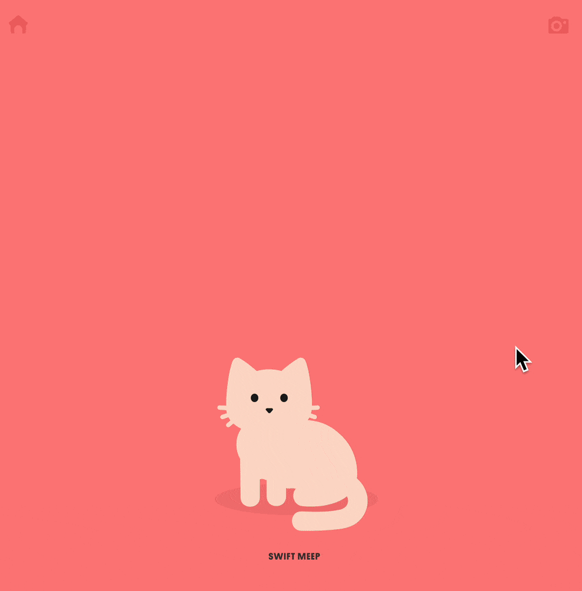
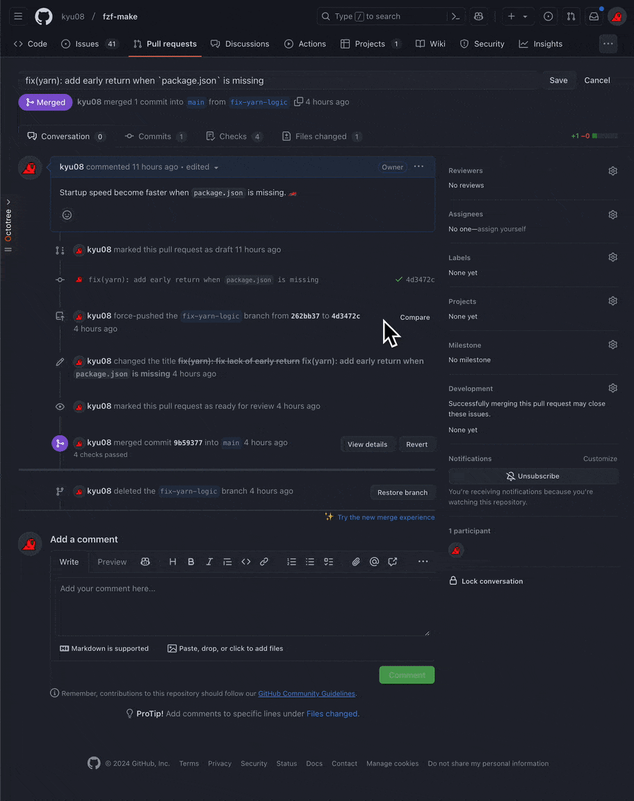
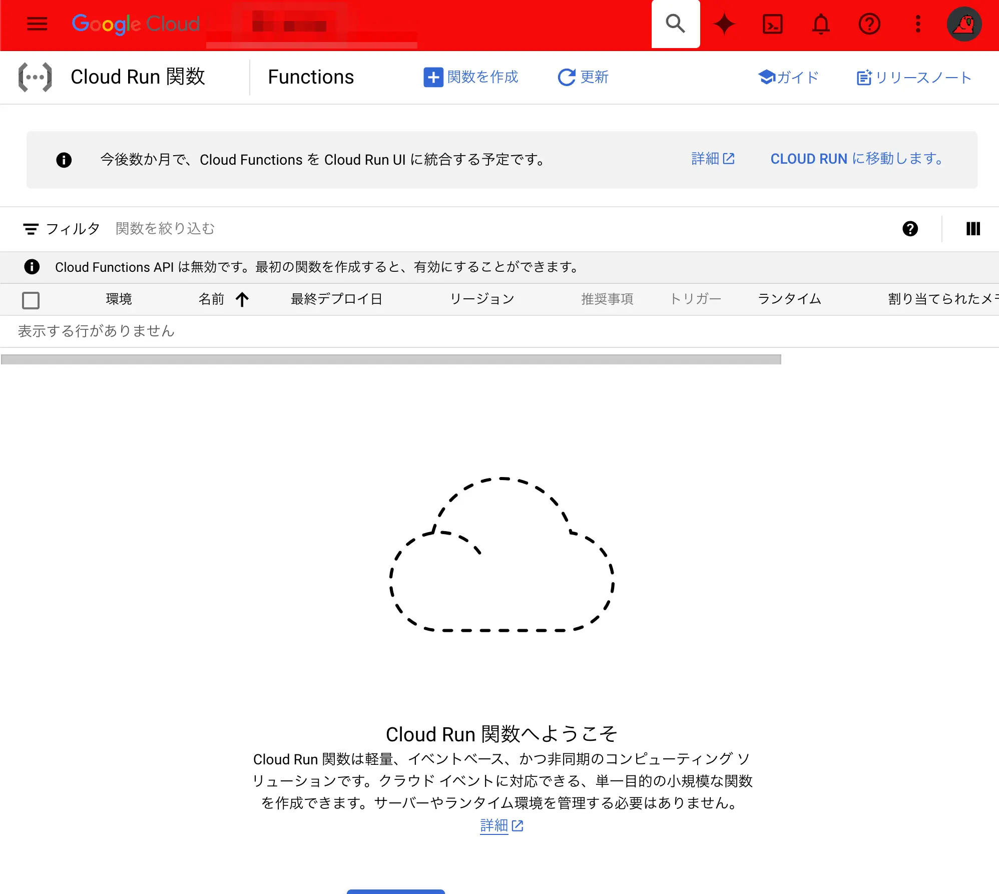
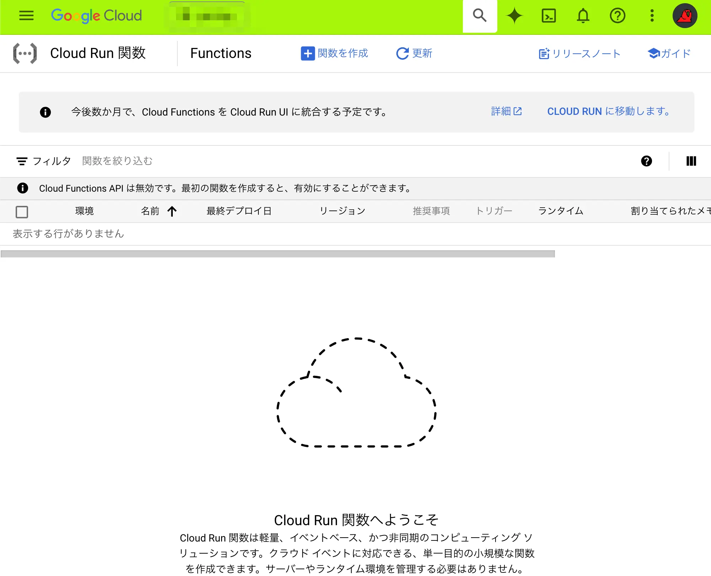
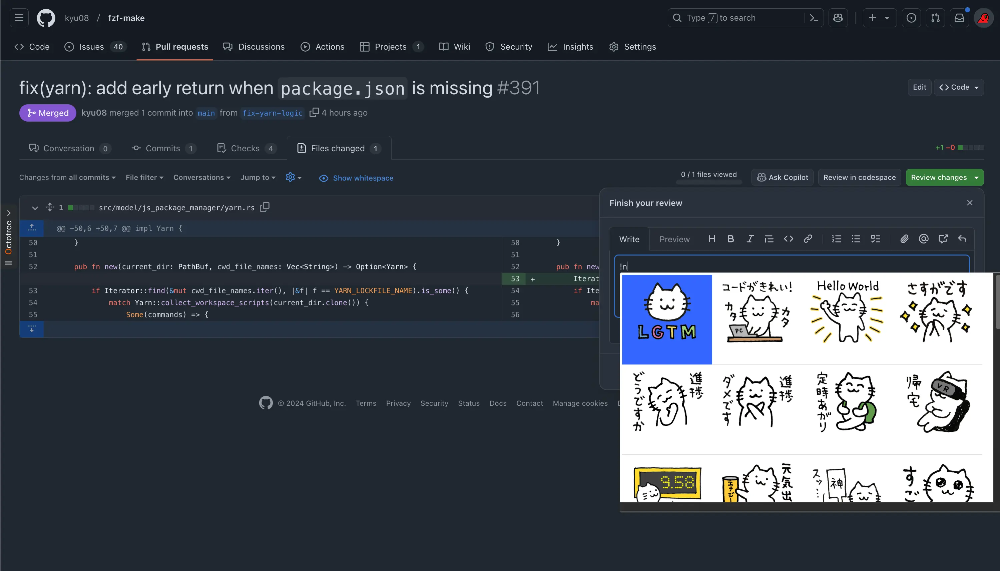
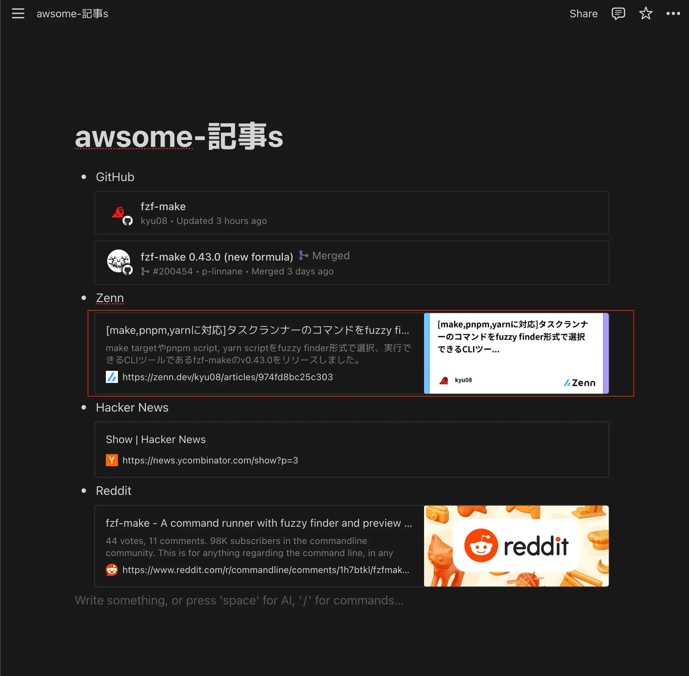
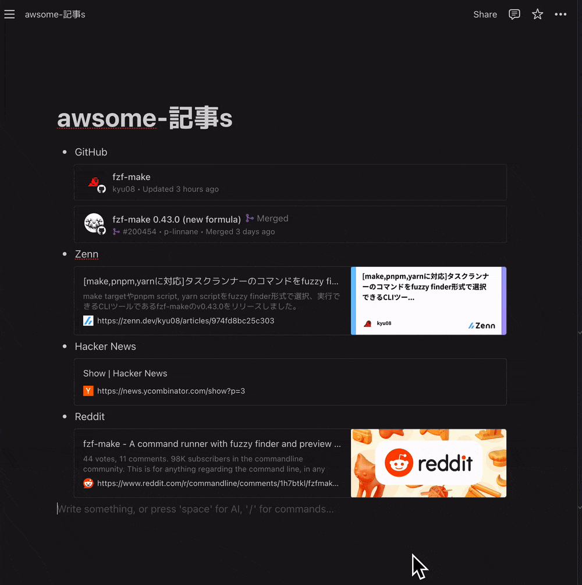
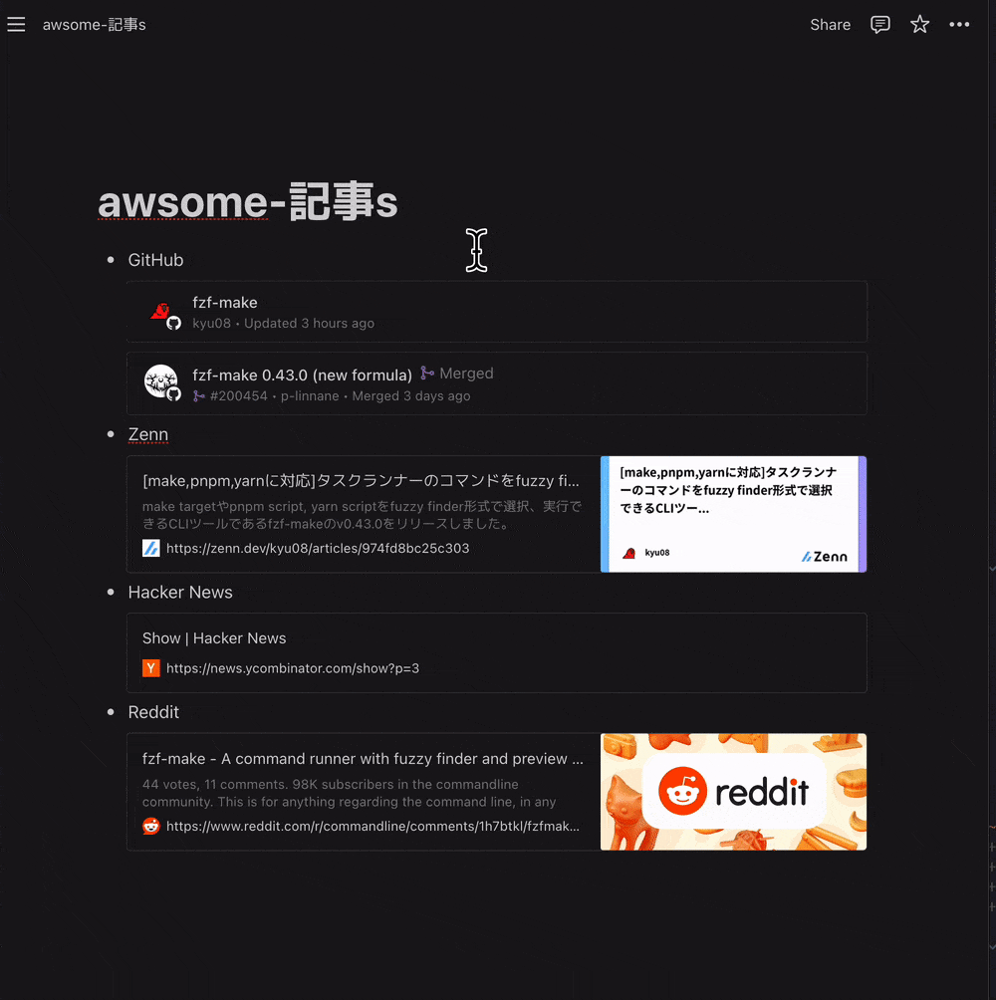

本記事は[Unipos Advent Calendar 2024](https://qiita.com/advent-calendar/2024/unipos)の13日目の記事です。

本記事では使ってみて便利だったChrome拡張を紹介します。

## Stylus 
[Stylus](https://chromewebstore.google.com/detail/stylus/clngdbkpkpeebahjckkjfobafhncgmne?hl=ja)

ユーザー定義のCSSを手軽に適用できるChrome拡張です。

筆者の使い方としては[Notionのガントチャートを見やすくしたり](https://blog.kyu08.com/posts/refine-notion-gantt-chart/)、GitHubのUIの幅を大きくしたりしています。PR上で実行計画を見る際などにスクロールしなくてよくなり便利になりました。

## Google search results shortcuts
[Google search results shortcuts](https://chromewebstore.google.com/detail/google%E6%A4%9C%E7%B4%A2%E3%82%AD%E3%83%BC%E3%83%9C%E3%83%BC%E3%83%89%E3%82%B7%E3%83%A7%E3%83%BC%E3%83%88%E3%82%AB%E3%83%83%E3%83%88/dchaandmcifgjemlhiekookpgjmkcelg)

Google検索結果のページでキーボードショートカットを使えるようにするChrome拡張です。

筆者がよく使うのは以下です。

- ↑: 1つ上の検索結果に移動
- ↓: 1つ下の検索結果に移動
- Enter: 選択中の検索結果を開く

以下のような操作がキーボードだけでできるようになります。[^1]



## Vimium
[Vimium](https://chromewebstore.google.com/detail/vimium/dbepggeogbaibhgnhhndojpepiihcmeb?hl=ja)

言わずと知れたvimのような操作感でChromeを操作できるChrome拡張です。

あらゆる操作をキーボードだけで行いたいと考えている筆者にとってはなくてはならない拡張です。[^2]

基本的な操作方法についてはたくさんの情報があると思いますのでここでは筆者のキーマップや最近知った機能について紹介します。

まずキーマップについてですが、以下のようにして左手だけで操作しやすいように設定しています。

```vim
map q goBack
map d goForward
map s scrollPageUp
map a scrollPageDown
map w scrollDown
map e scrollUp
```

また、最近知ったvimiumの機能についても紹介したいと思います。ふと[README](https://github.com/philc/vimium)を眺めていたら
```
gi      focus the first (or n-th) text input box on the page. Use <tab> to cycle through options.
```
という記述を見つけました。

フォーカスできるテキストボックスが1つの場合はその要素にフォーカスが当たり、複数の場合はタブで切り替えることができます。
これまではマウスを使ってフォーカスを当てていましたがこれを知ってからマウスへの依存をより下げることができました。



## GCP console colorize
[GCP console colorize](https://chromewebstore.google.com/detail/gcp-console-colorize/higjahjicmccalicmgfpokdmooopdhej?hl=ja)

Google Cloudのプロジェクトごとにヘッダーの色を変更するChrome拡張です。

以下のようにプロジェクトごとに色を分けておくとうっかり間違って操作することを防ぎやすくなります。（環境ごとに適切な権限管理をするのは前提として）

| 環境      | イメージ画像                                                          |
| ---       | ---                                                                   |
| project-a |        |
| project-b |  |

## LTTM
[LTTM](https://chromewebstore.google.com/detail/lttm/jdidcgkdggndpodjbipodfefnpgjooeh)

PRレビューの際にいい感じの画像を手早く貼ることができるChrome拡張です。

PR上でのコミュニケーションが捗っています。



## find+ | Regex Find-in-Page Tool
[find+ | Regex Find-in-Page Tool](https://chromewebstore.google.com/detail/find+-regex-find-in-page/fddffkdncgkkdjobemgbpojjeffmmofb)

正規表現を使ってページ内を検索できるChrome拡張です。

便利です。

## Notion Sidebar Tamer
[Notion Sidebar Tamer](https://chromewebstore.google.com/detail/notion-sidebar-tamer/kkjflddbknmcnjodgeobojmdacilodlb?hl=ja)

Notionのサイドバーにマウスカーソルが近づいたときにサイドバーが表示されるのを防ぐChrome拡張です。

1日に1回はこの挙動にストレスを感じていたのでQOLが上がりました。

たとえば次のようなNotionページの赤枠部分をコピーしたいとします。



コピーするには赤枠の左あたりにカーソルを持っていく必要がある[^3]のですが判定が結構厳しいので意図せずサイドバーが表示されてしまうことがよくあります。



そこでNotion Sidebar Tamerを使うとカーソルをサイドバー付近に移動してもサイドバーが表示されなくなります。やったね！



## おわりに
Chrome拡張開発者のみなさんに圧倒的感謝...！

[^1]: ちなみに可愛い動物が表示されているのは[Tabby Cat](https://chromewebstore.google.com/detail/tabby-cat/mefhakmgclhhfbdadeojlkbllmecialg?hl=ja&utm_source=chrome-ntp-launcherhttps://chrome.google.com/webstore/detail/mabl-trainer/npfildagndinaoofhecikgcfcohfapeo?hl%3Dja)の機能です。`cmd + T`で新しいタブを開くと可愛い動物たちとchillな時間を過ごすことができます。
[^2]: 早くNotionとSlackがキーボードだけで操作できるようになってほしいです。あわよくば誰か完璧なTUIクライアントを作ってください。
[^3]: このケースだとカーソルを右側に持っていってコピーすることもできますが普段は左側に持っていかないとコピーが難しいケースが多いためこのように書いています。具体的なケースが思い出せたら記事を修正しようと思います。
