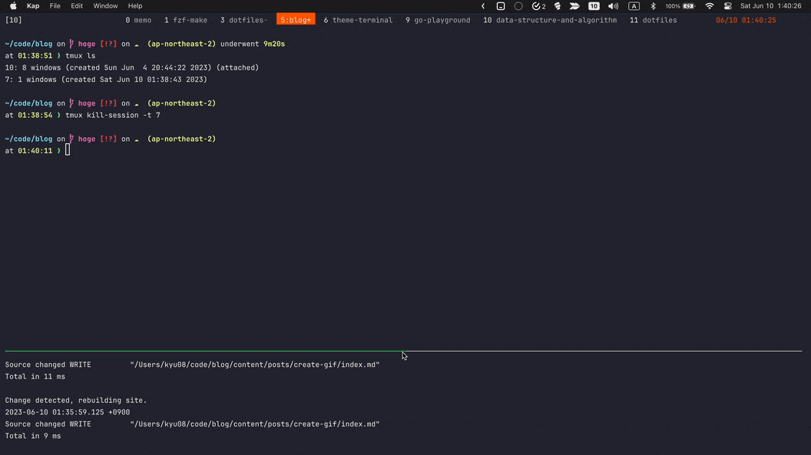

ブログ用によくGifをつくるので自分用の備忘録代わりに手順を記しておく。

## 追記(2023/11/29)
下記の方法だと生成後のgifに格子模様のようなものが入ってしまうので以下の記事で紹介されているffmpegを使った方法を使うようにしたところ綺麗なgifが生成できるようになった。

[Mac で GIF 画像を作る技術 - Qiita](https://qiita.com/takasp/items/65d1d0d90073bcfc4873)

> 動画内で使用している色を最適化するために、パレット画像を生成します。
> 
> ```sh
> ffmpeg -i input.mov -vf "palettegen" -y palette.png
> ```
> 
> GIF 画像を出力します。
> サンプルでは、-r オプションでフレームレートを 24 に設定しています。
> 
> ```sh
> ffmpeg -i input.mov -i palette.png -r 24 -y output.gif
> ```


追記ここまで

## 前提
- macOS
- [Kap](https://getkap.co/)がインストールされていること
- [Keycastr](https://github.com/keycastr/keycastr)がインストールされていること

## 手順
### 1. Keycastrを起動


### 2. Kapでいい感じに範囲を選んで録画開始ボタンを押す


### 3. いい感じのサイズで保存(重要)
(あとから圧縮しようとすると思いのほか大変なのでサイズを小さくしたい場合はいい感じのサイズにするのを忘れない)


## おわりに
(いざ書いてみると書くほどでもなかった)
