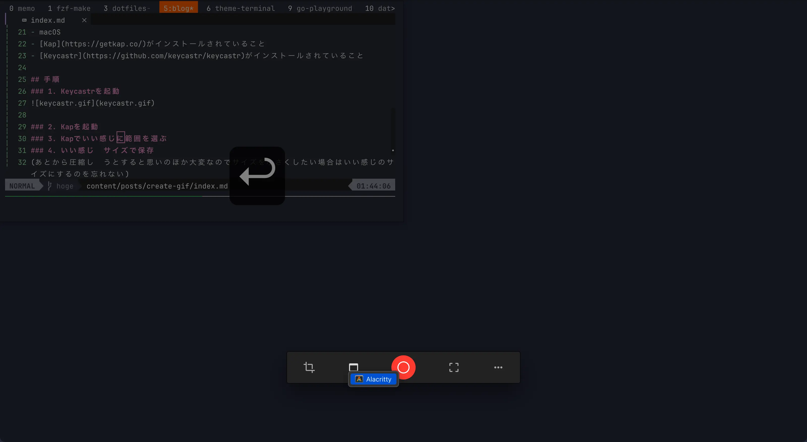

ブログ用によくGifをつくるので自分用の備忘録代わりに手順を記しておく。

## 前提
- macOS
- [Kap](https://getkap.co/)がインストールされていること
- [Keycastr](https://github.com/keycastr/keycastr)がインストールされていること

## 手順
### 1. Keycastrを起動

### 2. Kapでいい感じに範囲を選んで録画開始ボタンを押す

### 3. いい感じのサイズで保存(重要)
(あとから圧縮しようとすると思いのほか大変なのでサイズを小さくしたい場合はいい感じのサイズにするのを忘れない)

## おわりに
(いざ書いてみると書くほどでもなかった)
