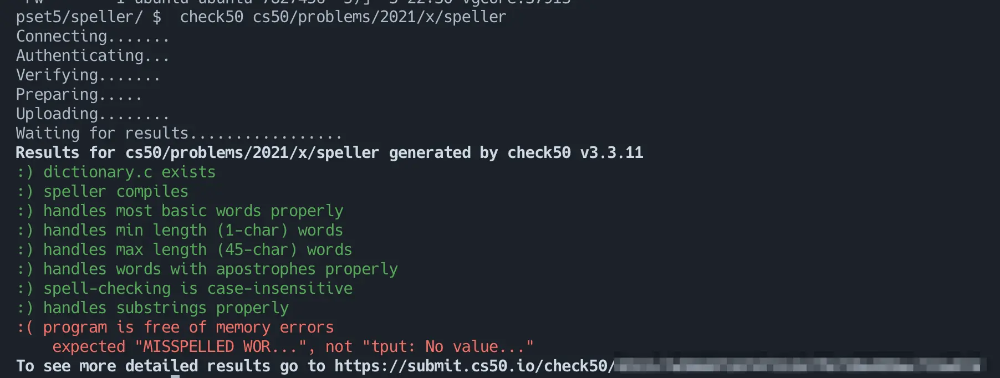

[CS50.jp](https://cs50.jp/)の気になっていたトピックを学んでみたので振り返っておく。

## CS50.jpとは
[CS50.jp](https://cs50.jp/)の説明はサイトから引用する。

> このページは、ハーバード大学 CS50 の日本語版翻訳プロジェクトのページです。当サイトのドメインに掲載されているコンテンツは、Creative Commons ライセンスが適用されています。個人利用のほか、非営利に限って教材として利用することができます。
> 
> （中略）
> 
> ハーバード大学の CS50x は、コンピュータサイエンスとプログラミング技術を紹介するコースで、プログラミングの経験の有無にかかわらず、経験者と未経験者の両方を対象としています。David J. Malan が担当するエントリーレベルのコースである CS50x では、アルゴリズム的に考え、問題を効率的に解決する方法を学びます。テーマは、抽象化、アルゴリズム、データ構造、カプセル化、リソース管理、セキュリティ、ソフトウェアエンジニアリング、ウェブ開発など。言語は C、Python、SQL、JavaScript に加え、CSS と HTML を使用します。問題集は、生物学、暗号、金融、科学捜査、ゲームなどの実世界の領域からヒントを得ています。CS50x の学内版である CS50 は、ハーバード大学で最大のコースです。

カリキュラムは次のような構成になっている。

- Week0 Scratch
- Week1 C
- Week2 Arrays
- Week3 Algorithms
- Week4 Memory
- Week5 Data Structures
- Week6 Python
- Week7 SQL
- Week8 HTML, CSS, JavaScript
- Week9 Flask
- Week10 Ethics
- Security
- Artificial Intelligence
- Final Project

各章はレジュメと課題で構成されている。

課題を解いてコードを提出するとリモート環境でテストが実行され結果を確認することができる。[^1]

正直にいうと日本語訳がなかったら取り組もうと思わなかったと思うのでCS50.jpの翻訳コントリビュータであるCODEGYM社には感謝してもしきれない。本当にありがとうございます。

## そもそもなぜCSを勉強しているか
前提として筆者について補足しておくと筆者は電気系の学部・大学院を卒業しておりコンピューターサイエンスのバックグラウンドを持っていない。（かつSaaS企業でソフトウェアエンジニアとして働き初めて現在4年目）

「〜という分野に精通して自分の業務パフォーマンスを向上させる」のような明確な目的意識はないがおおむね以下のような理由でやっている。

- CSの知識を習得することでソフトウェアエンジニアとして見える世界がどう変わるのか知りたい
- 普段触っている技術の裏側を理解することでよりよい選択ができたり、より素早い問題解決ができるのではないか、という仮説がある
- 知的好奇心を満たすことができて単純に楽しい

## やったこと
Week6 Python以降は自分にとって大きな学びはなさそうだったのでWeek5 Data Structuresの課題（Lab & Problem Set）までを取り組んだ。2024/3/8~2024/5/3まで平日夜や土日の時間を使って取り組んだ。

自分のメモ用のリポジトリは以下。（解いた課題のコードも載っているのでネタバレ（？）注意）

https://github.com/kyu08/cs50

## 学びや得たもの
### CSの基礎
CSの基礎の導入部分くらいには触れることができたと思う。たとえばこのあたり。
- ASCIIとは
- Cで記述したプログラムが実行可能になるまでの流れ
- アルゴリズム
    - O記法とΩ記法
    - 代表的なソートアルゴリズム
- データ構造
    - 連結リスト(課題ではダイレクトチェイニング法を用いた連結リストを使ってハッシュテーブルを実装した)

ただ、各週の講義動画は1.5hくらいのボリュームなのであくまでそれぞれのトピックの序章（または序章の導入部分）くらいの内容だとは思う。

### C言語の基礎

あとはWeek1 ~ Week5までの課題はすべてC言語で課されたのだが、C言語の経験が得られたのは自分にとって貴重だった。(各Weekの課題が2~3問あり合計で14問の課題をC言語で解いた。)

特に

- 文字列の扱い（終端文字）
- 数値型のオーバーフロー

あたりが印象に残っている。（課題を解いていてこれらに起因するバグに何度か悩まされた）

C言語を触ることで現在自分がよく触っている言語であるGoやRustがいかに便利かを思い知った。

あとはC言語で書かれたOSSやサンプルコードの理解を多少は深めやすくなったので今後の学習・調査の助けになってくれそう。

## まとめ
全体感としてはCSの勉強をやっていく上での基礎的な知識を学ぶことができ、今後の学習の足がかりになってくれそうだったので取り組んでみてよかった。あとはC言語の経験が得られてよかった。

やはり新しい分野や言語を習得するには時間を投資して手を動かすのが自分にはあっているように思った。引き続きやっていき。

[^1]: テストケースは[cs50/problems](https://github.com/cs50/problems)にあるので参考にしながら課題を進めた。
