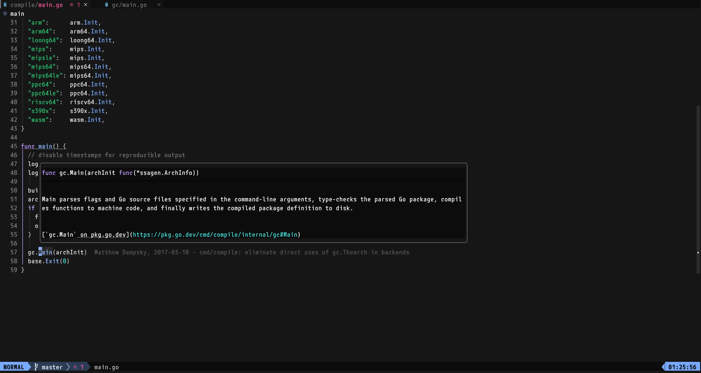

gc(go compiler)のコード（具体的には[`go/src/cmd/compile`](https://github.com/golang/go/tree/master/src/cmd/compile)配下）を読むために必要な手順があったのでメモ代わりに書いておく。neovimでしか確認していないが他のエディタでもきっと同じような感じなはず。


## `packages.Load error: err: exit status 2: stderr: panic: runtime error: index out of range [-1]  goroutine 1 [running]: cmd/go/internal/list.collectDepsErrors...`
というエラーを出力してLSPが停止する。go1.21.0のバグだった模様。

https://github.com/golang/go/issues/61816

ローカルのgoをgo1.21.1に上げることでエラーが解決した。


## `Error loading workspace folders (expected 1, got 0) failed to load view for file:///path/to/repo/go/src/cmd: err: exit status 1: stderr: go: downloading go1.22 (darwin/arm64) go: download go1.22 for darwin/arm64: toolchain not available`
`src/cmd/go.mod` の `go 1.22`を`go 1.21.0`に書き換えることで解決した。

```diff
diff --git a/src/cmd/go.mod b/src/cmd/go.mod
index 1eaad916ff..da12b2adff 100644
--- a/src/cmd/go.mod
+++ b/src/cmd/go.mod
@@ -1,6 +1,6 @@
 module cmd

-go 1.22
+go 1.21.0

 require (
  github.com/google/pprof v0.0.0-20230811205829-9131a7e9cc17
```

## `This file is within module ".", which is not included in your workspace. To fix this problem, you can add a go.work file that uses this directory. See the documentation for more information on setting up your workspace: https://github.com/golang/tools/blob/master/gopls/doc/workspace.md.`
リンク先のドキュメントの手順に従って`go.work`を作成する。

```sh
// src/cmd ディレクトリで
go work init
go work use ./compile
```

## ということで
無事LSPを動作させることができた。



これでgo本体のコードがサクサク読めるぞー。
