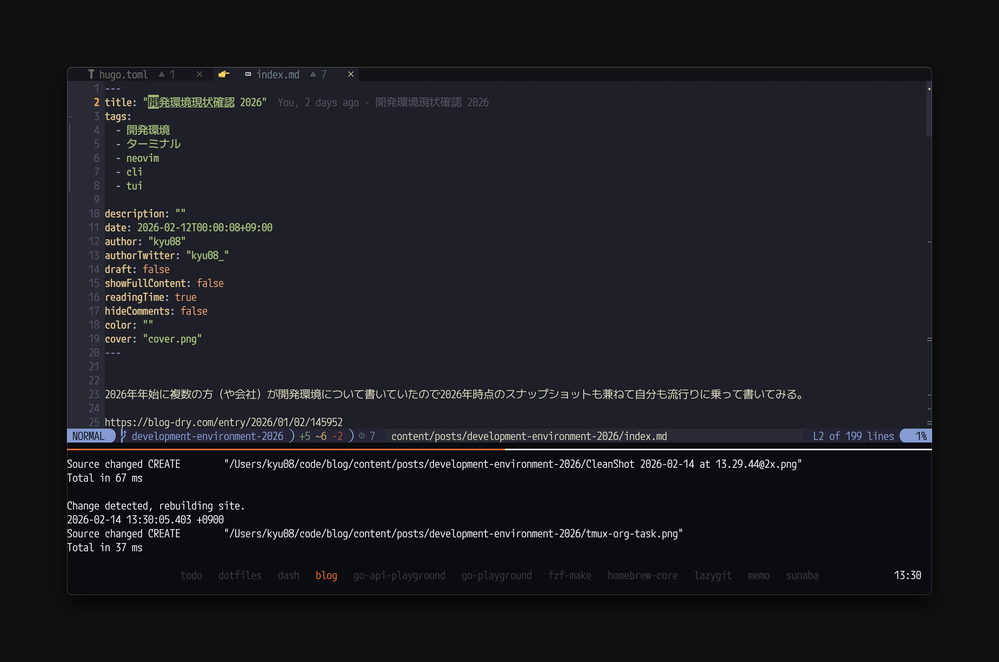
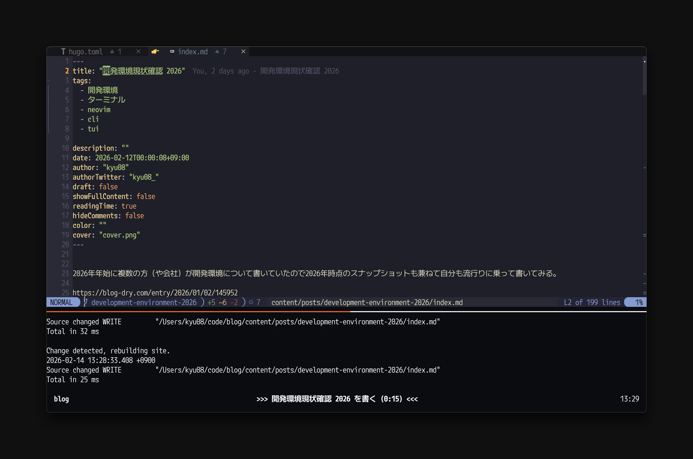
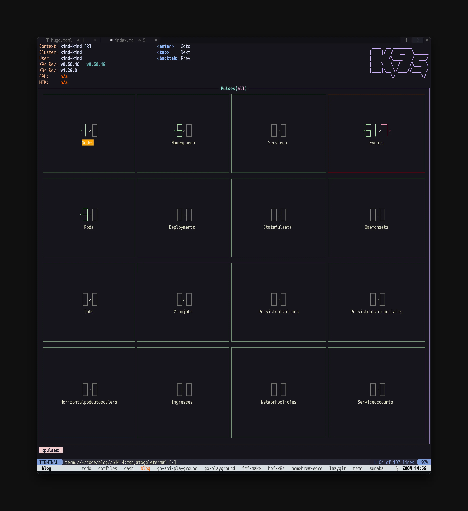

2026年年始に複数の方（や会社）が開発環境について書いていたので2026年時点のスナップショットも兼ねて自分も流行りに乗って書いてみる。

https://blog-dry.com/entry/2026/01/02/145952

https://k0kubun.hatenablog.com/entry/development-environment-2026

https://tech.pepabo.com/2026/01/23/development-environment-2026/ [^1]

それではやっていきます。

## OS
大学生くらいからmacOSを使っている。あまり不満がなくて好き。（仕事用端末もmacOS）

唯一あるとしたらゲームがあんまりできないのでこれがちょっとだけ気になっている。

https://store.steampowered.com/sale/steammachine

5年くらい前に買ったM1 MacBook Air(16GB RAM)の物持ちが良すぎて新しいMacを買うタイミングがなかなか来ない。新しいMacを買うのは楽しいので買いたい気持ちもありつついかんせん困ってないのでなあ...の気持ち。

## エディタ
（就職した）2021年くらいからNeovimを使っている。厳密には2022年ごろまではJetBrains系のエディタと併用していたが、そこからはNeovimのみを使っている。


キーボードだけで操作しやすいのと起動が早いのとカスタマイズしやすいのが好きでつかっている。（もちろんvimの操作性も気に入っている）

最近はこんな感じで[diffview.nvim](https://github.com/sindrets/diffview.nvim)を使ってPRのdiffはすべてNeovim上で見るようにしている。コードをレビューしていると周辺の実装も含めて確認したいことがよくあるので、エディタ上でレビューしているとすぐに該当ファイルに飛べて便利。（[octo.nvim](https://github.com/pwntester/octo.nvim)にコメント周りのバグがあったのでレビューコメントの書き込みはGitHubのWebUIから行っている。）


https://github.com/sindrets/diffview.nvim

今はGo/TypeScript/Rustあたりしか書いてないので特に困ってないが、JVM系をNeovimで書こうとすると若干辛みがあるかもしれない。（ちょっとだけJava/ScalaをNeovimで書いたことがあるが重かったり不安定だったりして辛かった）

AI時代になって設定を自分好みにするコストが格段に減ったのでNeovimのカスタマイズが捗っており嬉しい。最近はPRレビュー効率化のための色々をClaude Codeにやってもらっている。（Luaの書き方を覚える前にAI時代が来てしまった...）

久々に起動時間を測ってみたら60msくらいになっていたので気が向いたらもうちょっとチューニングしてもいいかもしれない。（たぶん30msくらいまではいけるはず）

一時期cursorも頑張って設定ファイルを作り込んだうえで慣れようとしてみたが、どうもVSCode系エディタとは思想が合わなかったので結局数日で戻ってきてしまった。

## AIツール
ClaudeとDevin、GitHub Copilotを使っている。

ClaudeはDesktop App経由で壁打ちや検索用途で使ったり、Claude Codeでコードを書いてもらったりしている。

Claude Codeを使うときはNeovim plugin等ではなくtmuxのpaneを切ってそこで直接動かしている。

Devinは主にAsk Devinを使ってコードベースの調査などに使っている。レスポンスがめっちゃ早くてありがたい。

GitHub Copilotはエディタのインライン補完で使ったり、GitHubのWebUI上でタスクを依頼したりするときに使っている。特にこのブログの機能開発ではよく使っている。（issueさえ書けばそのままWebUIからタスクを依頼できて便利）

## ターミナルエミュレータ
Alacrittyを使っている。ターミナルにはタブ機能がない方が`cmd+w`等を誤爆したりとかが起きないので好きで使っている。（iTerm2を使っていたときはたまに誤爆してシェルが消えて悲しくなっていた。）

正直早いかどうかはあまりわかってないが特に不満もない。（少し前に日本語入力もいい感じになったし）

https://github.com/alacritty/alacritty

## ターミナルマルチプレクサ
tmuxを使っている。1セッションに好きなだけウィンドウを開く運用で使っている。

tmux-fzfでのwindow切り替えがとても便利で気に入って使っている。



設定手順は過去にこちらに書いた。

https://blog.kyu08.com/posts/tmux-fzf-window/


前述の通りalacrittyとの相性がいい感じなのでよほどのことがない限りこの組み合わせは変えなさそう。[^2]

Status Lineはこんな感じで画面下側にwindow名と現在時刻を表示している。



詳しくは後述するが、[nvim-orgmode/orgmode](https://github.com/nvim-orgmode/orgmode)でClock In(時間計測)しているタスクがあるときはそのタスク名と経過時間をStatus Lineに表示するようにしている。1つのタスクに集中できて割と作業が捗っている。



その他のtmuxの設定とか工夫を紹介する記事は別で書きたい。

[Zellij](https://github.com/zellij-org/zellij)も試したことはあるが、自分の環境だとなぜか表示が崩れてしまったので使っていない。

## シェル
zshを使っている。

元々はネットに落ちているshellのコードが（fishよりも）動きやすいから、という理由で使っていたのを惰性で使い続けている。

少し前にこの記事を参考にして起動を高速化したりした。（最近は測ってないが多分今も数10msくらいで起動するはず）

https://zenn.dev/fuzmare/articles/zsh-plugin-manager-cache

2024/4頃から[zeno.zsh](https://github.com/yuki-yano/zeno.zsh)を使っていてよく使うコマンドの実行がかなり効率化できている。snippetがいい感じに展開されるのは言わずもがな嬉しいが、`zeno-insert-snippet`でzenoに登録したsnippetをfzfで選択&挿入できるのがとても便利。設定ファイルはまだyaml形式で書いている。

https://github.com/yuki-yano/zeno.zsh

プロンプト表示にはstarshipを使っている。

https://github.com/starship/starship

こんな感じでk8sのcontextとnamespaceを表示するようにしている。


誤ってprod環境を壊すことがないようにこんな感じでcontextに`prod`という文字列が含まれていたら目立つようにしている。


設定はこんな感じ。

```toml
[kubernetes]
format = '[[$symbol]($style)\[ctx\]$context \[ns\]$namespace]($style) '
disabled = false
contexts = [
  { context_pattern = ".*dev.*", style = "blue", symbol = " " },
  { context_pattern = ".*prod.*", style = "bold red", symbol = "🔥 " },
]
```

その他の設定とか便利スクリプトを紹介する記事は別で書きたい。

## ランチャー
AlfredとRaycastを併用している。

基本的に不満がないかつ操作性がRaycastよりも好みなので基本的にはAlfredを使っている。

使い道は至って普通でスニペットやweb検索、ローカルのファイル検索などに使っている。

あとはWorkflowを利用してよく使うアプリを以下のようなキーバインドで呼び出せるように設定している。

- Alacritty: `opt + space`
- Brave: `cmd + esc`
- Slack: `opt + opt`
- Notion: `opt + n`
- Claude: `opt + x`
- TickTick: `opt + t`
- Spotify: `ctrl + esc`

今は治ってるかもしれないが、一時期Alfredのクリップボードの動作がとてつもなく重くなってしまったのでそこだけRaycastを使っている。

## ウィンドウマネージャー
yabaiとskhdを使っている。設定をコード管理できるのが嬉しい。たまに動作が不安定になるのでそのたびに`yabai --restart-service && skhd --restart-service`を実行している。とはいえ特に不満もない。

https://github.com/asmvik/yabai

https://github.com/asmvik/skhd

めっちゃ雑に書くとよく使うのはこの辺のやつ。

- windowを右半分に表示
- windowを左半分に表示
- windowを左上に表示
- windowを左下に表示
- windowを右3/4に表示
- windowを左1/4に表示

## フォント
M+1Code Nerd Font Monoを使っている。まるっとしていて好き。nerd fontも入っているのでNeovimを使っていても豆腐が出ず嬉しい。（あまり原理はわかってないがCicaなどの他のnerd font対応フォントよりも豆腐が出なくてありがたい）

## タスク管理
ここ1年くらいは[nvim-orgmode/orgmode](https://github.com/nvim-orgmode/orgmode)を使っている。emacsのorg-modeライクな機能をNeovimで使えるようにしたプラグイン。

https://github.com/nvim-orgmode/orgmode

少し前まで素朴にこんな感じのマークダウンファイルを毎日生成して管理していたが、期日が違うタスクをいい感じに管理したくて使い出した。
```markdown
## TODO
- 実装

## DONE
- コードレビュー
```

Neovimでタスク管理できるのとタスクに優先度、期日を設定してそれをいい感じにソートして表示してくれるのがかなり肌にあっていて気に入っている。


最近は時間の使い方を振り返る目的でClock In的な機能を使ってタスクごとの所要時間も管理してみている。

これに関してはそのうち別の記事として詳しく書きたい。

## ブラウザ
数年前からBraveを使っている。広告をブロックしてくれつつChrome拡張も使えるので便利。一時期Arcも使っていたが肌に合わない挙動があったので使うのをやめてしまった。（具体的には覚えていない）

よく使うChrome拡張は少し前にこの記事に書いた。

https://blog.kyu08.com/posts/chrome-extensions-for-dev-2024/

## IME
Google日本語入力を使っている。

たまーにひらがなの変換がおかしいのが気になっているが全体的には割と満足している。

azooKeyも試したが辞書登録した単語の優先度が低いのが使いづらくて使うのをやめてしまった。（ライブ変換はとても便利だった。）

ならissueを立てんかい...という話ではあるがちょっとこのところ忙しくそこまではできていない。

## CLI/TUIツール
よく使っているCLI/TUIツールはこのあたり。

- fzf
    - 言わずと知れたあいまい検索ツール。
    - ディレクトリ履歴移動やファイル検索などあらゆるスクリプトで使っている。
- lazygit
    - gitのTUIクライアント。
    - gitの操作はすべてlazygitでやっている。
        
    - add commit push pullなどの日常の操作やブランチ操作などをかなり少ないキー入力で行えるのがとても便利。
    - `git rebase -i`相当のことができたり、commitの一部だけstagingに戻したりと細かいこともできる。
    - ここ2年くらいで細々とPRを送っており、去年末頃に9番目にcommitが多い人になれた。
        
- k9s
    - GKEのリソースを見たり操作したりするときに使っている。とても便利。（画像はサンプル用にkindでローカル起動したクラスタのもの）
        
        
    - ログはあまり使いこなせてないので普段の開発ではDatadogやCloud Loggingを見ていることが多い。

**<PRここから>**

fzf-makeというmake targetをfuzzy finder形式で選択、実行できるTUIを開発しています。


コマンド名やその内容を覚えずとも楽に実行できたり、履歴機能があるのが特徴です。

現在は`Makefile`に定義されたmake target以外にも以下のようなコマンドに対応しています。

- `package.json`の`scripts`に定義されたコマンド(pnpm, yarn, npmに対応)
- `justfile`に定義されたrecipe
- `Taskfile.yml`に定義されたtask

次のようなコマンドでインストールできるのでぜひ使ってみてください。

```sh
brew install fzf-make
```

```sh
cargo +1.90.0 install --locked fzf-make
```

スターもしてもらえると嬉しいです🙏

https://github.com/kyu08/fzf-make

**</PRここまで>**

## キーリマッパー
Karabiner-Elementsを使っている。

vimmerなのでAの左側のキーを

- 単押しでesc
- 長押しでctrl

となるように設定している。

あとはよくある左cmdを英数、右cmdをかなにリマップする設定とか、ctrl+shift+hjklで←↓↑→が入力する設定とかを入れている。

## キーボード
- 7sPro
    
    - 2021/8から使っている。今は家でメインのキーボードとして使っている。
    - キースイッチは[Yushakobo Fairy Silent Linear Switch](https://shop.yushakobo.jp/products/5659)を使用。
    - https://shop.yushakobo.jp/products/7spro
- EPOMAKER SPLIT70
    - 2026/1に買って職場で使っている。分割キーボードかつガスケットマウントでとても打鍵感が良い。
    - キースイッチは同じく[Yushakobo Fairy Silent Linear Switch](https://shop.yushakobo.jp/products/5659)を使用。
    - https://epomaker.jp/products/epomaker-split70

## その他
- fuwari
    - スクリーンショットを付箋のように画面上に貼り付けておけるmacアプリ。画面に表示されている何かをちょっとメモ的に見たいときにとても便利
    - https://github.com/kentya6/Fuwari
    - こんな感じで動く
        

## まとめ
ここ数年で主要な使用ツール（Neovim, tmux, zsh）が変わっていないので安定して自分好みのカスタマイズが進められている。

AIツールの実装力がかなり上がったのもあり、Neovimやtmuxのカスタマイズも今まで以上にかなり捗るようになっている。

好みの環境で作業ができると作業自体が楽しくなって仕事や趣味のモチベーションも上がるので2026年もやっていき。

みなさんのこだわりもぜひ教えてください〜！

[^1]: これ系の記事でNeovimの使用率が1位になってるの初めて見た。Neovimユーザーとしては嬉しい。
[^2]: 画面内の文字を検索するのにcmd+fをよく使うのでGhosttyは自分には合わなかった。
