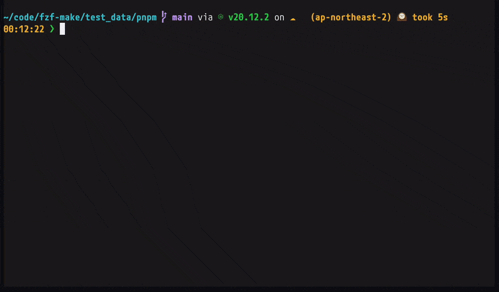

## tl;dr
make targetやpnpm scriptをfuzzy finder形式で選択、実行できるCLIツールであるfzf-makeの`v0.42.0`をリリースしました。



インストールはこちらから。(現時点ではbrew, cargo, nix, paruに対応しています)

https://github.com/kyu08/fzf-make?tab=readme-ov-file#-installation

この記事ではfzf-makeの**使い方**や**利点**を紹介します。

## 使い方
fzf-makeはタスクランナーのコマンドを手軽に確認、実行できるCLIツールです。

<!-- TODO: callout的なやつでかく -->
なお、現状サポートされているタスクランナーはpnpm, makeのみです。今後yarn, npmはサポートする予定です。もし需要がありそうであれば他のタスクランナーのサポートも追加しようと思います。（後述）

ここではタスクランナーごとにどのようなコマンドが表示対象となるのかについて解説します。

### pnpm
`package.json`, `pnpm-lock.yaml`があるディレクトリで`fzf-make`を実行すると`package.json`の`scripts`フィールドに定義されたscriptが表示されます。

```json
// package.json
{
  "name": "project",
  "version": "1.0.0",
  "private": true,
  "scripts": {
    "build": "echo build",
    "start": "echo start",
    "lint": "echo start",
    "test-unit-tests": "echo test-unit-tests",
    "test-storybook": "echo test-storybook",
    "test-integration": "echo integration",
    "test-e2e": "echo test-e2e"
  },
  "devDependencies": {
    "@babel/cli": "7.12.10"
  },
  "dependencies": {
    "firebase": "^8.6.8"
  }
}
```

たとえば上記のような`package.json`があるディレクトリで`fzf-make`を実行すると以下のように表示されます。


fzf-makeはmonorepoにも対応しています。

以下のようなディレクトリ構造で`fzf-make`を実行すると、各`package.json`の`scripts`フィールドに定義されたscriptがすべて表示されます。

```tree
${CWD}
├── package.json
├── node_modules/
├── packages
│   ├── app1
│   │   ├── package.json
│   │   └── node_modules
│   ├── app2
│   │   ├── package.json
│   │   └── node_modules
│   └── app3
│       ├── package.json
│       └── node_modules
├── pnpm-lock.yaml
└── pnpm-workspace.yaml
```

具体的には以下のファイルの`scripts`フィールドに定義されたscriptが表示されます。

- `package.json`
- `packages/app1/package.json`
- `packages/app2/package.json`
- `packages/app3/package.json`


### make
`Makefile`が置かれたディレクトリで`fzf-make`を実行すると`Makefile`に定義されたtargetがfuzzy finder形式で表示されます。[^1]

makeのincludeディレクティブにも対応しています。

```makefile
# Makefile
include ./makefiles/test.mk

run:
	echo "run"

cmd:
	@read -p "Do something? y/n:" ans; \
	if [ "$$ans" = y ]; then  \
		echo "Doing something..."; \
	fi

.PHONY: run cmd
```

```makefile
# makefiles/test.mk
.PHONY: target-included
target-included:
	@echo "target-included"
```

上記のような`Makefile`, `makefiles/test.mk`がある状態で`fzf-make`を実行すると以下のようにincludeされたtargetも表示されます。


## 主な機能
fzf-makeの特徴的な機能を2つ紹介します。

### 1. fuzzy finder形式でコマンドを選択できる


fzf-makeを起動して文字をタイプするとその文字列にマッチするコマンドが絞り込まれます。

fuzzy-finder形式なので、たとえば`pnpm test-e2e`というコマンドを実行したい場合は`tee`と入力するだけで絞り込むことができます。(↓のようにマッチしている)

```sh
pnpm test-e2e
     ^^   ^
```

このためコマンドの文字列のうち一部を打ち込むだけでいいので**少ないタイプ数で目的のコマンドを選択できる**のが特徴です。

### 2.コマンドの内容を見ながら選択、実行できる


現在カーソルがあたっているコマンドの内容がプレビューウィンドウに表示されます。(上記の画像では`package.json`に定義されている`pnpm build`の内容が表示されている)

**コマンドの中身を確認しながらその場で実行**できるため、コマンドの内容を覚えたり内容を確認してからコマンドを打って実行する手間が省けます。

## インストール方法
### brew
```sh
brew install kyu08/tap/fzf-make
```

### cargo
```sh
cargo install --locked fzf-make
```

その他のインストール方法は[📦 Installation](https://github.com/kyu08/fzf-make?tab=readme-ov-file#-installation)を参照ください。

## そのほかの機能
### 履歴機能


fzf-make経由で実行したコマンドはパスごとに10件まで履歴として保存されます。[^2]

保存された履歴は右側に表示され、↑↓キーで選択、enterで実行できます。

ここでは履歴関連のサブコマンドを2つ紹介します。

#### `fzf-make repeat`
`fzf-make repeat`を実行すると最後に実行されたコマンドが再度実行されます。(↑の例だと`pnpm test-e2e`が再度実行される)


コードを編集 -> テスト実行を繰り返す際などに特に便利です。

#### `fzf-make history`
`fzf-make history`を実行すると履歴ペインにフォーカスがあたった状態でfzf-makeが起動します。


「さっき実行したコマンドの名前なんだっけな...?」というときに便利です。

## 今後開発予定の機能
### サポート対象のタスクランナーの追加
現状サポートされているタスクランナーはpnpm, makeのみです。今後yarn, npmはサポートする予定です。

もし反響があればrake, just, cargo-makeなどもサポートできるかもしれません。

just, npm, yarnについては下記のissueにリアクションを、他のタスクランナーについては新規にissueを立てたりコメントやTwitter等で声をかけていただけると対応の優先度を上げられるかもしれません。

- [runner: support just #339](https://github.com/kyu08/fzf-make/issues/339)
- [runner: support npm #332](https://github.com/kyu08/fzf-make/issues/332)
- [runner: support yarn #333](https://github.com/kyu08/fzf-make/issues/333)

### 新バージョンのリリース通知
[Show latest version if newer version exists #194](https://github.com/kyu08/fzf-make/issues/194)

ghコマンドがやっているように、新しいバージョンがリリースされた場合にfzf-makeのUI上に通知する機能の開発を予定しています。

他にも「こんな機能があったら便利なのに」というアイディアがあればGitHub上でもTwitterでもお気軽に教えていただけると助かります。（個人開発者としては「使ってるよー！」という連絡をいただけるだけでもとっても嬉しかったりします！）

## おわりに
make targetやpnpm scriptをfuzzy finder形式で選択、実行できるCLIツールであるfzf-makeの機能や利点を紹介しました。

Homebrewやcargoでインストールできるので気になる方はぜひ試してみてください。

開発のモチベーションにも大いに繋がるのでスターしていただけると嬉しいです！

https://github.com/kyu08/fzf-make

Twitter(現X) [@kyu08_](https://x.com/kyu08_) のフォローもお願いします！

[^1]: ドキュメントにもある通り、makeコマンドと同様にファイル名は`GNUmakefile`, `makefile`でも動作します。 https://www.gnu.org/software/make/manual/make.html#Makefile-Names
[^2]: fzf-makeを起動したパスごとに履歴が保存されます
