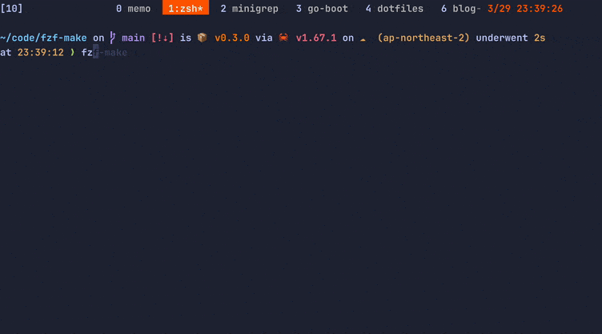
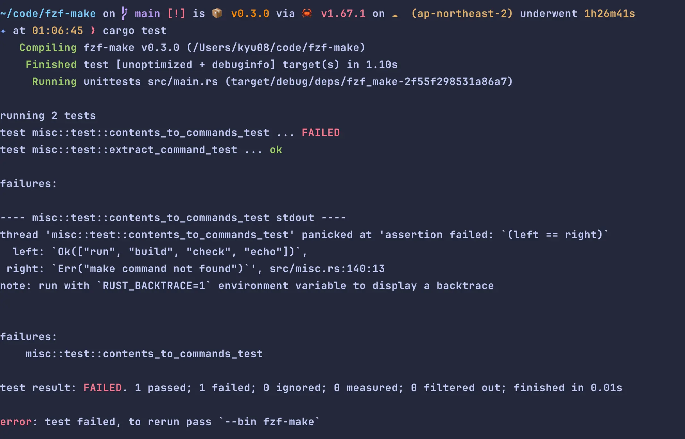
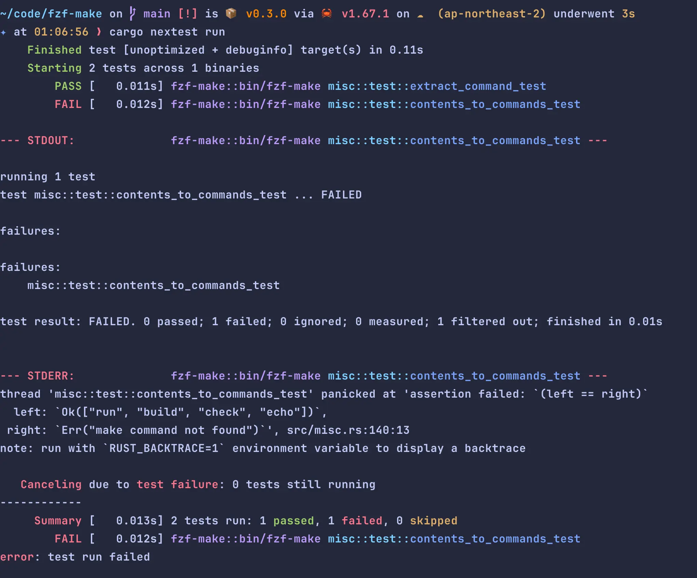

> # (2024/12/14追記) 内容を更新した紹介記事をZennに投稿しました。
> [[make,pnpm,yarnに対応]タスクランナーのコマンドをfuzzy finder形式で選択できるCLIツール fzf-makeの紹介](https://zenn.dev/kyu08/articles/974fd8bc25c303)

Makefileに定義されたtargetをfzfで選択して実行するCLIツールをRustでつくった。

[https://github.com/kyu08/fzf-make](https://github.com/kyu08/fzf-make)

こんな感じで動く。



## fzf-makeがやっていること
1. `Makefile`からtargetを正規表現で抜き出す
1. `skim`(※)に実行オプションとtargetたちを渡す
1. `skim`がプレビューウィンドウ付きのfuzzy-finderを表示
1. `skim`から選択されたtargetが返ってくるので`make ${target}`を実行

基本的な動作はすべて`skim`任せになっていてRust側でやっているのは`skim`とのやりとりくらいになっている。

※[lotabout/skim](https://github.com/lotabout/skim)...Rust製のfuzzy-finder。Rustのライブラリとして利用することもできる。

(makeの文法が思ったより多彩っぽかったので自分が必要とするごく簡単なユースケース以外をカバーするのは[早々に諦めた。](https://twitter.com/kyu08_/status/1639986936407531525)(makeで1冊本が書けるぐらいだしそれはそうという感じではある))

brewコマンドでインストールできるので気になる方はぜひ。

```sh
brew tap kyu08/tap
brew install kyu08/tap/fzf-make
```

ソースも公開しているので、「こう書くといいよ」とかバグとかありましたらぜひissueやPRで教えてください。

[https://github.com/kyu08/fzf-make](https://github.com/kyu08/fzf-make)

## 実装
上述の通り処理の大部分はskim任せになっている。(書いたコードはテストを含めても200行程度)

ただskimをライブラリとして利用する実装サンプルがあまりなかったのがちょっと大変だった。特にプレビューウィンドウの表示にfzfの候補文字列を変数としたシェルコマンドの形で渡すことができることに気づくまでに時間がかかった

↓の`{}`にtarget名が入るイメージ。

```rust
let preview_command = r"line=$(bat Makefile | grep -nE '^{}\s*:' | sed -e 's/:.*//g'); bat --style=numbers --color=always --line-range $line: --highlight-line $line Makefile";
```

[https://github.com/kyu08/fzf-make/blob/3a627d0a1aa75b1bf1ff87f3443f63393afbcf10/src/misc.rs#L18](https://github.com/kyu08/fzf-make/blob/3a627d0a1aa75b1bf1ff87f3443f63393afbcf10/src/misc.rs#L18)

あとはgoでいつもやっている感じでテーブル駆動テストっぽくテストを書いてみた。可読性も保守性も高いので割と気に入っている。

[https://github.com/kyu08/fzf-make/blob/3a627d0a1aa75b1bf1ff87f3443f63393afbcf10/src/misc.rs#L145](https://github.com/kyu08/fzf-make/blob/3a627d0a1aa75b1bf1ff87f3443f63393afbcf10/src/misc.rs#L145)

## 動機
- Rustが書きたかった。(以上)

最近Rustのやっていきが高まっており、[The Rust Programming Language](https://doc.rust-jp.rs/book-ja/) を1周したので何か作ってみるぞーという機運とMakefileのターゲットをfuzzy-finderで絞り込めたら便利そうだなーという気持ちが重なったのでRustでfzf-makeを作ってみた。 (あとはskimの存在を知っていたのも大きい。)

自分が欲しいCLIツールを手に入れつつRustの経験が積めたのでよかった。

ちなみにRustに入門した直接的(?)なきっかけとしてはこのスライドを目にして、「Elmっぽい！楽しそう！」と思ったのが発端だった。Rustに興味を持っている人はぜひ読んでみて欲しい。

[満を持して始める Rust](https://speakerdeck.com/estie/man-wochi-siteshi-merurust)

## Rustを触ってみて感じたこと
Rustを触る前に持っていた印象は「コンパイルが通りずらく、安全性が高い」「関数型っぽい」という感じだった。

実際に学んでみた印象は次のような感じ。

- 関数型っぽい書き心地
  - 特にenumとパターンマッチング,Option型 ,Result型, 式指向な考え方などの関数型っぽい言語機能や極力データをイミュータブルに扱う思想などが心地よかった。筆者が大好きな言語であるElm(ウェブブラウザベースのGUIを作成するための純粋関数型)の好きな部分をほとんど含んでたのでElmに近い感覚で書くことができた。(もちろん慣れてないこともあってElmよりも全然難しかったけど) 
  - (Elmが気になる方は[Elm Guide](https://guide.elm-lang.jp/)がおすすめです)
- ↑に近いがNull安全なことに加えて所有権などの概念のおかげでコンパイルが通りさえすればちゃんと動いてくれるという安心感がある。
  - リファクタもやりやすそう。(enumにバリアントを追加したとき、パターンマッチの全箇所を修正しないとコンパイルが通らなかったりすると思うので)
- 開発体験が良い
  - エラーメッセージがとても丁寧。「ここがこう悪いで〜」とか「ここをこう直すとええで〜」みたいなことまでエラーメッセージに書いてくれてあるホスピタリティに感動した。こういったところもRustが生産性が高いと言われる所以なのかもしれない。
- コミュニティの初学者をサポートする姿勢がすごい
  - RustのOSSプロジェクトへのcontributionについては [rust-lang/rustへのcode contributionをはじめからていねいに](https://zenn.dev/fraternite/articles/4e11063bf05aac) が詳しいが、Rust製のOSSプロジェクトには`E-mentor`というタグがありissueを進めるに当たってメンターが指針を記してくれているらしい。（[https://github.com/rust-lang/rust/issues/109099](https://github.com/rust-lang/rust/issues/109099) これとかすごい。）
  - いつかRustのOSSプロジェクトにもcontributionしてみたい
- 他の言語と比べて動くものをつくるまでに必要な学習コストは高いとは思うがRustをちゃんと書けるようになれば生産性高く安全なコードが書けると思うので必ずしも学習コストが高いとは言えないのかもしれない。（他の言語でも安全なコードを書くためには一定の学習や経験が必要だろうし）（※想像で喋っています）

総じて開発体験は良かったのでこれからもゆるゆるとRustの学習は続けていきたい。
  
## 余談
テスト実行に [https://github.com/nextest-rs/nextest](nextest-rs/nextest) を使ってみたがテスト結果が見やすくて便利だった。

`cargo run`の結果


`cargo nextest run`の結果


カラフルで見やすい。
