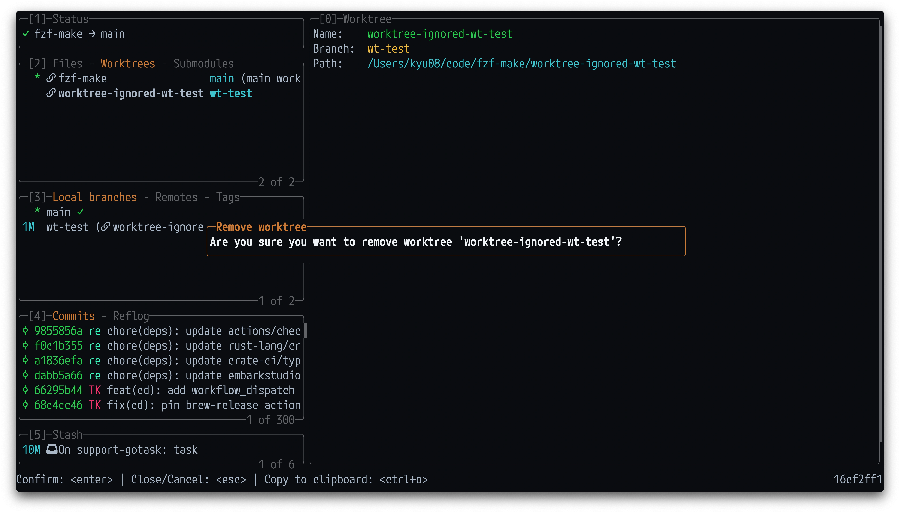
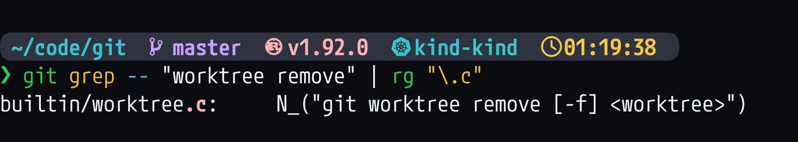

lazygitでworktreeを削除したときにworktreeのworking directoryも一緒に削除されるのかどうかがふと気になった。（普段はworktreeのworking directoryをrepository内に配置し、かつgit ignoreする運用にしているのでworktree削除後にworking directoryが残っているのかどうかを意識していない）



実際にlazygitでworktreeを削除してみればすぐにわかることではあるが、そういえばgitのソースコードを読んだことがなく、読んでみたかったのであえてソースコードから挙動を追ってみた。

（なお、タイトルが誤解を生みそうなので先に書いておきますが、lazygitでworktreeを削除しても、`git worktree remove`コマンドでworktreeを削除しても、挙動に大きな差はなさそうでした。）

なお、調査に使用したrepositoryとcommit hashは以下の通り。

| repository | commit hash |
|---|---|
| `jesseduffield/lazygit` | `16cf2ff1a9c18352c60d38655d9eb2c284dbec4b` |
| `git/git` | `8d96f09e9245ddf80c1981476fcbac8c4bb4125f` |

## 1. lazygitの挙動を追う
1. lazygitで削除したいworktreeにカーソルを合わせて`d`キーを押すとこのような確認モーダルが表示される。
    ")
1. モーダルに表示された文言でlazygitのソースコードを検索してみる。
    
    検索結果の一番上にあるこの箇所が探していた実装な模様（他はtestファイルなので関係なさそう。）
    ```sh
    pkg/i18n/english.go: RemoveWorktreePrompt: "Are you sure you want to remove worktree '{{.worktreeName}}'?",
    ```
1. `RemoveWorktreePrompt`の参照場所を見ると下記で使われていることがわかる。
    ```go
    // https://github.com/jesseduffield/lazygit/blob/16cf2ff1a9c18352c60d38655d9eb2c284dbec4b/pkg/gui/controllers/helpers/worktree_helper.go#L173
    func (self *WorktreeHelper) Remove(worktree *models.Worktree, force bool) error {
	title := self.c.Tr.RemoveWorktreeTitle
	var templateStr string
	if force {
		templateStr = self.c.Tr.ForceRemoveWorktreePrompt
	} else {
        // ここで文言を参照している
		templateStr = self.c.Tr.RemoveWorktreePrompt
	}
    // ...
    ```
1. その少し下のここでworktreeの削除処理(`self.c.Git().Worktree.Delete()`)を呼んでいる。
    ```go
    // https://github.com/jesseduffield/lazygit/blob/16cf2ff1a9c18352c60d38655d9eb2c284dbec4b/pkg/gui/controllers/helpers/worktree_helper.go#L188
    self.c.Confirm(types.ConfirmOpts{
		Title:  title,
		Prompt: message,
		HandleConfirm: func() error {
			return self.c.WithWaitingStatus(self.c.Tr.RemovingWorktree, func(gocui.Task) error {
				self.c.LogAction(self.c.Tr.RemoveWorktree)
                // ここでworktreeの削除処理を呼んでいそう
				if err := self.c.Git().Worktree.Delete(worktree.Path, force); err != nil {
                    // 省略
				}
				self.c.Refresh(types.RefreshOptions{Mode: types.ASYNC, Scope: []types.RefreshableView{types.WORKTREES, types.BRANCHES, types.FILES}})
				return nil
			})
		},
	})
    ```
1. `self.c.Git().Worktree.Delete()` の実装は以下。`git worktree remove` というコマンドを呼んでいることがわかった。
    ```go
    // https://github.com/jesseduffield/lazygit/blob/16cf2ff1a9c18352c60d38655d9eb2c284dbec4b/pkg/commands/git_commands/worktree.go#L45-L49
    func (self *WorktreeCommands) Delete(worktreePath string, force bool) error {
    	cmdArgs := NewGitCmd("worktree").Arg("remove").ArgIf(force, "-f").Arg(worktreePath).ToArgv()
    
    	return self.cmd.New(cmdArgs).Run()
    }
    ```

ということでlazygitが`git worktree remove`を呼んでいることがわかったので次はgit本体のソースコードを見てみる。

## 2. gitの挙動を追う
1. gitのソースコードはGitHubに[ミラー](https://github.com/git/git)があり、以下のコマンドでcloneできる。
    ```sh
    gh repo clone git/git
    ```
1. `git grep -- "worktree remove"`したら104箇所も出てきてしまった。
    
1. 検索結果をCのファイルに絞ったところ`git worktree remove --help`の文言のような部分が見つかったので該当ファイルを見てみる。
    
1. `builtin/worktree.c`の関数一覧を眺めているとかなりそれっぽい関数が見つかった。
    ```c
    // https://github.com/git/git/blob/8d96f09e9245ddf80c1981476fcbac8c4bb4125f/builtin/worktree.c#L1378-L1431
    static int remove_worktree(int ac, const char **av, const char *prefix,
    			   struct repository *repo UNUSED)
    {
    	int force = 0;
    	struct option options[] = {
    		OPT__FORCE(&force,
    			   N_("force removal even if worktree is dirty or locked"),
    			   PARSE_OPT_NOCOMPLETE),
    		OPT_END()
    	};
    	struct worktree **worktrees, *wt;
    	struct strbuf errmsg = STRBUF_INIT;
    	const char *reason = NULL;
    	int ret = 0;
    
    	ac = parse_options(ac, av, prefix, options, git_worktree_remove_usage, 0);
    	if (ac != 1)
    		usage_with_options(git_worktree_remove_usage, options);
    
    	// worktree全体から対象のworktreeを取得
    	worktrees = get_worktrees();
    	wt = find_worktree(worktrees, prefix, av[0]);
    	if (!wt) // NULLが返った == 見つからなかった
    		die(_("'%s' is not a working tree"), av[0]);
    	if (is_main_worktree(wt))
    		die(_("'%s' is a main working tree"), av[0]);
    	if (force < 2)
    		reason = worktree_lock_reason(wt);
    	if (reason) {
    		if (*reason)
    			die(_("cannot remove a locked working tree, lock reason: %s\nuse 'remove -f -f' to override or unlock first"),
    			    reason);
    		die(_("cannot remove a locked working tree;\nuse 'remove -f -f' to override or unlock first"));
    	}
    	if (validate_worktree(wt, &errmsg, WT_VALIDATE_WORKTREE_MISSING_OK))
    		die(_("validation failed, cannot remove working tree: %s"),
    		    errmsg.buf);
    	strbuf_release(&errmsg);
    
    	if (file_exists(wt->path)) {
    		if (!force)
    			check_clean_worktree(wt, av[0]);
    
            // worktreeのworking directoryを削除
    		ret |= delete_git_work_tree(wt);
    	}
    	/*
    	 * continue on even if ret is non-zero, there's no going back
    	 * from here.
    	 */
        // .git/worktrees/<id>を削除
    	ret |= delete_git_dir(wt->id);
    	delete_worktrees_dir_if_empty();
    
    	free_worktrees(worktrees);
    	return ret;
    }
    ```

ということで、`git worktree remove`がおおよそ以下のような処理をしていることがわかった。

1. worktree全体を取得し、さらにそこから引数に指定されたworktreeを検索する
1. worktreeのworking directoryを削除
    - **今回の調査の発端の処理。`git worktree remove`を実行すると、worktreeのworking directoryも削除されることがわかった。**
1. `.git/worktrees/<id>`を削除
    - ちなみに、`.git/worktrees/<id>`にはworktreeのメタ情報が入っている。
        ```sh
        ❯ tree .git/worktrees/myworktree
        .git/worktrees/myworktree
        ├── commondir
        ├── gitdir
        ├── HEAD
        ├── index
        ├── logs
        │   └── HEAD
        ├── ORIG_HEAD
        └── refs
        
        3 directories, 6 files
        
        ```
        たとえばworktreeの`.git`ディレクトリの位置が格納されていたりする。
        ```sh
        ❯ cat .git/worktrees/myworktree/gitdir
        /Users/kyu08/code/fzf-make/myworktree/.git
        ```

## 感想
- `git worktree remove`を実行したときに何が行われるかがおおよそわかった。
- git/gitが意外と読みやすかった。
    - 歴史あるコードは略語が多くて読みづらいという偏見があったが、あまり略語が使われておらず読みやすかった。（もちろんコードベースのごく一部を読んだだけなので他の部分についてはわからないが）
    - gitの挙動が気になったら今後も気軽にソースコードを読んでみようという気持ちになった。
- gitやLinuxやコンパイラがついつい何か特別な魔法的なものによって動いていると思いこんでしまいがちだが、普通にコードを読めばわかることもあるので気になることがあったら読んでみると発見があるかもしれない。(もちろん自分の知識が足りなすぎて読んでもわからない場合もありそうですが...)
    - 引き続きKubernetesやLinuxを始めとしたCS関連の諸々など、身の回りの技術に対する解像度を上げていきたい。
