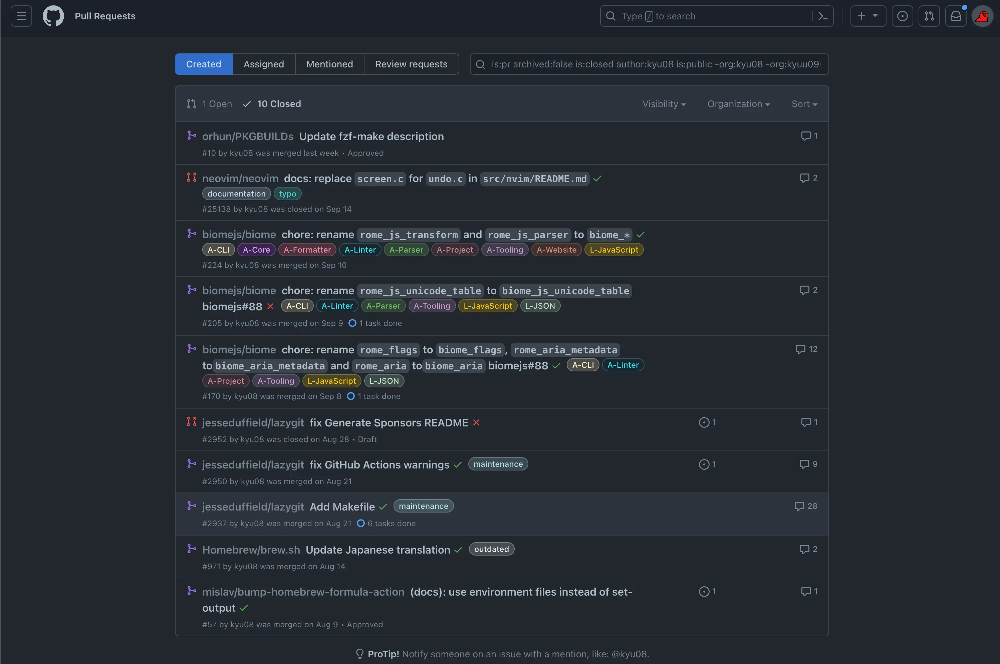

稀に自分がOSSに送ったPR一覧を見たくなるのでメモ代わりに書く。 (正確には「自分所有でないpublic repositoryに送ってマージされたPR一覧」を表示する方法)

## tl;dr
https://github.com/pulls でクエリに

```shell

is:pr archived:false is:closed author:@me is:public -user:@me created:2024-01-01..2024-12-31 

```
を指定して検索するとこんな感じで表示される。



## 余談
- orgを所属組織とかに絞って検索すれば仕事の振り返りとかにも使えそう。
- 他にも https://github.com/pulls/review-requested にいくと自分がレビュワーとしてアサインされているPR一覧が見れて便利だったりする。ターミナル上で同じようなことをやりたい人は [dlvhdr/gh-dash](https://github.com/dlvhdr/gh-dash) とかもオススメかもしれない。
