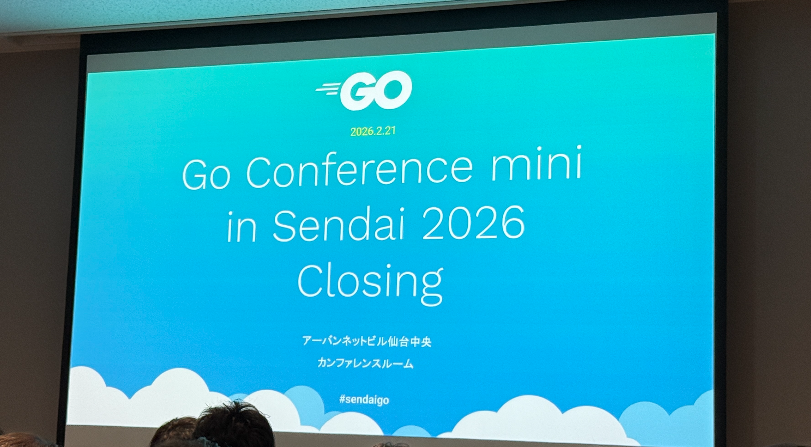
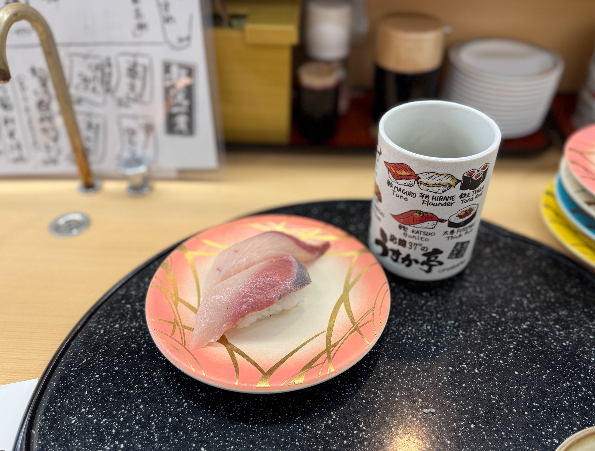

2026/02/21(土)に仙台で行われたGo Conference mini in Sendai 2026に参加したのでその内容をまとめる。

https://sendaigo.jp/

## 【KeyNote】静的解析からみるGoの過去と未来
tenntennさんによるキーノート。

https://docs.google.com/presentation/d/14e9PiaKbyqcZTu5mYCKBqa9MokJhxmT0WePHxwPzCmg

最後に紹介されていたGo1.27のアノテーションで静的解析をできるようにする機能は今まさに自分が欲している機能[^1]なので調べてみようと思った。

以下メモ。

- `//line a.go:1`のような記法は知らなかった。
    - 調べてみたところ`line directive`という名前がついているようだった。[^2]
    - こんな感じでコンパイラが出力するエラーメッセージなどが上書きされる。
        - 
        - https://go.dev/play/p/Thvs9U8Twvj
    - 自動生成されたコードのエラーを元のコードの行番号で表示したいときなどに使われるらしい。(例えば自動生成されたGoファイルでのエラーに対してprotoファイルの行番号をエラーに表示したいケースなど)
- `go test -cover`を実行すると裏側では`go tool -cover`が実行され、計測用のコードが挿入される
- Goがセルフホスティングされるようになったのは2015年（Go1.5）（それまではC）
    - (まだ10年しかたってないんだなー)
    - ここからコンパイラのコードが既存標準パッケージと共通化されたりするようになった
- 2019
    - goplsが登場
    - 最初はgolspだったがしれっと名前が変わったらしいw
- Go 1.27
    - アノテーションによる静的解析
        - 一点もののlinterを作らなくてよくなる。
        - `//go:fix inline`
            - https://go.dev/doc/go1.26#go-command
        - xxしたあとにyyする、みたいな制約をアノテーションで表現できるようになる（らしい。が一次情報は見つけられていない）

## AI時代のGo開発2026 爆速開発のためのガードレール
UPSIDERのRyo MimuraさんによるAI時代の開発生産性を保つにあたっての課題と対策についてのセッション。

https://www.docswell.com/s/r4mimu/ZQXGNY-2026-02-21-102435

最近PRレビューをする機会が増えてレビュワーとPR作成者双方の負担を減らす方法を考えていたのでとても参考になった。

以下メモ。
- AIの予期せぬ変更はRules / Skillsでもある程度は防げるがあくまで挙動は非決定的なためすり抜けてしまう可能性がある。そのためハード制約（決定的な処理による制約）を設けることが重要。
- ハード制約の例
    - `internal` packageで予期せぬ外部参照から保護する
    - `depguard`による依存性ルールの強制
    - Package by Featureで凝集性を向上させることでコンテキストをうまく制御する
- Fuzzing Test, Mutation Testingなどのテスト手法を活用してコード品質を保つ
- 開発者体験 = エージェント体験
    - 両者は同じもの。
    - 環境構築、テストとフィードバック、可観測性等開発者体験が悪ければAI Agentもうまく開発を進めることはできなくなる。

## Go での並列処理 「最初の一歩」から「次の一歩」へ
TakasagoさんによるGoでの並行処理についてのセッション。

https://docs.google.com/presentation/d/1SpK9Pxsh2QOOXwIirNe3YiN6U5ujAxiottt4ZNPdBkg/edit

並行処理の原理だけでなく、パターンを身に着けておくといざ実装するとなったときに役に立ちそうだと思った。（なかなか毎月書くような機会がないのであまり定着してない...）

以下メモ。

- Goは同期で書いておいて高速化したい箇所だけ並列化する、という書き方がやりやすいのが特徴。

## Go.1.26のruntime/metricsが便利そうな件（？）
o_ga09さんによる発表。

https://docs.google.com/presentation/d/1mamepeOir5fiEh3ZcGuRM9kkEvQohCcKeZIsKwZ6_L4/edit?slide=id.SLIDES_API254050862_0#slide=id.SLIDES_API254050862_0

goroutineリークをリアルタイムに検出できるの便利そう。

## モジュラモノリスにおける境界をGoのinternalパッケージで守る
SODA inc.のmagavelさんによる発表。

https://speakerdeck.com/magavel/moziyuramonorisuniokerujing-jie-wogonointernalpatukezideshou-ru

メモ: 

- 「結合はむしろ、忘れてはならない設計ツールだ。」
- `bounded_context`ディレクトリを切っているのが印象的だった 

お話したこと:

- ディレクトリ構成について
    - `bounded_context`ディレクトリの同階層には`monolish`ディレクトリがある
        - これらは現状ワンバイナリになっている
    - `bounded_context`ディレクトリの中には購入、xxx、yyyなどの境界づけられたコンテキストが並ぶ。
    - たとえば購入コンテキストの中には購入モジュール、決済モジュールなどがある。
    - 購入モジュールからは決済モジュールの公開されたIFを呼び出すようになっている。
    - 公開したくないパッケージはすべてinternal配下に置くことで予期しない依存を防いでいる。
    - 他にも`depguard`を使って依存関係を制御している。

## Go設計思想の深掘り
k_program510さんによる発表。

https://speakerdeck.com/ykf1999/gonoshe-ji-si-xiang-woshen-jue-risuru-unixkaraji-kumono-slidev

メモ:

- 発表者の方がオブジェクト指向言語に慣れていてGoにクラスがないことに驚いてGo誕生の背景を深ぼろうと思った、という自分の疑問に向き合う姿勢がとても素敵だと思った。
- `設計思想は「どこで使うべきか」を教えてくれる`いい言葉だ。

## database/sql/driverを理解してカスタムデータベースドライバーを作る
replu5さんによる発表。

https://speakerdeck.com/replu/driver-to-create-a-custom-database-driver

メモ:
- カスタムデータベースドライバーを作る理由
    - ログをだしたい
    - リクエストをDBのwriteインスタンスとreadインスタンスに振り分けたい
    - sqlcを使っているが、sqlcが生成したコードに手を加えていくのは避けたい
    - 本体をforkしてしまうと本体に追従するのが大変なので既存のドライバーをラップしたドライバーを作成することにした

お話したこと
- sqlcだと引数に応じてwhere句を一部変更することができないと思うがどうやっているのか。
    - そういうケースでは複数パターンのクエリを（愚直に）repository層に書いている。
    - そもそも巨大で複雑なクエリにはsqlcは適していないので使うべきではないかもしれない。
        - （技術の思想や特徴を理解し適切な場所で使うべき、という姿勢は↑のk_program510さんの『Go設計思想の深掘り』とも通じることがあると感じた。）

## nilとは何か 〜言語仕様と設計者の葛藤から理解する〜
株式会社サイバーエージェント kurodaさんによる発表。

https://speakerdeck.com/kuro_kurorrr/understanding-nil-in-go-interface-representation-and-why-nil-equals-nil

以下メモ。

- Goで定義されているキーワード数を即答している人が数人いてすごかったw（25個らしい）
- `nil`はキーワードではない。`true`, `false`, `iota`と同じpredeclared identifier(事前宣言された識別子)である。
- predeclared identifierのなかでデフォルト型を持たないのは`nil`だけ。
- （ちょいちょいクイズが挟まっていて参加者を飽きさせない工夫があって発表の仕方が参考になった）
- interfaceが==nilになるのは型情報もデータも両方ゼロのときのみ。
    - なのでtyped nilは==nilにならない。
        - -> `var err *MyError = nil`のように初期化した値は==nilにならないのでnilをreturnしたい場合は明示的にnilを返す必要がある。（全然知らなかった）
- nilに関する問題をどう解決するかの議論がなかなか前に進んでいないことを説明してからの`errors.AsType`をセマンティクスを変えずにうまく問題を解決した例として説明する流れがめっちゃ綺麗だった。

## Who tests the `Tests` ?
sivchariさんの発表。

https://docs.google.com/presentation/d/1we1bAhUH-_hCEZTYFy2DOyFjWN0fp7VWBkWBha8nwk4/edit?usp=sharing

メモ:

- AI時代になってCIの重要性が増している。
- カバレッジだけを追っていくと本質的でないテストコードが増えてしまう。
- テストコードのテストとしてMutation Testingという手法を紹介する。
- Mutation Testing
    - プログラムの一部を意図的に書き換え、生成したミュータントに対してテストを実行し、失敗するかどうかを検証する手法。
        - 演算子の変更、`else`ブロックの削除など
    - 失敗することを期待するテスト(`KILLED`: テスト失敗 == 期待した挙動、`SURVIVED`: テスト成功 == 期待した挙動ではない)
    - どれくらい失敗したかを指標にする。
    - ただこれは銀の弾丸ではない。実行時間とのトレードオフになる。
        - 100% `KILLED`を目指すべきではない。
- Mutation Testingをどう実装するか
    - [sivchari/gomu](https://github.com/sivchari/gomu)というMutation Testingライブラリを作成した。
    - overlayを使うと実際のファイルを仮想的に変更して実行できる
        - ソースコードを汚さずに好きなように変更できる

感想: 

- overlayすごそう
- 気になったこと
    - mutation testingの使い所について
        - 実際のプロダクションに導入するならある程度テストが整備されたあとにやるのが優先順位としてよい？（Mutation Testingがちゃんと動作することの前提としてある程度のカバレッジが必要そう）
        - あとは不慣れな巨大コードと向き合うときにmutation testを実行してみてテスト品質を把握する、というのもいいかもしれない。
    - mutation testing以外のテスト品質保証手法について
        - あまりテストの品質を定量的、機械的に保証する方法をカバレッジ以外に考えたことがなかった。
        - mutation testing以外ではどのようにテストコードの品質や正当性を保証するのがよさそう？
        - たとえばk8sの内部実装などではどのように品質担保しているのか気になった（気になっただけで調べられてはいない）

## Goから学ぶGCの仕組みとGreen Tea GCによる次世代最適化
go_poron10さんによる発表。

https://speakerdeck.com/yuporon/gokaraxue-bugc-green-tea-gcniyoruci-shi-dai-zui-shi-hua

とても高度だったので途中でついていけなくなってしまったのでいつかリベンジしたい。

## 【実装公開】Goで実現する堅牢なアーキテクチャ：DDD、gRPC-connect、そしてAI協調開発の実践
株式会社テレシーのDaisuke Sasakiさんによる発表。

https://speakerdeck.com/fujidomoe/godeshi-xian-surujian-lao-naakitekutiya-ddd-grpc-connect-sositeaixie-diao-kai-fa-noshi-jian

お話したこと:
- application層のQuery Serviceからdomain packageへの依存はOKにしている？それとも独自のreturn typeをQuery serviceで定義している？
    - 依存OKにしている。
    - domain層に以下の2種類があり、それぞれ別パッケージに定義している。
        - commandとqueryの両方から参照される型(tier1)
        - queryからのみ参照される型(tier2)

## スポンサーブースで話したこと（の一部）
- ANDPAD
    - 意外にもGo関連の勉強会でスポンサーブースを出すのは初とのこと。
        - スポンサーブースが抽選なのでなかなか機会が得られないらしい。
        - 個人的には2年くらい前からGoに力を入れている会社のイメージがあったので意外だった。
- SODA
    - Code Rabbitでレビュー負荷を下げている
    - PRレビューはチーム全員で分担して特定の誰かに負担が偏らないようにしている

## 感想
- ソロ参加だったがセッションの合間や懇親会でたくさんの人と交流できてとても楽しかった。
    - 社外のエンジニアと話せるとかなり刺激&学びになるので今後も機会を見つけていろんな勉強会に参加してみようと思った。
    - 自分の時間を使って勉強会に参加するくらいなのでモチベが高い（あるいは技術が好きな）人が多いというのはあるかもしれない。（考えてみれば当たり前だが実際に行ってみてそのことを実感できた）
- 今年はCSの勉強[^3]と並行してGoのインプット & アウトプットを頑張っていこうと思っているのでモチベがいい感じに上がった。
    - たくさんの強者を見たことで自分が目指す技術力の基準を上げられた感覚がある。
- 運営、登壇者、スポンサー、参加者の皆様ありがとうございました！

## 振り返り
- セッションの合間は発表者の方に質問するためにウロウロしている時間が長かったのもあり、全スポンサーブースを回れなかった。もうちょっといい感じに時間を使えるとよさそう。（スポンサーブースで各社の方とお話するのは楽しいので全部回りたい気持ち）
- 懇親会の途中から他の人に自分から話しかけたりできたけど次回は最初からできるともっとよさそう。[^4]

## おまけ
- 土日に仙台でKing Gnuのライブがあった影響か、土曜は仙台駅付近のホテルがめっちゃ高かったので福島まで移動して宿泊してgot aことなきした。（ありがとうアパ）
- 福島で食べたお寿司が美味しかった。観光までする（体力的）余裕がなかったのが残念。
    - 
- なんか新幹線が長かった。
    - 

[^1]: 大AI時代になりPRレビュー負担が肥大化しているのでCIで機械的にコード品質を担保するためにLinterを増やそうと思っているため。
[^2]: https://pkg.go.dev/cmd/compile#hdr-Line_Directives
[^3]: 今は（今更ながら）『ネットワークはなぜつながるのか』を読んでいる。
[^4]: 話しかけるときは普通に「お疲れ様です〜」とかでいいんだなというのが学び。
