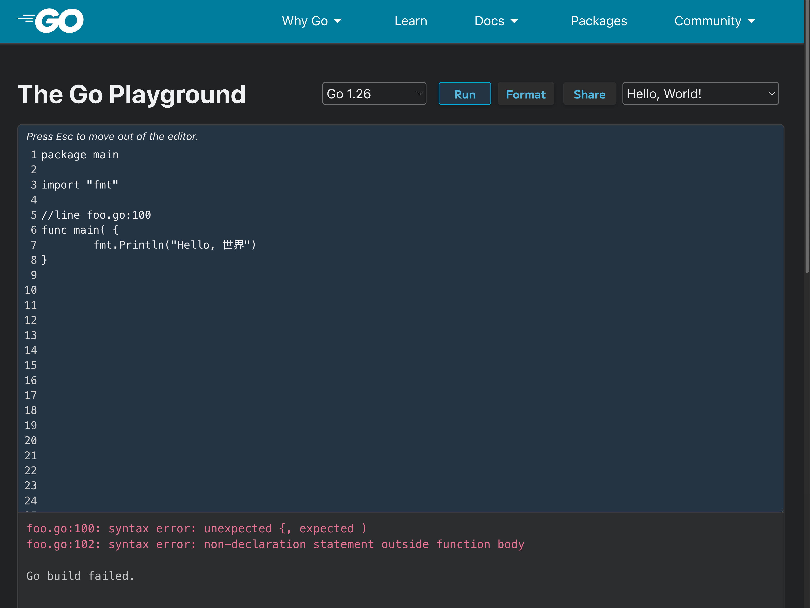

2026/02/21(土)に仙台で行われGo Conference mini in Sendai 2026に参加したのでその内容をまとめる。

https://sendaigo.jp/

## 【KeyNote】静的解析からみるGoの過去と未来
tenntennさんによるキーノート。

https://docs.google.com/presentation/d/14e9PiaKbyqcZTu5mYCKBqa9MokJhxmT0WePHxwPzCmg

最後に紹介されていたGo1.27のアノテーションで静的解析をできるようにする機能は今まさに自分が欲している機能[^1]なので調べてみようと思った。

以下メモ。

- `//line a.go:1`のような記法は知らなかった。
    - 調べてみたところ`line directive`という名前がついているようだった。[^2]
    - こんな感じでコンパイラが出力するエラーメッセージなどが上書きされる。
        - 
        - https://go.dev/play/p/Thvs9U8Twvj
    - 自動生成されたコードのエラーを元のコードの行番号で表示したいときなどに使われるらしい。(例えば自動生成されたGoファイルでのエラーに対してprotoファイルの行番号をエラーに表示したいケースなど)
- `go test -cover`を実行すると裏側では`go tool -cover`が実行され、計測用のコードが挿入される
- Goがセルフホスティングされるようになったのは2015年（Go1.5）（それまではC）
    - (まだ10年しかたってないんだなー)
    - ここからコンパイラのコードが既存標準パッケージと共通化されたりするようになった
- 2019
    - goplsが登場
    - 最初はgolspだったがしれっと名前が変わったらしいw
- Go 1.27
    - アノテーションによる静的解析
        - 一点もののlinterを作らなくてよくなる。
        - `//go:fix inline`
            - https://go.dev/doc/go1.26#go-command
        - xxしたあとにyyする、みたいな制約をアノテーションで表現できるようになる（らしい。が一次情報は見つけられていない）

## AI時代のGo開発2026 爆速開発のためのガードレール
UPSIDERのRyo MimuraさんによるAIを時代の開発生産性を保つにあたっての課題と対策についてのセッション。

https://www.docswell.com/s/r4mimu/ZQXGNY-2026-02-21-102435

最近PRレビューをする機会が増えてレビュワーとPR作成者双方の負担を減らす方法を考えていたのとても参考になった。

以下メモ。
- Rules / Skillsでも防げるが、非決定的であるため、すり抜けてしまう可能性があるため、ハード制約を設けることが重要。
- `internal` packageで予期せぬ外部参照から保護する
- `depguard`による依存性ルールの強制
- Package by Featureで凝集性を向上させることでコンテキストをうまく制御する
- Fuzzing Test, Mutation Testingなどのテスト手法を活用してコード品質を保つ
- 開発者体験 = エージェント体験
    - 両者は同じもの。
    - 環境構築、テストとフィードバック、可観測性等開発者体験が悪ければAI Agentもうまく開発を進めることはできなくなる。

## Go での並列処理 「最初の一歩」から「次の一歩」へ
TakasagoさんによるGoでの並行処理についてのセッション。

https://docs.google.com/presentation/d/1SpK9Pxsh2QOOXwIirNe3YiN6U5ujAxiottt4ZNPdBkg/edit

- 並行処理の原理だけでなく、パターンを身に着けておくといざ実装するとなったときに役に立ちそうだと思った。（なかなか毎月書くような処理ではないのであまり身につかない...）

以下メモ。

- Goは同期で書いておいて高速化したい箇所だけ並列化する、という書き方がやりやすいのが特徴。

## Go.1.26のruntime/metricsが便利そうな件（？）
https://docs.google.com/presentation/d/1mamepeOir5fiEh3ZcGuRM9kkEvQohCcKeZIsKwZ6_L4/edit?slide=id.SLIDES_API254050862_0#slide=id.SLIDES_API254050862_0

- goroutineリークをリアルタイムに検出できるの便利そう

## モジュラモノリスにおける境界をGoのinternalパッケージで守る
SODA inc.のmagavelさんによる発表。

https://speakerdeck.com/magavel/moziyuramonorisuniokerujing-jie-wogonointernalpatukezideshou-ru

- 「結合はむしろ、忘れてはならない設計ツールだ。」
- `bounded_context`ディレクトリを切っているのが印象的だった 

- お話したこと
    - ディレクトリ構成はどんな感じになっている？
        - `bounded_context`ディレクトリの同階層には`monolish`ディレクトリがある
            - これらは現状ワンバイナリになっている
        - `bounded_context`ディレクトリの中には購入、xxx、yyyなどの境界づけられたコンテキストが並ぶ。
        - たとえば購入コンテキストの中には購入モジュール、決済モジュールなどがある。
        - 購入モジュールからは決済モジュールの公開されたIFを呼び出すようになっている。
        - 公開したくないパッケージはすべてinternal配下に置くことで予期しない依存を防いでいる。
        - 他にも`depguard`を使って依存関係を制御している。

## Go設計思想の深掘り
https://speakerdeck.com/ykf1999/gonoshe-ji-si-xiang-woshen-jue-risuru-unixkaraji-kumono-slidev

メモ:

- 発表者の型がオブジェクト指向言語に慣れていてGoにクラスがないことに驚いてGo誕生の背景を深ぼろうと思った、という自分の疑問に向き合う姿勢がとても素敵だと思った。
- `設計思想は「どこで使うべきか」を教えてくれる`いい言葉だ。

## database/sql/driverを理解してカスタムデータベースドライバーを作る
https://speakerdeck.com/replu/driver-to-create-a-custom-database-driver

ここから
ここから
ここから
ここから

メモ:

- ログをだしたい
- リクエストをDBのwriteインスタンスとreadインスタンスに振り分けたい
- sqlcを使っているが、sqlcが生成したコードに手を加えていくのは避けたい
- 本体をforkしてしまうと本体に追従するのが大変
- なので既存のドライバーをラップしたドライバーを作成することにした

- お話したこと(本筋じゃないけどsqlcの使い心地が気になった)
    - 引数に応じてwhere句を一部変更するとかができないのでどうやっているのか気になる。
        - そういうケースでは複数パターンのクエリをrepository層に書いている。
        - そもそも巨大で複雑なクエリにはsqlcはあっていないので使うべきではないかも知れない。
            - 今の使い方は割とシンプルなクエリが多いアプリケーションなので適している。

## nilとは何か 〜言語仕様と設計者の葛藤から理解する〜
Goのキーワード数を即答している人が数人いてすごかった
- nilはキーワードではない。true, false, iotaと同じpredeclared identifier(事前宣言された識別子)である。
- predeclared identifierのなかでデフォルト型を持たないのはnilだけ。
- ちょいちょいクイズが挟まっていて三k社を空きさせない工夫があって発表の仕方が参考になった
- interfaceが==nilになるのは型情報もデータも両方ゼロのときのみ。
    - なのでtyped nilは==nilにならない。`var err *MyError = nil`のように初期化した値は==nilにならないのでnilをreturnしたい場合は明示的にnilを返す必要がある。（全然知らなかった）
- nilに関する問題をどう解決するかの議論がなかなか前に進んでいないことを説明してからの`errors.AsType`をセマンティクスを変えずにうまく問題を解決した例として説明する流れがめっちゃ綺麗だった

### 実務での向き合い方

## Who tests the `Tests` ?
sivchariさんの発表

https://docs.google.com/presentation/d/1we1bAhUH-_hCEZTYFy2DOyFjWN0fp7VWBkWBha8nwk4/edit?usp=sharing
- AI時代になってCIの重要性がましている
- カバレッジだけを追っていくと本質的でないテストコードが増えてしまう
- テストコードのテストとしてMutation Testingという手法を紹介する。
    - Mutation Testingで壊れるテストを書くと
- Mutation Testing
    - プログラムの一部を意図的に書き換え、生成したミュータントに対してテストを実行し、失敗するかどうかを検証する手法。
        - 演算子の変更、elseブロックの削除など
    - 失敗することを期待するテスト(KILLED: テスト失敗 == 期待した挙動、SERVIVED: テスト成功 == 期待した挙動ではない)
    - どれくらい失敗したかを指標にする
    - ただこれは銀の弾丸ではない。実行時間とのトレードオフになる
        - 100% KILLEDを目指すべきではない。
- Mutation Testingをどう実装するか
    - sivchari/gomuというMutation Testingを作成した。
- overlayを使うと実際のファイルを仮想的に変更して実行できる
    - ソースコードを汚さずに好きなように変更できる
- 感想
    - 四則演算は適用するイメージが持てた。
        - ドメインメソッドではif elseとかもあるがそこも対応できるのか
    - overlayすごそう

    - 気になったこと
        - mutation testingの使い所について
            - 実際のプロダクションに導入するならある程度テストが整備されたあとにやるのが優先順位としていいのだろうか
            - というよりは品質が重要な箇所に必要に応じて追加していくのがいい？
        - mutation testing以外のテスト品質保証手法について
            - mutation testing以外ではどのようにテストコードの品質や正当性を保証するのがよさそう？
            - k8sの内部実装などではどのように品質担保している？

## Goから学ぶGCの仕組みとGreen Tea GCによる次世代最適化
- 並行GCってなんだろう

## スポンサーブースで話したこと
- ANDPAD
    - 意外にもGo関連の勉強会でブースを出すのは初とのこと
        - スポンサーブースは抽選なのでなかなか機会が得られない
- Soda
    - Code Rabbitでレビュー負荷を下げている
    - PRレビューはチーム全員で分担して特定の誰かに負担が偏らないようにしている

## 【実装公開】Goで実現する堅牢なアーキテクチャ：DDD、gRPC-connect、そしてAI協調開発の実践
株式会社テレシーのDaisuke Sasakiさんによる発表。

- application層でCommandとQueryを分けるパターン

- お話したこと
    - application層のQuery Serviceからdomain packageへの依存はOKにしている？それとも独自のreturn typeをquery serviceで定義している？
        - yes
        - domain層に以下の2種類がある。
            - commandとqueryの両方から参照される型
            - queryからのみ参照される型
    - ドメインモデルのフィールドを公開するとパッケージ外から自由に更新できてしまうと思うが課題等はあるか。
        - 特に強いこだわりがあってそうしているわけではない。
        - まだ運用して半年なのでこれから課題が出てくる可能性はある。

<!-- TODO: これ書かないほうが発表者にとって嬉しいのかな? -->
## 上記以外に参加したセッションは以下。
- Goだから出来るProduction ready ジャッジシステム
- はじめての Go 〜 きっかけは TinyGo だった

<!-- TODO: もうちょいかく -->
## 感想
- ソロだったけどセッションの合間や懇親感でたくさんの人と交流できてとても楽しかった。

<!-- TODO: もうちょいかく -->
## 振り返り
- セッションの合間は発表者の方に質問するためにウロウロしている時間が長かったのもあり、全スポンサーブースを回れなかった。もうちょっといい感じに時間を使えるとよさそう。（スポンサーブースで各社の方とお話するはとても楽しいので全部回りたい）

[^1]: 大AI時代になりPRレビュー負担が肥大化しているのでCIで機械的にコード品質を担保するためにLinterを増やそうと思っているため。
[^2]: https://pkg.go.dev/cmd/compile#hdr-Line_Directives
