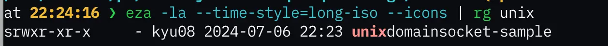

『Goならわかるシステムプログラミング第2版』を一通り読んだので感想や学んだことをまとめておく。

低レイヤに興味がある方にはとてもおすすめなので買って読んでみてください。

https://www.lambdanote.com/products/go-2

## 第1章 Go言語で覗くシステムプログラミングの世界
- デバッガを使って`fmt.Println`の動作をシステムコールまで追った。[^1]
- 当然だがデバッガを使うと変数の中身に何が入ってるかがわかって便利。
- デバッガを使ってみて別パッケージのprivate変数の中身を見ることができるのはプリントデバッグにはないデバッガの利点だと気づいた。

## 第2章 低レベルアクセスへの入口1：io.Writer
- `io.Writer`はOSが持つファイルのシステムコールの相似形
- OSでは、システムコールを**ファイルディスクリプタ**と呼ばれるものに対して呼ぶ。
- ファイルディスクリプタ(file descriptor)は一種の識別子（数値）で、この数値を指定してシステムコールを呼び出すと、数値に対応するモノへとアクセスできる。
- ファイルディスクリプタはOSがカーネルのレイヤーで用意している抽象化の仕組み。
- OSのカーネル内部のデータベースに、プロセスごとに実体が用意される。
- OSはプロセスが起動されるとまず3つの擬似ファイルを作成し、それぞれにファイルディスクリプタを割り当てる。
- `0`が標準入力、`1`が標準出力、`2`が標準エラー出力。
- 以降はそのプロセスでファイルをオープンしたりソケットをオープンしたりするたびに1ずつ大きな数値が割り当てられていく。

複数のファイル`f1`, `f2`を`os.Create()`する処理をデバッガーで追ってみたところ、それぞれファイルディスクリプタの値が`3`, `4`[^2]となっておりファイルディスクリプタの値が`3`からインクリメントされる様子を確認できた。

<!-- TODO: 画像をローカルに保存してリンクを貼る -->


## 第3章 低レベルアクセスへの入口1：io.Reader
### エンディアン変換
- リトルエンディアンでは、10000という数値(`0x2710`)をメモリに格納するとき下位バイトから順に格納する。
- ビッグエンディアンでは、上位バイトから順に格納する。
- 現在主流のCPUではリトルエンディアンが採用されている。
- ネットワーク上で転送されるデータの多くはビッグエンディアンが用いられている。
- そのため多くの環境ではネットワークで受け取ったデータをリトルエンディアンに変換する必要がある。
### `io`パッケージのいくつかの関数 / 構造体 / インターフェースの使い方
- `io.Pipe`[^3]
- `io.LimitReader`: 先頭の`n`バイトだけ読み込む
- `io.MultiReader`: 複数の`io.Reader`を1つの`io.Reader`にまとめる
- `io.SectionReader`: `offset`と`n`を指定して一部のデータだけ読み込む

## 第4章 チャネル
普段goroutineを全然使わないので忘れていることが多かった。以下学んだことメモ。

- バッファなしチャネルでは、受け取り側が受信しないと、送信側もブロックされる。[^4]
- `for task := range tasks // tasksは任意のch`のように書くと、チャネルに値が入るたびにループが回り、チャネルがクローズされるまでループが回る。

## 第5章 システムコール
### システムコールとは何か
- 特権モードでOSの機能を呼ぶこと

### CPUの動作モード
- OSの仕事は以下の2つ
    - 各種資源（メモリ、CPU時間、ストレージなど）の管理
    - 外部入出力機能の提供（ネットワーク、ファイル読み書き、プロセス間通信） 
- 動作モード
    - 実行してよいハードウェアとしての機能がソフトウェアの種類に応じて制限されている
    - OSが動作する特権モード
    - 一般的なアプリケーションが動作するユーザーモード

### システムコールが必要な理由
- 通常のアプリケーションでメモリ割り当てやファイル入出力、インターネット通信などの機能を使うために必要なのがシステムコール
- システムコールがなくてもCPUの命令そのものはほとんど使うことができる
- しかし、ユーザーモードでは計算した結果を画面に出力したり、ファイルに保存したり外部のWebサービスに送信したりできない。

`dtruss`コマンドを使ってシステムコールの呼び出しを確認しようとしたがmacOSのセキュリティの設定上何も表示されなかったのでdockerを使って確認してみることにした。

```shell
docker run -it --name stracetest golang:1.22.4-alpine3.19
apk add strace

go mod init kyu08/stracetest
# 任意のgoファイルを作成
go build ./...
strace -o strace.log ./実行ファイル
less strace.log
```

今回は`f, _ := os.Create("test_file.txt")`と`defer f.Close()`を実行するだけのgoプログラムを実行したときのシステムコールのログを確認した。以下はその一部。

```shell
rt_sigaction(SIGRT_32, {sa_handler=0x70d90, sa_mask=~[], sa_flags=SA_ONSTACK|SA_RESTART|SA_SIGINFO}, NULL, 8) = 0
rt_sigprocmask(SIG_SETMASK, ~[], [], 8) = 0
clone(child_stack=0x400001c000, flags=CLONE_VM|CLONE_FS|CLONE_FILES|CLONE_SIGHAND|CLONE_THREAD|CLONE_SYSVSEM) = 890
rt_sigprocmask(SIG_SETMASK, [], NULL, 8) = 0
--- SIGURG {si_signo=SIGURG, si_code=SI_TKILL, si_pid=889, si_uid=0} ---
rt_sigreturn({mask=[]})                 = 1139696
rt_sigprocmask(SIG_SETMASK, ~[], [], 8) = 0
clone(child_stack=0x4000062000, flags=CLONE_VM|CLONE_FS|CLONE_FILES|CLONE_SIGHAND|CLONE_THREAD|CLONE_SYSVSEM) = 891
rt_sigprocmask(SIG_SETMASK, [], NULL, 8) = 0
futex(0x4000080148, FUTEX_WAKE_PRIVATE, 1) = 1
futex(0x4000048948, FUTEX_WAKE_PRIVATE, 1) = 1
prlimit64(0, RLIMIT_NOFILE, NULL, {rlim_cur=1024*1024, rlim_max=1024*1024}) = 0
fcntl(0, F_GETFL)                       = 0x20002 (flags O_RDWR|O_LARGEFILE)
futex(0x4000049148, FUTEX_WAKE_PRIVATE, 1) = 1
fcntl(1, F_GETFL)                       = 0x20002 (flags O_RDWR|O_LARGEFILE)
fcntl(2, F_GETFL)                       = 0x20002 (flags O_RDWR|O_LARGEFILE)
openat(AT_FDCWD, "test_file.txt", O_RDWR|O_CREAT|O_TRUNC|O_CLOEXEC, 0666) = 3
futex(0x115ea0, FUTEX_WAKE_PRIVATE, 1)  = 1
futex(0x115db8, FUTEX_WAKE_PRIVATE, 1)  = 1
fcntl(3, F_GETFL)                       = 0x20002 (flags O_RDWR|O_LARGEFILE)
fcntl(3, F_SETFL, O_RDWR|O_NONBLOCK|O_LARGEFILE) = 0
epoll_create1(EPOLL_CLOEXEC)            = 4
pipe2([5, 6], O_NONBLOCK|O_CLOEXEC)     = 0
epoll_ctl(4, EPOLL_CTL_ADD, 5, {events=EPOLLIN, data={u32=1549912, u64=1549912}}) = 0
epoll_ctl(4, EPOLL_CTL_ADD, 3, {events=EPOLLIN|EPOLLOUT|EPOLLRDHUP|EPOLLET, data={u32=3997171713, u64=18446585726557487105}}) = -1 EPERM (Operation not permitted)
fcntl(3, F_GETFL)                       = 0x20802 (flags O_RDWR|O_NONBLOCK|O_LARGEFILE)
fcntl(3, F_SETFL, O_RDWR|O_LARGEFILE)   = 0
close(3)                                = 0
exit_group(0)                           = ?
+++ exited with 0 +++
```

- `openat(AT_FDCWD, "test_file.txt", O_RDWR|O_CREAT|O_TRUNC|O_CLOEXEC, 0666) = 3`の部分でファイルが作成され、ファイルディスクリプタに`3`が割り当ている
- `close(3)                                = 0`の部分で`defer f.Close()`に相当する処理が行われている

ということを確認できた。

## 第6章 TCPソケットとHTTPの実装
### ソケットとは
<!-- TODO: 「ソケットとは？」の答えになってなくない？ -->
- ほとんどのOSではアプリケーション層からトランスポート層のプロトコルを利用するときのAPIとして**ソケット**という仕組みを利用している
- HTTP/1.0と1.1はこのソケットのバイトストリーム上に作られたテキストを使ったプロトコル

### ソケットの種類（本書で説明するもののみ）
- TCP：一番使われている。安定性が高い。
- UDP：通信開始が早い。相手に一方的に送りつける。
- Unixドメインソケット：ローカル通信でしか使えないが最速。

### ソケット通信の基本構造
- どんなソケット通信も基本となる構成は次のような形態
    - サーバー：ソケットを開いて待ち受ける
    - クライアント：開いているソケットに接続し、通信する
- GoではTCP通信が確立されると、送信側、受信側の両方に相手との通信する`net.Conn`インタフェースを満たすオブジェクトが渡ってくる

### Goに組み込まれているTCPの機能（`net.Conn`）だけを使ってHTTPによる通信を実現する
- `net.Conn`だけを使ってTCPソケットの初期化や通信の確立などの普段なら`net/http`がやってくれている部分を実装した。
- `http.ListenAndServe()`のコードを読んでみたら、[golang/go/src/net/http/server.go#L3258](https://github.com/golang/go/blob/c83b1a7013784098c2061ae7be832b2ab7241424/src/net/http/server.go#L3258)で本書のハンズオンと同じようにTCPソケットの初期化を行っていることを確認できた。

### 素朴な実装の速度改善
- ①Keep-Aliveへの対応
    - HTTP/1.1から入った規格
    - HTTP/1.0ではセットの通信が終わるたびにTCPコネクションが切れる仕様になっていたが、Keep-Aliveを使うことで、しばらくの間はTCP接続のコネクションを維持して使い回すことができる。
    - TCP接続の通信には一定のオーバーヘッドがあるが、Keep-Aliveを使うことでそのオーバーヘッドを削減できる。
- ②レスポンスの圧縮
    - レスポンスを圧縮することで、通信量を削減でき速度向上につながる。
    - レスポンスヘッダーは圧縮されないため、少量のデータを通信する場合は効率が悪くなる。そのため実際のデータ量に応じて圧縮するかどうかを判断する必要がありそう。
- ③チャンク形式のボディー送信
    - 動画など大きいデータを送信する場合、データを分割して送信することでデータの送信が完了する前に受信側でデータを処理できるようになる。また、すべてのデータをメモリに展開する必要もなくなるのでメモリの使用量を抑えることができるというメリットもある。
    - チャンク形式ではヘッダーに送信データのサイズを書かないかわりに`Transfer-Encoding: chunked`というヘッダーを付与する。
- ④パイプライニング
    - 送受信を非同期化する方法

## 第7章 UDPソケットを使ったマルチキャスト通信
### UDPとTCPの用途の違い
UDPはTCPと同じトランスポート層のプロトコルで以下のような特徴がある。

- 誰と繋がっているか管理しない
- データロスの検知をすることも通信速度の制限をすることもしない
- パケットの到着順序も管理しない
- 複数のコンピュータに同時にメッセージを送ることが可能な「マルチキャスト」と「ブロードキャスト」をサポートしている。（TCPにはない機能）
- UDPの利用例としてはDNSやNTP, WebRTCなどがある。

### UDPのマルチキャストの実装例
- マルチキャストはリクエスト側の負担を増やすことなく多くのクライアントに同時にデータを送信できる仕組み。

### UDPとTCPの機能面の違い
- TCPには再送処理とフロー処理がある。

#### 再送処理
- TCPでは送信するメッセージに**シーケンス番号**が入っているので、受信側ではこの数値をみることでパケットの順序を管理できる。
- 受信側はメッセージを受け取ると、受信したデータの**シーケンス番号**と**ペイロードサイズの合計**を確認応答番号として返信する。
- 送信側はこの応答確認番号が受け取れなかった場合に再送処理を行う。

#### フロー処理
- 受信側がリソースを用意できていない状態で送信リクエストが集中して通信内容が失われるのを防ぐための仕組みを**ウィンドウ制御**という。
    - 具体的には、受信用のバッファ（ウィンドウ）をあらかじめ決めておき送信側ではそのサイズまでは受信側からの受信確認を待たずにデータを送信できる。
- 受信側のデータの読み込みが間に合わない場合には、受信できるウィンドウサイズを受信側から送信側に伝えて通信量を制御できる。これを**フロー制御**という。

#### フレームサイズ
- UDPレイヤーで取り扱えるデータは約64キロバイトまで。
- UDPではデータの分割などはアプリケーションで面倒を見る必要がある。

#### 輻輳制御とフェアネス
- **輻輳制御**とは、ネットワークの輻輳（渋滞）を避けるように流量を調整し、そのネットワークの最大効率で通信できるようにするとともに複数の通信をお互いに**フェアに行う**ための仕組み。
- TCPには輻輳制御が備わっており、そのアルゴリズムにはさまざまな種類がある。
- UDPにはTCPのような輻輳制御の仕組みはなく、流量の制御はUDPを利用する各プログラムに委ねられている。そのため、UDPとTCPを利用するアプリケーションがそれぞれあって、UDPを利用するアプリケーションでフェアネスが考慮されていない場合には、**両方の通信が重なった時に遠慮する機能が組み込まれたTCPの通信速度だけが極端に落ち込む**こともある。

## 第8章 高速なUnixドメインソケット
- UnixドメインソケットはPOSIX系OSで提供されている機能で、コンピュータ内部でしか使えない代わりに高速な通信が可能。
- Unixドメインソケットには、TCP型（ストリーム型）とUDP型（データグラム型）の両方の使い方ができる。

### Unixドメインソケットの基本
- TCPとUDPによるソケット通信が外部のネットワークにつながるインターフェースに接続するのに対し、Unixドメインソケットはカーネル内部で完結する高速なネットワークインターフェースを作成する。
- Unixドメインソケットを使うことで、ウェブサーバーとNGINXなどのリバースプロキシとの間、あるいはウェブサーバーとデーターベースとの間の接続を高速にできる場合がある。
- Unixドメインソケットを開くには、ファイルシステムのパスを指定する。サーバープロセスを起動するとファイルシステム上の指定したパスにソケットファイルが作成される。
- Unixドメインソケットで作成されるのはソケットファイルと呼ばれる特殊なファイルであり、通常のファイルのような実体を持たない。あくまでもプロセス間の高速な通信としてファイルというインターフェースを利用するだけ。

以下はソケットファイルが作成されている様子。ソケットファイルは先頭が"s"で始まる。



### UnixドメインソケットとTCPのベンチマーク
- Unixドメインソケットを使った実装とTCPを経由した実装のベンチマークの比較をすると筆者の環境だとUnixドメインソケットの方が10倍ほど高速だった。

```shell
$ go test -bench . -benchmem
goos: darwin
goarch: arm64
pkg: github.com/kyu08/go-system-programming/bench
BenchmarkTCPServer-8                4165            327038 ns/op           52175 B/op        110 allocs/op
BenchmarkUDSStreamServer-8         42742             27837 ns/op           16762 B/op         59 allocs/op
PASS
ok      github.com/kyu08/go-system-programming/bench    4.788s
```

## 第9章 ファイルシステムの基礎とGo言語の標準パッケージ
この章では`os`パッケージと`path/filepath`パッケージの主要な関数の使い方が紹介されていた。

### ファイル/ディレクトリを扱うGo言語の関数たち

- 2つのファイルの同一性の判定: `os.Samefile()`
- ファイルのパーミッション、オーナー、タイムスタンプの変更: `os.Chmod()`, `os.Chown`, `os.Chtimes()`
- ハードリンク、シンボリックリンクの作成: `os.Link`, `os.Symlink()`
- ファイル一覧の取得: `dir, _ := os.Open(path)` -> `dir.Readdir()`

### OS内部におけるファイル操作の高速化
- CPUにとってディスクの読み書きはとても遅い処理であり、なるべく最後までやらないようにしたい。LinuxではVFSの内部に設けられているバッファを利用することでディスクに対する操作をなるべく回避している。

### `path/filepath`パッケージの関数たち
- パスの最後の要素を返す: `filepath.Base()`
- パスのディレクトリ部分を返す: `filepath.Dir()`
- パスをディレクトリとパス名に分割する: `filepath.Split()`
- ファイルの拡張子を返す: `filepath.Ext()`
- `/some/../path`や`another//path`のような形式のパスを整える: `filepath.Clean()`
- パターンにマッチするファイルの判定: `filepath.Match()`
- ディレクトリのトラバース: `filepath.Walk()`

想像よりも標準パッケージでいろんなことができるのでこの辺りの操作をしたくなったら自作関数を書く前に標準パッケージを探してみるのが良さそうだと思った。

## 第10章 ファイルシステムの最深部を扱うGo言語の関数
### ファイルの変更監視（`syscall.Inotify`）
プログラムでファイルを監視する方法には次の2種類がある。
1. 監視したいファイルをOS側に通知しておいて、変更があったら教えてもらう（パッシブな）方式
1. タイマーなどで定期的にフォルダを走査し、`os.Stat()`などを使って変更を探しに行く（アクティブな）方式

アクティブな方式の方がコード量は少ないが監視対象が増えるとCPU負荷やIO負荷が増える。

パッシブな方式はファイルの変更検知が各OSでシステムコールやAPUIとして提供されている一方で環境ごとのコード差は大きくなる。

ここでは [fsnotify/fsnotify.v1](https://github.com/fsnotify/fsnotify)を用いてファイルの変更検知プログラムを作成した。

fsnotify.v1では、Linuxの場合はinotify系APIが、BSD系OSの場合はkqueueが使われている。

### ファイルのメモリへのマッピング（`syscall.Mmap()`）
`syscall.Mmap()`を使うことでファイルの中身をそのままメモリ上に展開したり、メモリ上で書き換えた内容をそのままファイルに書き込むことができる。

[edsrzf/mmap-go](https://github.com/edsrzf/mmap-go)では`mmap.Map()`を使うことでファイルをメモリに展開できる。`mmap.Map()`は次のようなシグネチャを持つ。

```go
func Map(f *os.File, prot, flags int) (MMap, error)
```

2つ目の引数に次のような値を指定することでメモリ領域に対して許可する操作を設定できる。

- `mmap.RDONLY`: 読み込み専用
- `mmap.RDWR`: 読み書き可能
- `mmap.EXEC`: 実行可能にする
- `mmap.COPY`: コピーオンライト

コピーオンライトが指定されると、複数のプロセスが同じファイルをマッピングしているときに、カーネル上は1つ分のみメモリ領域が使用され、それ以上のメモリを消費しない。

しかし、その領域内でメモリ書き換えが発生すると、その領域がまるごとコピーされる。このようにすることでメモリ消費量をうまく節約できる。

### 同期・非同期 / ブロッキング・ノンブロッキング
- 同期処理: OSにI/Oタスクを投げて、入出力の準備ができたらアプリケーションに処理が返ってくる
- 非同期処理: OSにI/Oタスクを投げて、入出力の準備ができたら通知をもらう
- ブロッキング処理: お願いしたI/Oタスクの結果の準備ができるまで待つ（自分は停止）
- ノンブロッキング処理: お願いしたI/Oタスクの結果の準備ができるのを待たない（自分は停止しない）

### select属のシステムコールによるI/O多重化
非同期・ブロッキングは1スレッドでたくさんの入出力を効率よく扱うための手法でありI/O多重化とも呼ばれる。それを効率よく実現するAPIのことを本書では**select属**と総称する。

並行処理を使うことで小さい規模のI/Oの効率化は十分に行えるが、select属はC10K問題と呼ばれる、万の単位の入出力を効率よく扱うための手法として有効。

### 第11章 コマンドシェル101
シェルとは、ユーザーがコンピューターを操作するために使う接点となるシステムにおいてコンピューターシステムの殻（shell）となるプログラムのこと。

#### シェルがないシステム
Distrolessと呼ばれるコンテナイメージはシェルがないため、セキュリティホールをついてシステムに侵入されることがない。[^5]（当然攻撃の脅威がゼロになるわけではない）

#### シェルがコマンドを起動するまで
シェルがコマンドを起動するまでには次のようなことを行っている。

1. ユーザーの入力を受け付ける
1. 入力されたテキストの分解
1. コマンドと引数の前処理
1. 実行ファイルの探索
1. ワイルドカードの展開
1. プロセスの起動


「11.5.3コマンドと引数の前処理」で紹介されていたが、`$(which nvim)`と同様に`` `which nvim` ``でもコマンドの実行結果を変数に代入できるのは知らなかった。

## 第12章 プロセスの役割とGo言語による操作
- OSが実行ファイルを読み込んで実行するには、そのためのリソース（CPU、メモリ）を用意する必要がある。そのようなリソースをまとめたプログラムの実行単位のことを**プロセス**と呼ぶ。プロセスはOSが実行ファイルを読み込んで実行するときに新しく作られる。
- プロセスにはプロセスごとにユニークな識別子がある。（**プロセスID**）。Go言語では`os.Getpid()`で取得できる。

### プロセスの入出力
すべてのプロセスは少なくとも次の3つの入出力データを持っている。
- 入力：コマンドライン引数
- 入力：環境変数
- 出力：終了コード

### OSから見たプロセス
- OSの仕事はたくさんあるプロセスに効率よく仕事をさせること
- Linuxではプロセスごとに`task_struct`型の**プロセスディスクリプタ**と呼ばれる構造体を持っている。
    - 基本的にはプロセスから見た各種情報と同じ内容だが、そこには含まれていない要素もいくつか存在する。
    - 例えば、**どこからどこまでが自分のメモリ領域かというメモリブロックの情報**や**スタック領域がどこにありプログラムが静的に確保するデータや動的に確保するデータがどのようにレイアウトされるか**もOSが持つプロセスの情報の中にある。

### プロセスの出力に色づけをする
プロセスの出力に色をつけたい場合には**ANSIエスケープシーケンス**を使うことができる。

自分が利用したことある[^6]Rustの[`colored`](https://crates.io/crates/colored)クレートも確認したところ実際にANSIエスケープシーケンスを使ってターミナルに色をつけていた。

```rust
    #[cfg_attr(feature = "no-color", ignore)]
    #[test]
    fn compute_style_simple_fg_blue() {
        let blue = "\x1B[34m";

        assert_eq!(blue, "".blue().compute_style());
    }
```
https://github.com/colored-rs/colored/blob/775ec9f19f099a987a604b85dc72ca83784f4e38/src/lib.rs#L805-L811 より

調べてみたところ`\x1B`でも`\e`でもエスケープシーケンスを表現できるらしい。[^7]

### 外部プロセスに対して自分が擬似端末だと詐称する
ライブラリによっては、自分が繋がっている先が擬似端末かどうかでエスケープシーケンスを出力するかどうかを決定している。

子プロセスの出力を色づけするためには、親を擬似端末だと詐称することでエスケープシーケンスを出力させることができる。

### デーモン化
普通のプログラムはシェルのプロセスの子になってしまうので、ログアウトしたりシェルを閉じたりするだけで終了してしまう。

そのような場合でも終了しないように下記のような特別な細工が施されたプロセスが**デーモン**である。

- セッションID、グループIDを新しいものにして既存のセッションとグループから独立
- カレントのディレクトリはルートに移動
- フォークしてからブートプロセスのinitを親に設定し、実際の親はすぐに終了
- 標準入出力も起動時のものから切り離される(通常は`dev/null`に設定される)

## 第13章 シグナルによるプロセス間の通信
シグナルには主に2つの用途がある。

- **プロセス間通信**: カーネルが仲介してあるプロセスから別のプロセスへとシグナルを送るケース。自分自身にシグナルを送ることもできる。
- **ソフトウェア割り込み**: システムで発生したイベントがシグナルとしてプロセスに送られる。シグナルを受け取ったプロセスは現在置くなっているタスクを中断してあらかじめ登録しておいた処理を実行する。

システムコールはユーザー空間で動作しているプロセスからカーネル空間にはたらきかけるためのインターフェースだが、その逆方向がシグナルだと考えることができる。

- システムコールでは最大7つほどの引数を指定できるのに対し、ソフトウェア割り込みとしてのシグナルで送信できるのはその種類のみ。
- プロセスは受け取ったシグナルを無視するか補足して処理する。

### シグナルのハンドラを書く
Goでは次のように`signal.NotifyContext()`を使ってシグナルを受け取ることができる。

```go
package main

import (
	"context"
	"fmt"
	"os/signal"
	"syscall"
	"time"
)

func main() {
	ctx := context.Background()
	sigctx, cancel := signal.NotifyContext(ctx, syscall.SIGINT, syscall.SIGTERM)
	defer cancel()
	toctx, cancel2 := context.WithTimeout(ctx, time.Second*5)
	defer cancel2()

	select {
	case <-sigctx.Done():
		fmt.Println("signal")
	case <-toctx.Done():
		fmt.Println("timeout")
	}
}
```

KubernetesやDockerでは外からタスクを終了させるとき、まずSIGTERMをアプリケーションに対して送信する。(SIGTERM: `kill()`システムコールや`kill`コマンドがデフォルトで送信するシグナル。プロセスを終了させるもの)

(GoアプリケーションのGraceful Shutdownの実装例でSIGTERMをハンドリングするのをよく見るのはだからか、と納得した。)

## 第14章 Go言語と並列処理
### 並行処理と並列処理の違い
- 並行処理: 1つのコアで複数のタスクを素早く切り替えながら処理すること
- 並列処理: 複数のコアを使って複数のタスクを同時に処理すること

### チャネル
- Go言語で簡単に並列処理を書くための道具としてgoroutineとチャネルがある。
- チャネルを使うことでデータの入出力を**直列化できる。**

### スレッドとgoroutineの違い
- スレッドとはプログラムを実行するためのものであり、OSによって手配される。
- プログラムからみたスレッドは「**時間が凍結されたプログラムの実行状態**」で、CPUが演算に使ったり計算結果や状態を保持したりする**レジスタ**と呼ばれるメモリと**スタックメモリ**が含まれる。
- OSは凍結状態のプログラムの実行状態を復元して各スレッドに短時間ずつ処理をさせる。実行予定のスレッドは**ランキュー**と呼ばれるリストに入っている。
- **スレッドがCPUコアに対してマッピングされる**のに対し、**gouroutineはOSのスレッドにマッピングされる**点が通常のスレッドとgoroutineとの最大の違い。
    - goroutineはOSスレッドの1~2MBと比べると初期スタックメモリのサイズが小さい(2KB)ため起動処理が軽い。
    - また、gouroutineはOSに処理を渡さずに作成できるのでカーネルとのタスク切り替えのコストも小さい。

### goroutineのメリット
大量のクライアントからのリクエストを効率よく捌きたいとき（いわゆるC10K）に、クライアントごとに1つのgoroutineを割り当てたとしても少ないメモリ消費量で処理できる（前述の通りgoroutineは起動時の初期スタックメモリのサイズが小さいため）

## 第15章 並行・並列処理の手法と設計のパターン
### 代表的な並行・並列処理の手法
- マルチプロセス
- イベント駆動
- マルチスレッド
- ストリーミング・プロセッシング

### イベント駆動
- 主に並列化ではなく並行処理のために使われる。
- I/Oバウンドなプログラムで用いられる。
- OSに依頼したデータ受信の仕事が終わるたびにコールバックが返ってくる仕組み。
- 単体ではCPUを使いこなしにくい点が欠点。

### マルチスレッド
- 同じメモリ空間内で多くのCPUが同時に実行するための仕組み
    - Linuxではプロセスもスレッドもカーネル上は同じ構造体として表現されている。親のプロセスとメモリ空間を共有していなければプロセス、共有していればスレッド。
- 利点はCPUのパフォーマンスを引き出すことができる点。
- 欠点はプロセスほどではないが、OSのスレッドの場合は比較的大きなスタックメモリ（1~2MB）を必要とし、起動時間もややかかる。そのためスレッドプールを作っておき、必要になったらすぐ使えるようにする、ということが行なわれている。


### Goにおける並行・並列処理のパターン集
アムダールの法則: 並列化を導入するとどれだけ効率が改善するかを表す数式

```
S(N) = 1 / ((1 - P) + P/N)
```
ここで`P`は並列化できる仕事の割合、`N`は並列数である。

P = 0.5, N = ∞のとき、S(N) = 2倍になり、P = 0.9, N = ∞のとき、S(N) = 10倍になる。このことからもわかるように、並列数よりも並列化できるタスクの割合が支配的になる。

Pを改善するためのアイディアとして次のような手法が考えられる。

- 同期処理を非同期にする
- 非同期にしたものを同期化する
- タスク生成と処理を分ける（Producer-Consumerパターン）
- 開始した順で処理する（チャネルのチャネル）
- タスク処理が詰まったら待機（バックプレッシャー）
- 並列なForループ
- 決まった数のgoroutineでタスクを消化する（ワーカープール）
- 依存関係のあるタスクを表現する（Future/Promise）
- イベントの流れを定義する（ReactiveX）
- 自立した複数のシステムで協調動作（アクターモデル）


#### 同期 -> 非同期化
I/O処理などの重いタスクを非同期化する

#### 非同期 -> 同期化
非同期化したタスクはどこかで同期化する必要がある。そのための一番簡単な手法がチャネル。

#### タスク生成と処理を分ける（Producer-Consumerパターン）
GoではチャネルでProducerとConsumerを接続することで簡単に実現できる。

#### 開始した順で処理する（チャネルのチャネル）
チャネルを用いると複数の処理を終了した順に取り出すことができる。
```go
// 終了した順に書き出し
// チャネルに結果が投入された順に処理される
func writeToConn(responses chan *http.Response, conn net.Conn) {
	defer conn.Close()
	// 順番に取り出す
	for response := range responses {
		response.Write(conn)
	}
}
```

チャネルのチャネルを使うと処理を開始した順で処理をできる。
```go
// 開始した順に書き出し
// チャネルにチャネルを入れた(開始した)順に処理される
func writeToConn(sessionResponses chan chan *http.Response, conn net.Conn) {
	defer conn.Close()
	// 順番に取り出す
	for sessionResponse := range sessionResponses {
		// 選択された仕事が終わるまで待つ response := <-sessionResponse response.Write(conn)
	}
}
```

#### タスク処理が詰まったら待機（バックプレッシャー）
以下のようなバッファ付きチャネルを使うことで実現できる。
```go
tasks := make(chan string, 10)
```

#### 並列Forループ
- forループ内の処理をgoroutineで実行することでループ処理を並列化できる。
- ループ内部の処理が小さすぎるとオーバーヘッドのほうが大きくなり効率が上がらないことがあるので注意が必要。

#### 決まった数のgoroutineでタスクを消化する（ワーカープール）
- 特にCPUバウンドな処理ではCPUのコア数以上にgoroutineを作ってもスループットは上がらないため、CPUコア数分のワーカーを作成してタスクを消化するのが効果的な場合がある。

#### 依存関係のあるタスクを表現する（Future/Promise）
Futureを`chan string`で表現すると、必要なデータが揃ったらタスクを逐次実行できる。

後続の処理に結果を引き継ぎたいが、処理自体は可能な限り非同期で実行したい場合に有効そう。

```go
func readFile(path string) chan string {
	// ファイルを読み込み、その結果を返すFutureを返す
	promise := make(chan string)
	go func() {
		content, err := os.ReadFile(path)
		if err != nil {
			fmt.Printf("read error %s\n", err.Error())
			close(promise)
		} else {
			// 約束を果たした
			promise <- string(content)
		}
	}()
	return promise
}

func printFunc(futureSource chan string) chan []string { 
    // 文字列中の関数一覧を返すFutureを返す
	promise := make(chan []string)
	go func() {
		var result []string
		// futureが解決するまで待って実行
		for _, line := range strings.Split(<-futureSource, "\n") {
			if strings.HasPrefix(line, "func ") {
				result = append(result, line)
			}
		}
		// 約束を果たした
		promise <- result
	}()
	return promise
}

func main() {
	futureSource := readFile("main.go")
	futureFuncs := printFunc(futureSource)
	fmt.Println(strings.Join(<-futureFuncs, "\n"))
}
```

また、次のような構造体を定義することで上記のFutureの値を複数回読み取ることができる。（上記の実装ではバッファなしチャネルを使っているので複数回受信してしまうと処理がブロックされてしまう）
```go
type StringFuture struct {
	receiver chan string
	cache    string
}

func NewStringFuture() (*StringFuture, chan string) {
	f := &StringFuture{
		receiver: make(chan string),
	}
	return f, f.receiver
}

func (f *StringFuture) Get() string {
	r, ok := <-f.receiver
	if ok {
		close(f.receiver)
		f.cache = r
	}
	return f.cache
}

func (f *StringFuture) Close() {
	close(f.receiver)
}
```

#### イベントの流れを定義する：ReactiveX
ここでは[RxGo](https://github.com/ReactiveX/RxGo)を使ってイベントの流れを定義する方法が紹介されていた。
まずこのようにwatcherを定義する。
```go
watcher := observer.Observer{
    NextHandler: func(item any) {
        line := item.(string)
        if strings.HasPrefix(line, "func ") {
            fmt.Println(line)
        }
    },
    ErrHandler: func(err error) {
        fmt.Printf("Encountered error: %v\n", err)
    },
    DoneHandler: func() {
        fmt.Println("Done!")
    },
}
```
以下のようにすると`NextHandler`に登録された関数に`line`が渡される。
```go
emitter <- line
```
そして次のようにすると`ErrHandler`に登録された関数が呼ばれる。
```go
emitter <- err
```

渡ってきた値に応じて処理を分岐させたく、かつ何度も同一のイベントが発生するケースではこの方法を使うと良さそう。

#### 自律した複数のシステムで協調動作：アクターモデル
- アクターと呼ばれる自律した多数のコンピューターが協調して動作するというモデル。
- 各アクターは別のアクターから送られてくるメッセージを受け取る**メッセージボックス**を持つ。

## 第16章 Go言語のメモリ管理
### 仮想メモリ
現代のOSではプロセスはメモリを読み書きするのに物理的なアドレスを直接扱うのではなく、プロセスごとに仮想的なメモリアドレス空間があり、それを使ってメモリにアクセスしている。この仮想的なメモリアドレス空間のことを仮想メモリという。

仮想メモリのアドレスから実際の物理メモリにアクセスするために**ページテーブル**というデータ構造が使われる。**ページ**とはメモリを管理する単位のこと。

仮想メモリのおかげで実際の保存領域が飛び飛びになっていたとしてもプロセスからはフラットなメモリ領域が確保されているように見える。

仮想メモリは物理メモリのアドレスと1対1対応しているわけではなく、物理メモリのあるアドレスが複数の仮想メモリから参照されることもある。こうすることで共有ライブラリなどを複数のプロセスで利用でき省メモリになる。

### OSカーネルがプロセスのメモリを確保するまで
- プロセスは起動時にOSからメモリをもらう。OSはプロセスごとに仮想メモリの領域を確保する。
- ユーザーのメモリ空間は大きく3つの連続したメモリ領域に分かれる。3つの領域の間の空きスペース分はメモリの確保が行われない。
    ```
    | ①プログラム + 静的データ | ヒープとして使われる領域 | ②共有ライブラリ |      | ③スタックなど |
    小さいアドレス                                                                大きいアドレス -> 
    ```

### スタック
関数を呼ぶとリターンアドレスや新しい関数のための作業メモリ領域として**スタックフレーム**と呼ばれるメモリ領域が確保される。

スタックフレームはスレッドごとにあらかじめ確保されているメモリブロックに対して順番に追加したり削除されたりされるだけなので割当のコストはほぼゼロ。

### Go言語でのスタックとヒープの使い分け
Go言語では変数のデータをヒープに置くかスタックに置くかはコンパイラが自動的に判断する。以下はその一部。

- `new`で初期化してもその関数内でしか利用されなければスタックに確保される。
- ローカル変数として宣言してもそのポインタを他の関数に渡したり、関数の返り値として返すような場合にはヒープに確保される。

Go言語でメモリがスタックとヒープのどちらに確保されるかを知りたい場合にはビルド時に`-gcflags -m`を渡すことで確認できる。

ということで次のコードを使って上記の挙動を確認してみる。

```go
package main

import "fmt"

func main() {
	strValue := "Hello, World!" // スタックに確保される(関数内でしか利用されていないため)
	_ = strValue + ""

	strPtr := new(string) // スタックに確保される(関数内でしか利用されていないため)
	_ = *strPtr + ""

	strPtr2 := new(string) // ヒープに確保される(他の関数に渡されているため)
	receiveStrPtr(strPtr2)

	strPtrFromFunc := returnStrPtr() // スタックに確保される(関数内でしか利用されていないため)
	_ = *strPtrFromFunc + ""
}

func receiveStrPtr(argStrPtr *string) {
	fmt.Printf("argStrPtr: %v\n", argStrPtr)
}

func returnStrPtr() *string {
	str := "Hello, World!" // ヒープに確保される(関数の返り値として返されているため)
	return &str
}
```

`-gcflags -m`をつけてビルドしてみると次のようになりコードコメント通り、`strPtr2`と`str`がヒープに確保されていることがわかった。

```sh
$ go build -gcflags -m main.go
# command-line-arguments
./main.go:19:6: can inline receiveStrPtr
./main.go:23:6: can inline returnStrPtr
./main.go:13:15: inlining call to receiveStrPtr
./main.go:15:32: inlining call to returnStrPtr
./main.go:13:15: inlining call to fmt.Printf
./main.go:20:12: inlining call to fmt.Printf
./main.go:7:15: strValue + "" does not escape
./main.go:9:15: new(string) does not escape
./main.go:10:14: *strPtr + "" does not escape
./main.go:12:16: new(string) escapes to heap
./main.go:13:15: ... argument does not escape
./main.go:16:22: *strPtrFromFunc + "" does not escape
./main.go:19:20: leaking param: argStrPtr
./main.go:20:12: ... argument does not escape
./main.go:24:2: moved to heap: str
```

### ガベージコレクタ
Goをはじめとして多くの言語ではマークアンドスイープという方式が採用されている。

マークアンドスイープ方式では、まずメモリの領域をスキャンして必要なデータか否かをマークしていき、次のフェーズで不要なものを削除する。

マークアンドスイープ方式では、不要なメモリを削除する間にプログラム全体を停止する必要がある。（これをストップザワールドと呼ぶ）

Goではバージョンを重ねる事にストップザワールドの時間の短縮化が進んでいる。

## 第17章 実行ファイルが起動するまで
最終的にCPUで実行されるバイナリはメモリ空間に単に命令が並んだもので、そこにはブロックのような概念は存在しない（Goでいうと`{`と`}`で囲まれた処理の塊）。

アセンブリ言語には関数のブロックのような概念はないが、その代わりにラベルという概念がある。

### ランタイムの役割
Goに限らずC言語でもRustでも何かしらのプログラミング言語で生成したアプリケーションは「ランタイム」と呼ばれるライブラリを利用したプログラムになるのが一般的。

ラインタイムライブラリが最終的にはOSのカーネルにシステムコールを発行して仕事を依頼し、メモリ管理やファイルやネットワークアクセスを実現する役割を担う。

ラインタイムライブラリがなければ、OSに仕事を依頼するところも自分で作成する必要がある。

### リンカーの役割
> a computer program that takes one or more object files generated by a compiler or generated by an assembler and links them with libraries, generating an executable program or shared library
> 
> [Linker - Wikipedia](https://en.wikipedia.org/wiki/Linker) から引用

上記を翻訳すると「コンパイラまたはアセンブラによって生成された1つ以上のオブジェクトファイルをライブラリと結合し実行可能ファイルまたは共有ライブラリを生成するプログラム」CPUが命令を読み込んで実行が開始される。実行中に発生する関数呼び出しはすでにリンカーによってアドレスが解決されているので示されたアドレスにジャンプするだけで高速に実行される。

### 実行ファイルのメモリ配置
OSがアプリケーションの実行ファイルを最初にロードしてくる部分についての解説。

実行ファイルのフォーマットによって異なる。
- LinuxなどのPOSIX系OS: ELF形式
- Windows: PE(Portable Executable)形式
- macOS: Mach-O形式

実行ファイルには次のようなデータが格納されている。

- この実行ファイルが対象としているCPUアーキテクチャの種類
- 実行ファイル中に含まれるセクションをどのメモリアドレスに配置するか、そのときのセクション名と実行権限
- プログラム起動時に最初に呼び出す命令が格納されているアドレス
- 実行ファイルの実行に必要な共有ライブラリの情報
- 実行コードのセクション
- 静的に初期化された変数のセクション

セクションは実行ファイルフォーマットを構成するバイナリデータのブロックのことで以下のようなものがある。

- `TEXT`: 機械語の実行コードが格納されるセクション
- `DATA`: 実行コードを含まない静的に確保された初期化済み（データがすでに入っている）のメモリ領域
- `BSS`: 変数が置かれる領域で初期化されていない（すべてゼロ）メモリ領域

OSはこの実行ファイルフォーマットに従って実行ファイルに含まれるセクションを適切なアドレスに配置していく。[^8]その後実行ファイルフォーマットに書かれた初期実行アドレスを実行することでアプリケーションが起動する。

### Goのプログラムの起動
Goで書かれたソースコードが実行されるまでの流れは以下。

1. Goで書かれたアプリケーションをコンパイルすると実行ファイルが作成される
1. コンパイル済みのGoプログラムを実行すると実行環境のランタイムにある`$GOROOT/src/runtime/asm_(ARCH名).s`というファイルのなかにある`_rt0_(ARCH名)`という関数が呼ばれる。このプロシージャの中では以下のような処理が実行される。
    1. 最初のgoroutineの初期化
    1. OSから渡されるコマンドライン引数`os.Args`のパース
    1. コンピュターで利用可能なCPUコア数の取得
1. `$GOROOT/src/runtime/proc.go`の`schedinit()`関数の中で以下のような処理が実行される。
    - スタックを初期化
    - メモリマネージャを初期化し、Mを初期化
    - mapの内部で使われるハッシュアルゴリズムの初期化
    - モジュール機能向けのモジュール情報や型情報の取得
    - シグナルハンドラの初期化
    - コマンドライン引数と環境変数の初期化
    - ガベージコレクタの初期化

次に新しいgoroutineを作って`$GOROOT/src/runtime/proc.go`の`main()`関数が呼び出される。そこでは以下のような流れで処理が進む。

1. `runtime.lockOSThread()`
1. (ランタイムの)`init()`
1. `main・init()`(アプリケーションのmainパッケージの`init()`関数)
1. `runtime.unlockOSThread()`
1. `main・main()`(アプリケーションのmainパッケージの`main()`関数)


### プログラムが実行されるまでの流れ
ここまでの理解をもとに「プログラムが実行されるまでの流れ」を書いてみる。

1. コンパイラがソースコードをコンパイルする
1. リンカーがコンパイル済みのオブジェクトファイルをリンクし実行可能ファイルを生成する
1. ユーザーが実行可能ファイルを実行する(e.g. ターミナルから呼び出す)
1. OSがプロセスを生成し、プロセスの実行に必要な仮想メモリ空間を割り当てる
1. OSが実行ファイルの内容をディスクからメモリに読み込み、仮想アドレス空間に適切に配置する
1. メインスレッドでプログラムが実行される(プロセスが生成されると自動的にメインスレッドが作成される)

[^1]: Neovimでのデバッガの環境構築は [nvim-dapでGolangのデバッグ環境構築](https://zenn.dev/saito9/articles/32c57f776dc369) を参考にした
[^2]: `Sysfd`の定義はgolang/go/src/internal/poll/fd_unix.go#L23(https://github.com/golang/go/blob/c83b1a7013784098c2061ae7be832b2ab7241424/src/internal/poll/fd_unix.go#L23) にある。
[^3]: `io.Pipe`の使いどころに関しては [Go言語のio.Pipeでファイルを効率よくアップロードする方法](https://medium.com/eureka-engineering/file-uploads-in-go-with-io-pipe-75519dfa647b) が大変参考になった。
[^4]: cf. [kyu08/go-system-programming/4-channel/unbufferedchannel/main.go#L8](https://github.com/kyu08/go-system-programming/blob/b9da4a0ce759b2df4ce884ab61248fb893b60bef/4-channel/unbufferedchannel/main.go#L8)
[^5]: Distrolessに対して「コンテナイメージが軽量になる」以外のメリットを感じていなかったが書かれている通りセキュリティ面でもメリットがあると気付いた。
[^6]: fzf-makeの出力の一部に色を付けるために使っている。 https://github.com/kyu08/fzf-make/blob/12789acd19bc24daa60ba7eb84973dab18fe7a52/src/usecase/execute_make_command.rs#L5
[^7]: https://ufcpp.net/blog/2023/12/escape-escape/
[^8]: 仮想メモリ空間についてはκeenさんのこちらの記事がとてもわかりやすかった。[メモリとスタックとヒープとプログラミング言語](https://keens.github.io/blog/2017/04/30/memoritosutakkutohi_puto/)
