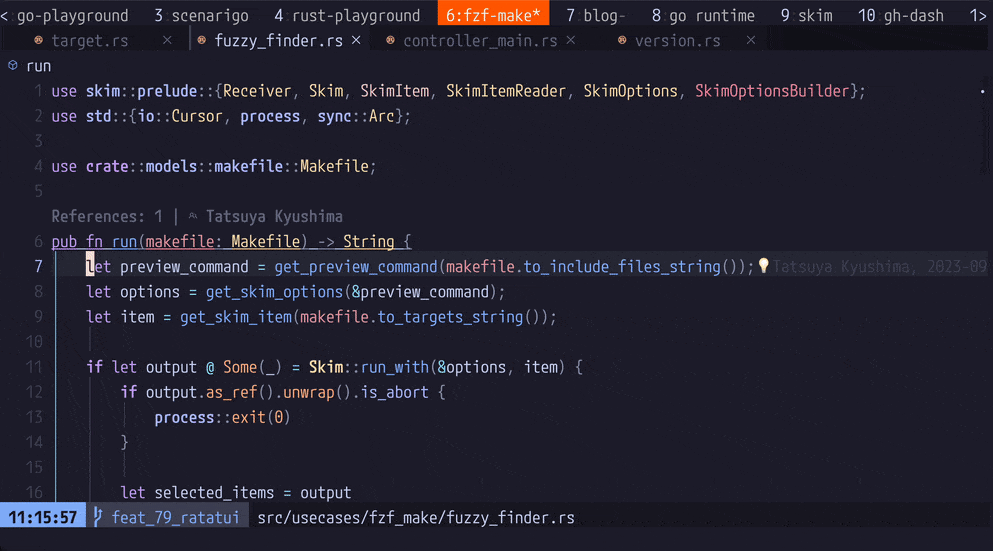

[ThePrimeagen/harpoon](https://github.com/ThePrimeagen/harpoon)というNeovimプラグインを使ってみたので気になっている人の参考になればと思い感想を書いてみる。

## できること
ファイルをマークしてquick_menu(マークしたファイルの一覧)からファイルを開くことができる。操作している様子は以下の通り。

### 1. ファイルをマークして
`:lua require("harpoon.mark").add_file()`を実行してファイルをマーク

### 2. quick_menuからファイルを開く
`:lua require("harpoon.ui").toggle_quick_menu()`を実行してマークしたファイル一覧からファイルを開く

機能は他にもありそう[^1]だが筆者はこの機能しか使ってないので割愛。

## 嬉しさ

個人開発などファイル数が少ないプロジェクトだとそこまで効果を感じないが業務では(当然だが)一定数のファイルがあり、かつ定義ジャンプを繰り返しているとバッファにはたくさんファイルが存在しているのでtelescopeなどのfuzzy-finderプラグインを使ったとしてもファイルの行き来には多少時間がかかってしまっていた。

harpoonの導入によってファイルの行き来が爆速になってかなり作業効率が爆上がりした。

## 推しポイント
### 1. マークしたファイルが一度エディタを閉じても保持される
LSPが不調だったりしてNeovimを再起動することがたまにあるので地味に便利。

(一度Neovimを閉じてもマークしたファイルが保持されている様子。)

### 2. 自由に編集できる quick_menu
作者自身もお気に入りと言及しているが[^2]quick_menuは純粋なテキストなので自由に編集できる。

つまりこんな感じで`dd` -> `y`のようなコマンドで自由に順番を入れ替えたり削除したりできる。普段のvimの操作感で扱えるのでとても直感的で使いやすくて嬉しい。

quick_menuを自由に編集している様子[^3]

## まとめ
気になった方はぜひ試してみてください。

インストール方法はこちら

https://github.com/ThePrimeagen/harpoon?tab=readme-ov-file#-installation

#### 余談
そういえばThePrimeagenの好きな動画があるので貼っておく。

https://www.youtube.com/watch?v=nMHxdz-N7EU

[^1]: 他には[ターミナルを開く機能](https://github.com/ThePrimeagen/harpoon?tab=readme-ov-file#terminal-navigation)とか[telescope](https://github.com/ThePrimeagen/harpoon?tab=readme-ov-file#telescope-support)や[tmux](https://github.com/ThePrimeagen/harpoon?tab=readme-ov-file#tmux-support)との連携機能もある模様
[^2]: https://github.com/ThePrimeagen/harpoon/issues/205#issuecomment-1241921113
[^3]: ちなみにdemoで使っているcolorschemeは[catppuccin-mocha](https://github.com/catppuccin/nvim)
