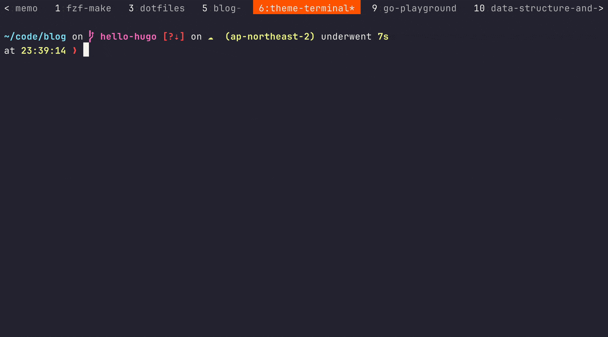
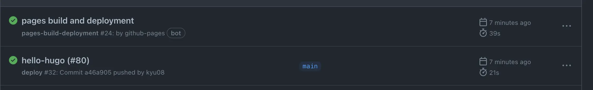

もともとこのブログはNext.js + Vercelの構成で作られていたが色々と辛くなってしまったのでお手軽にブログが作れそうなhugo + GitHub Pagesの構成に移行した。

## 動機
もともとNext.jsを触ってみたかったのでNext.jsで書いたでブログを運営していた。

このときのディレクトリ構成が以下のような感じになっていて、画像はrepositoryにアップロードして(PRのコメント欄とかに画像を貼って取得した`https://user-images.githubusercontent.com/xxxxx`のようなURLを使って)それをマークダウンから呼び出していた。

```shell
root/
  ├ posts/
  │　├ post1.md
  │　├ post2.md
  │　└ post3.md
  └ ...
```

ところがGitHubのrepositoryにアップした画像まわりの仕様が変わり[^1]、それ以降private repositoryにアップした画像は認証付きになったため画像のホスト方法の変更が必要になった。

そこで管理のしやすさから以下のようにマークダウンと同一ディレクトリに画像を配置する方法にすることにした。
```shell
root/
  ├ posts/
  │  ├ post1.md/
  │  │  ├ index.md
  │  │  └ image.png
  │  ├ post2.md/
  │  │  ├ index.md
  │  │  └ image.png
  │  └ post3.md/
  │     ├ index.md
  │     └ image.png
  └ ...
```

で、それをやろうとしたがどうにもうまく画像を読み込むことができなかった。(当然悪いのはNext.jsではなく1000億%自分の技術力のNASAです)

ちゃんとNext.js(やJSのツールチェイン周り)のお勉強をすればNextでもできたと思うが当面JS関連の技術を触る予定もないしブログの管理にそこまで時間をかけたい気持ちもなかったので諦めてhugoに移行することにした。

## やったこと
- テーマ選定([panr/hugo-theme-terminal](https://github.com/panr/hugo-theme-terminal)を選択した)
- フォントなどスタイルの調整
- ファビコンの設定
- デプロイの自動化
- カスタムドメインの設定
- GA4導入

以下部分的に補足する。

### デプロイの自動化
以下のようなyamlを`.github/workflows/deploy.yaml`として配置するとmainへのpush時に自動でデプロイが行われる。

カスタムドメインに指定したい場合は`cname`を指定しないとデプロイのたびにカスタムドメインが404になってしまうので注意。

```yaml
name: deploy

on:
  push:
    branches:
      - main

jobs:
  deploy:
    runs-on: ubuntu-latest # サポートされていないバージョンを指定するとGitHub Actionsがずっとrunningになるので注意
    steps:
      - uses: actions/checkout@v2
        with:
          submodules: true
          fetch-depth: 0

      - name: Setup Hugo
        uses: peaceiris/actions-hugo@v2
        with:
          hugo-version: "0.112.5"
          extended: true

      - name: Build
        run: hugo

      - name: Deploy
        uses: peaceiris/actions-gh-pages@v3
        with:
          github_token: ${{ secrets.GITHUB_TOKEN }}
          publish_dir: ./public
          cname: blog.kyu08.com # カスタムドメインの設定をしていない場合は不要
```

### GA4の導入
[こちらの記事](https://maku77.github.io/p/zxk6pat/)を参考に進めたらできた。

1点だけ注意が必要なのはpartialsの扱いがthemeによって異なる(っぽい)こと。

[panr/hugo-theme-terminal](https://github.com/panr/hugo-theme-terminal)では

```html
<!--
To add an extended head section, please create
`layouts/partials/extended_head.html` in your Hugo directory.
-->
```
とのことだった[^2]ので`layouts/partials/extended_head.html`にタグの設定を記述した。


## 着手 ~ 公開まででかかった時間
たぶん6hくらい。

数箇所詰まったがドキュメントや先人のブログのおかげですぐに解決できた。

おそらくミニマムな状態(カスタムドメイン設定なし, テーマのデザインをそのまま利用, GA4なしなどなど)なら1hもかからずに公開までできると思う。

## hugoのいいところ
- 既存のテーマを利用すると手軽に色々できる(TOC, シンタックスハイライト, 脚注などなど)。とにかくお手軽なのが最高。基本的にはテーマを選んで記事を書いてデプロイすればブログが公開できてしまうのですごい。
- ドキュメント・themeのソースコードを読めば大抵解決する
- `watch`オプションがあるので`hugo serve -w`を実行するとホットリロードが有効になるので捗る

## ハマったところ
~~長くなりそうなので別途記事にする予定~~

それぞれ記事にした。

- [hugo-theme-terminal でOGPに任意の画像を設定する方法](/posts/hugo-theme-terminal-ogp-config)
- [GitHub Pagesでデプロイのたびにカスタムドメインの設定が消える問題の解決方法](/posts/github-pages-custom-domain)

## 実際の運用はこんな感じ
1. 記事作成用のブランチを作成
1. 記事を作成
1. PRを作成してmainにマージ
1. GitHub Actionsでビルド・デプロイが走る

`2.記事を作成`だけ軽く補足すると、Makefileに以下のようなターゲットを定義したので

```Makefile
.PHONY: new
new:
	@read -p "post id: " id; \
	hugo new "posts/$${id}/index.md"
```

こんな感じで動く。地味に楽。



ちなみにデプロイは1分くらいで完了するのでサクサク反映できて嬉しい。



## おわりに
色々追加したい機能はあるけどとりあえず最低限の機能はできたのでヨシ！とする。

ブログたくさん書くぞ〜

感想はtwitterとかで呟いたりリプしてくれたりすると跳んで喜びます。

[^1]: https://github.blog/changelog/2023-05-09-more-secure-private-attachments/
[^2]: https://github.com/panr/hugo-theme-terminal/blob/9726b8d80658c6cf3c092c21484548aba6f64a68/layouts/partials/extended_head.html
