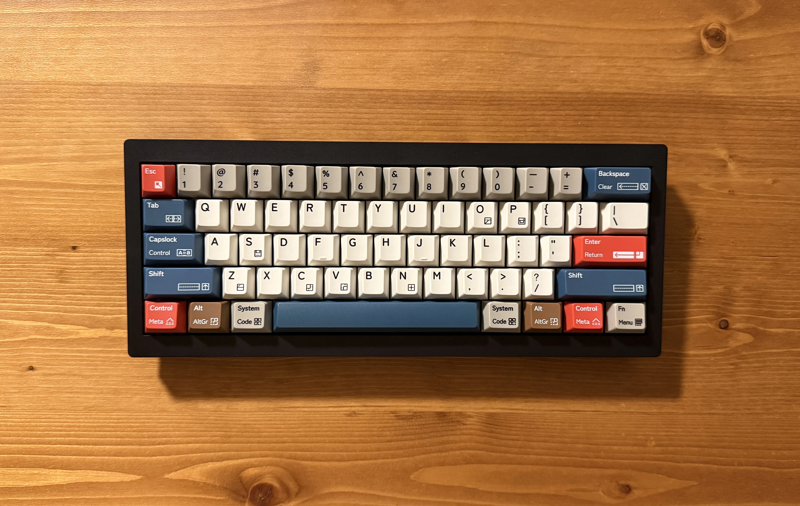
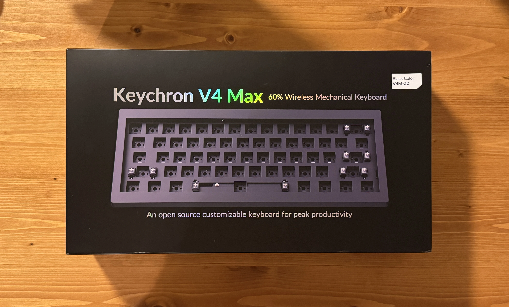
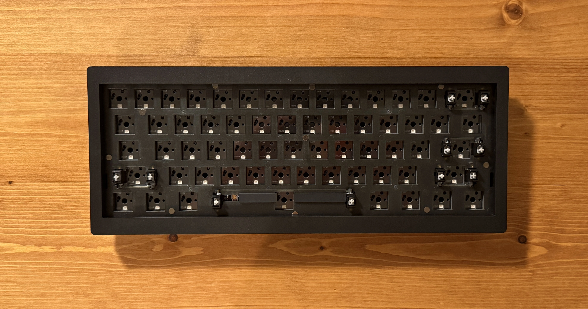
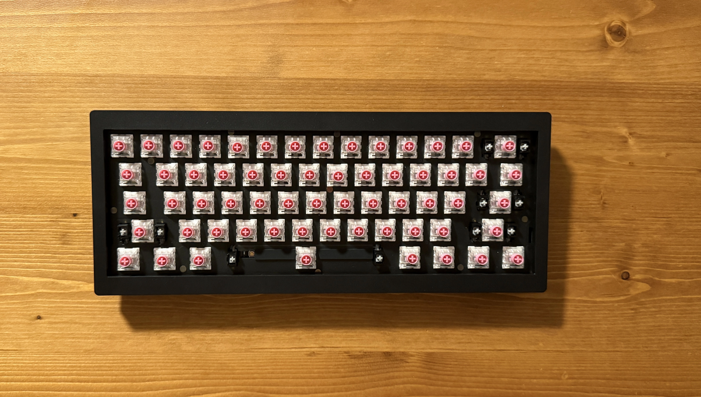
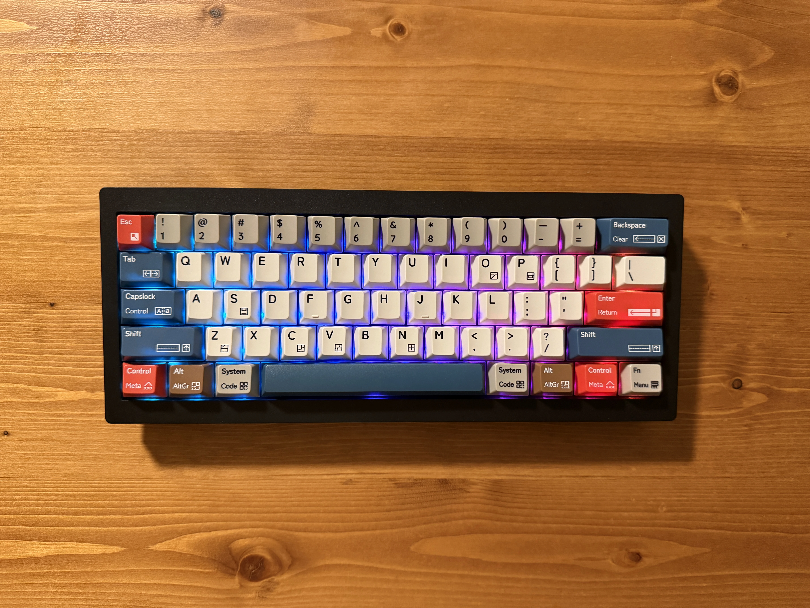
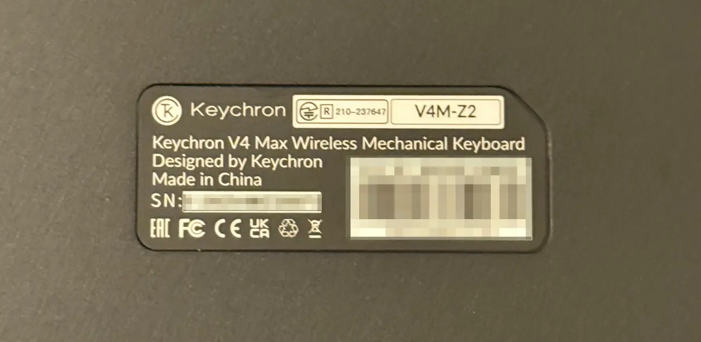

持ち運び用に軽めの60%メカニカルキーボードが欲しくなり、いくつか検討した結果、[Keychron V4 Max(Barebone)](https://www.keychron.com/products/keychron-v4-max-qmk-via-wireless-custom-mechanical-keyboard?variant=41285926682713)を買った。

## 候補
持ち運び用として考えていたので以下のような条件で探していた。

- ノーマルプロファイルのメカニカルキーボード
    - ロープロファイルよりノーマルな方が好みなため
- 重量が軽め(600g前後)
    - Magi65は900gくらいあり若干重い(あと結構打鍵音がでかい)
- 打鍵音が大きくなさそう(スイッチにも大きく依存するが)
    - オフィスでも使いたいので
- ホットスワップ対応
- おおよそ2万円以内
- 60%

最初は候補として5つのキーボードが挙がっていたが、冷静になった結果NiZとREALFORCEは価格が高かったのでやめ、CIDOO QK61 V2は重量が重めだったのでこちらも候補から外した。

| 機種名 | 重量 | ホットスワップ対応 | 価格 | 技適対応 | 備考 |
|--- | --- | --- | --- | --- | --- |
| Keychron V4 Max | 650g | 対応 | $84.99 | 対応 | ガスケットマウントで打鍵感&打鍵音がよさそう | 
| EPOMAKER Hack59 | 630g | 対応 | ¥10,700 | 対応 |ガスケットマウントで打鍵感&打鍵音がよさそう|
| NiZ Atom66 | ? | おそらく非対応 | ¥32,000 | ? | - |
| REALFORCE RC1 | 600g | おそらく非対応 | ¥35,860 | 調べてないがさすがに対応してそう | - |
| CIDOO QK61 V2 | 880g | おそらく対応 | ¥11,000 | ? | - |

最終的にはKeychron V4 MaxとEPOMAKER Hack59で迷ったが打鍵音がより静かそうなKeychron V4 Maxを選んだ。

## Keychron V4 Max
KeychronのWebサイトを見ると2つのオプションがあった。

| オプション | 価格 | 内容 |
|--- | --- | --- |
| Barebone | $84.99 | キーボード本体のみ |
| Fully Assembled | $104.99 | キーボード本体 + キーキャップ + キースイッチ |

+$20でキーキャップとキースイッチがつくのでコスパでいえばFully Assembledの方がいいが、ちょうど家にキーキャップとキースイッチが1セットずつ余っていたのでBareboneにした。

価格は送料込みで$92.99(¥14,093)だった。注文から5日後に届いた。（意外と早かった）

ベアボーンな様子。

## キースイッチ、キーキャップ
キースイッチはもともと使っていたKailh Box Silent Pinkを装着した。（今は廃盤らしい...）

普段7sProに装着して使っている[Yushakobo Fairy Silent Linear Switch](https://shop.yushakobo.jp/products/5659)より若干重くて押してる感じが適度にあってよい。

キーキャップは家にあった[Keyreative The Old Seaside ABS Cherry Profile](https://sanyollc.com/products/%E4%BA%88%E7%B4%84%E8%B2%A9%E5%A3%B2-the-old-seaside-abs-cherry-profile-keycaps)を装着した。

なぜか光る。

## 使ってみた感想
- ガスケットマウントのおかげか打鍵感もよいし音もうるさくないので大満足。
- 普段HHKB配列の分割キーボード[^1]を使っているので右シフトがデカくてfnキーがないのは気になっていた。が、自分の使い方だと右シフトは`?`を入力するときにたまに使っていたくらいだったので、思い切って右シフトをfnキーにすることで事なきを得た。
- 軽いが使っていて位置がずれたりすることもなく、よい。

あとちゃんと技適申請が通っていて、かつ技適マークも表示されていて嬉しい。

## おわりに
円高はよ〜。

[^1]: [7sPro](https://shop.yushakobo.jp/products/7spro)
