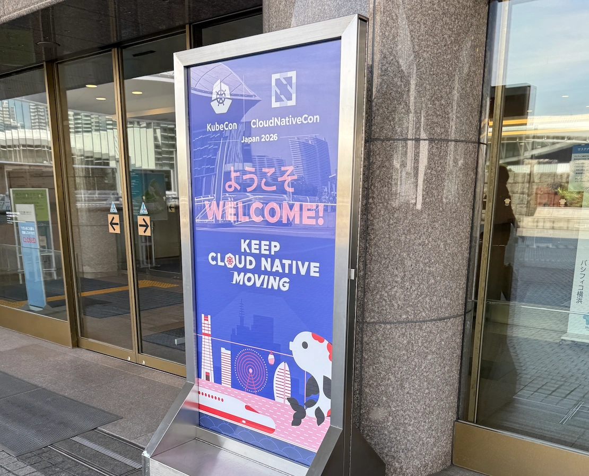
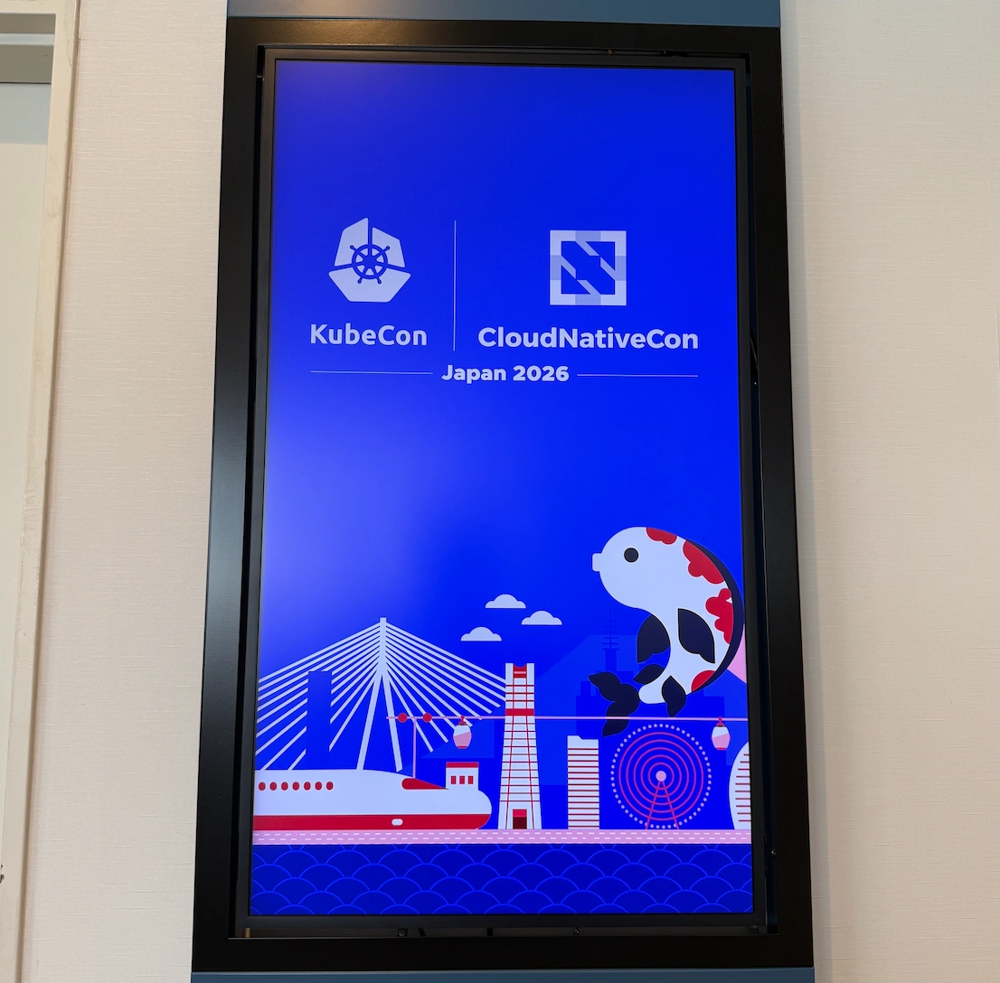
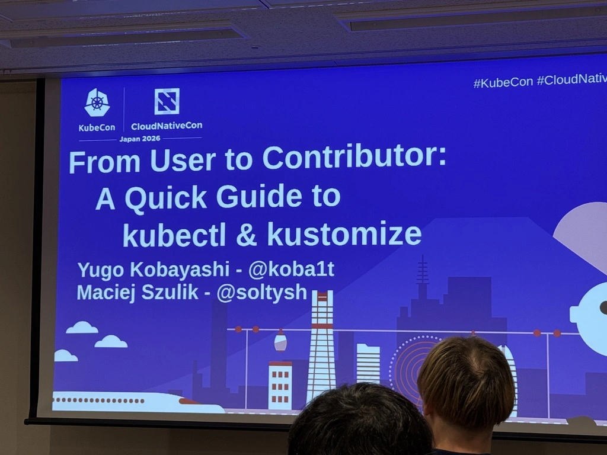
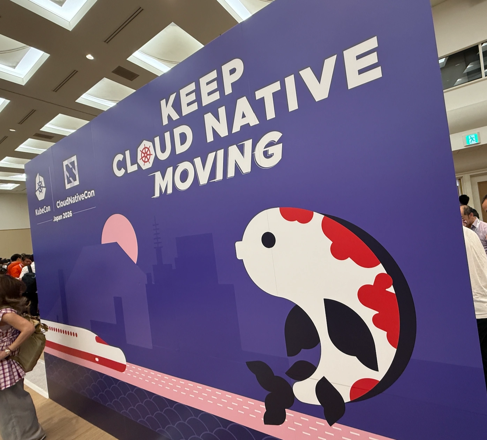

KubeCon + CloudNativeCon Japan 2026に参加したので感想などを記しておく。

ちなみに、カンファレンス自体は2026/7/28-2026/7/30で開催されていたが、KubeConが開催されていることに気付いたのが7/29の夜だったので最終日だけ参加した。(来年は全日程参加したい...！)

参加したセッションの感想を簡単に書いていく。

## Beyond Translation: The Journey of Building the Japanese Kubernetes SIG Docs Community
Aoi Takahashiさん、Junya OkabeさんによるKubernetesドキュメントの日本語翻訳を進める中での取り組みを紹介した発表。

https://events.linuxfoundation.org/kubecon-cloudnativecon-japan/program/schedule/?id=1228189

### 感想
Aoiさんの「Kubernetesの試験勉強との両立は大変だったが、むしろドキュメントの翻訳を通してKubernetesを深く理解することができた」という言葉が強く印象に残っている。

自分も1年ほど前から仕事でkubernetesを使うようになり、このところキャッチアップに時間を使っているのでドキュメントの貢献を通して日本語フレンドリーな学習環境を作りつつ、自分の理解も深めていきたいと思った。

ので、早速いくつかPRを送ってみた。

https://github.com/kubernetes/website/pull/56876

https://github.com/kubernetes/website/pull/56875

https://github.com/kubernetes/website/pull/56839

Aoiさん、Okabeさんのセッションとkubernetesのslackに共通していえることだが、非常にオープンな雰囲気で新規の貢献者を歓迎している空気感があったのも貢献に踏み出してみたいと思ったきっかけだった。とてもありがたい。

冒頭のリンクから発表のスライドがダウンロードできるのでぜひご覧ください。

## From User to Contributor: A Quick Guide to kubectl & kustomize

SIG CLI[^1]のメンテナであるYugo KobayashiさんとMaciej Szulikさんによるkubectlとkustomizeの内部構造を解説したセッション。

https://events.linuxfoundation.org/kubecon-cloudnativecon-japan/program/schedule/?id=1228191

### 感想
- コードの構造がわかると貢献へのハードルが下がるのでとても良い時間だった。
- これまで以上にこれらのツールへの貢献への興味を持てた。

## Repurposing OpenTelemetry Traces as Test Data: Breaking the Cost Barrier in System Migration
Yoshiki Fujikaneさんによるシステム移行の際にOtelのTraceを利用してシステムのinput/outputを記録し、そこからテストのinputと期待値を導き出す、という手法の共有。

https://events.linuxfoundation.org/kubecon-cloudnativecon-japan/program/schedule/?id=1194861

以下メモ。

- システム移行において、どのように新システムが旧システムと同じ挙動であることを保証するか
    - 課題
        - コードが読みづらい
        - 最新の仕様書がない
        - etc.
    - 解決策(概要)
        - 本番環境のinput/outputから新システムのテストのinput/期待値を導出する
    - どのようにinput/outputを記録するか
        - otelのtraceを利用する。
- OBIを使って旧アプリケーションのコードに手を入れずに欲しいデータを入手する
    - eBPFを使ってネットワークパケットをキャプチャする

### 感想
- 新旧システムの挙動を外形から比較するという発想はなかったので勉強になった。
    - ただ、現状はDBの中身はすべて空の状態を想定しているとのことで、DBを書き換えるAPI等についてはfeature workとのことだった。

## The Road to Cilium: Migrating 150+ Kubernetes Clusters at Airbnb
Yifei SunさんによるCilium移行の発表。

https://events.linuxfoundation.org/kubecon-cloudnativecon-japan/program/schedule/?id=1171327

## 感想
ネットワークまわりが何もわかっていないことがわかった。

## スポンサーブース
- スポンサーブースではKubernetesの相談をさせていただいたり、Datadogの相談をさせていただいたり、各社の製品をお話を聞かせていただいたりした。
    ")

## 感想

受付の方の英語がまったく聞き取れず絶望した。(通訳の方がいたのでなんとかなったが歯がゆい気持ちになった)結果英語モチベが上がった。

もちろん技術モチベ(とくにKubernetes周り)もあがった。直近は今読んでいるKubernetes In Actionのまとめを社内で共有するのをやる予定。

あとOSSモチベも上がったので翻訳への貢献もやっていきたい。

総じて行ってよかった！[^2]

[^1]: Special Interest Groupの略。SIG Docs、SIG CLIなど、分野ごとに存在するチームのような存在。（だと理解しているがあまり自信はない）ちなみにWorking Groupという組織もあるようだが、[New Contributor Orientationの資料](https://github.com/kubernetes/community/blob/main/mentoring/new-contributor-orientation/nco-slides/TEMPLATE%20%5BMONTH%5D%20New%20Contributor%20Orientation.pdf)によるとSIGとは違い、一時的な組織らしい。
[^2]: チケットは高かった。(ペイしたとも思っている)
