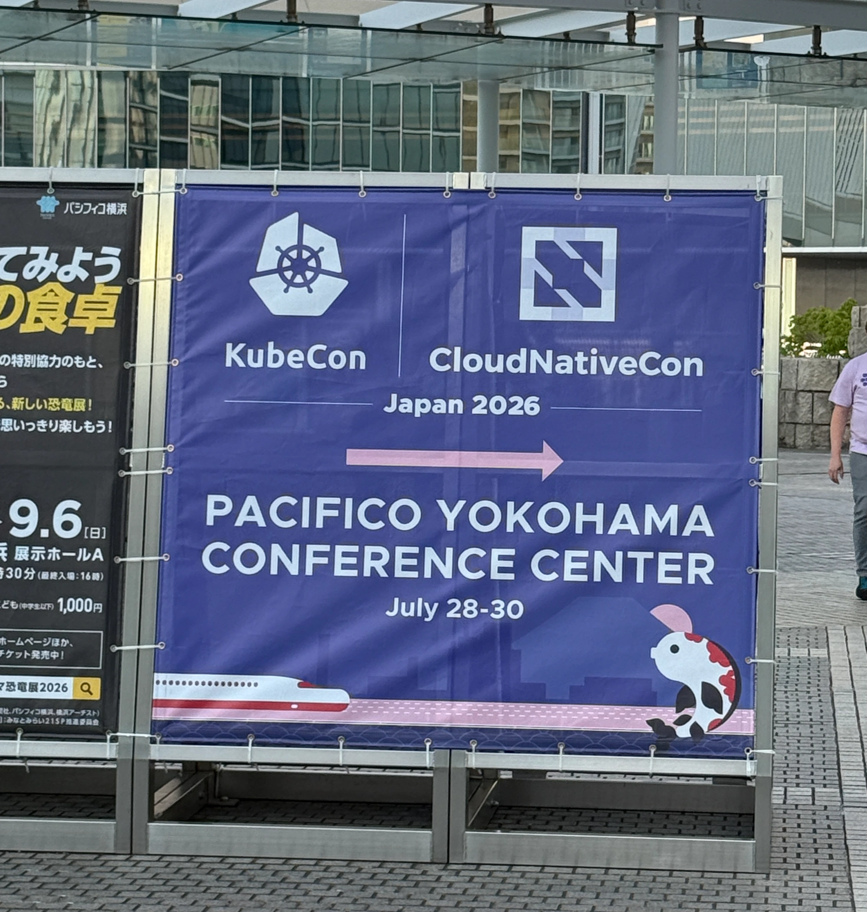

<!-- TODO: 写真貼る -->

KubeCon + CloudNativeCon Japan 2026に参加したので感想などを記しておく。

ちなみに、カンファレンス自体は2026/7/28-2026/7/30で開催されていたが、KubeConが開催されていることに気付いたのが7/29の夜だったので最終日だけ参加した。(来年は全日程参加したい...！)

参加したセッションの感想を簡単に書いていく。

## Beyond Translation: The Journey of Building the Japanese Kubernetes SIG Docs Community
Aoi Takahashiさん、Junya OkabeさんによるKubernetesドキュメントの日本語翻訳を進める中での取り組みを紹介した発表。

https://events.linuxfoundation.org/kubecon-cloudnativecon-japan/program/schedule/?id=1228189

### 感想
Aoiさんの「Kubernetesの試験勉強との両立は大変だったが、むしろドキュメントの翻訳を通してKubernetesを深く理解することができた」という言葉が強く印象に残っている。

自分も1年ほど前から仕事でkubernetesを使うようになり、このところキャッチアップに時間を使っているのでドキュメントの貢献を通して日本語フレンドリーな学習環境を作りつつ、自分の理解も深めていきたいと思った。

Aoiさん、Okabeさんのセッションとkubernetes slackに共通していえることだが、非常にオープンな雰囲気で新規の貢献者を歓迎している空気感があったのも貢献に踏み出してみたいと思ったきっかけだった。

冒頭のリンクからスライドがダウンロードできるのでぜひ気になる方はご覧ください。

<!-- TODO:ここから -->
## From User to Contributor: A Quick Guide to kubectl & kustomize

SIG CLIの一員であるYugo KobayashiさんとMaciej Szulikさんによるkubectlとkustomizeの内部構造を解説したセッション。

https://events.linuxfoundation.org/kubecon-cloudnativecon-japan/program/schedule/?id=1228191

<!-- ### kubectl -->
<!-- - Legacy -->
<!--     - kubectlの各コマンドの構造(New, Options, Complete, Validate, Run) -->
<!-- - NewStructure -->

### 感想
コードの構造がわかると貢献へのハードルが下がるのでめっちゃ良い時間だった。これまで以上に興味も持てたし。

## Repurposing OpenTelemetry Traces as Test Data: Breaking the Cost Barrier in System Migration
<!-- TODO: どんな発表だったのか書く -->
Yoshiki Fujikaneさんによる

https://events.linuxfoundation.org/kubecon-cloudnativecon-japan/program/schedule/?id=1194861

- システム移行において、どのように新システムが旧システムと同じ挙動であることを保証するか
    - 課題
        - コードが読みづらい
        - 最新の仕様書がない
        - ...
    - 解決策(概要)
        - 本番環境のinput/outputを新システムのテストデータとする
    - どのようにinput/outputを記録するか
        - traceを利用する。
- OBIを使って旧アプリケーションのコードに手を入れずに欲しいデータを入手する
    - eBPFを使ってネットワークパケットをキャプチャする

### 感想
- ちょうど仕事でも移行作業をする予定があったのでとても参考になった。
    - 新旧システムの挙動を外形で比較するという発想はなかった。
- 疑問
    - 多くの場合、APIはDatabaseの中身によってレスポンスが変わると思う。今回紹介された方法でテストのinputと期待値はわかるが、テストを実行するためにはシードデータも必要なはず。個々のテストケースで必要なシードデータはどう特定した？(PoCでは空のデータベースで行ったらしい)
        - CDCを使うことを検討しているが、技術的にもかなり大きな壁になりそう

## OTel meets Wasm: Rethinking OpenTelemetry Collector Extensibility

## The Road to Cilium: Migrating 150+ Kubernetes Clusters at Airbnb
- Cilium
    - Kubernetes-Native eBPF
    - ネットワークまわり、何もわからないことがわかった

## スポンサーブースでお話したこと
- microsoft
- datadog
- AWS

## 感想
<!-- TODO: 画像どれか使う -->
<!-- TODO: 画像のファイル名をいい感じにする -->

- 英語モチベが上がった
    - 受付の方の英語がまったく聞き取れず絶望した(通訳の方がいたのでなんとかなったが歯がゆい気持ちになった)
- もちろん技術モチベ(とくにkube)もあがった
- あとOSSモチベも上がったので翻訳への貢献をやっていきたい
- スポンサーブースでもためになる話を聞くことができた(各種グッズももらえたし)
- ノベルティたくさんもらえた
- いってよかった
