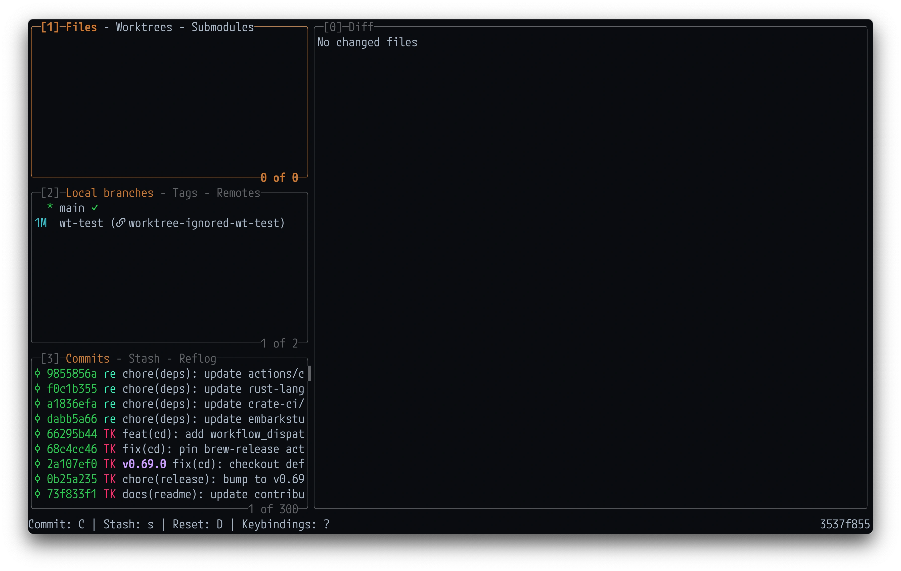
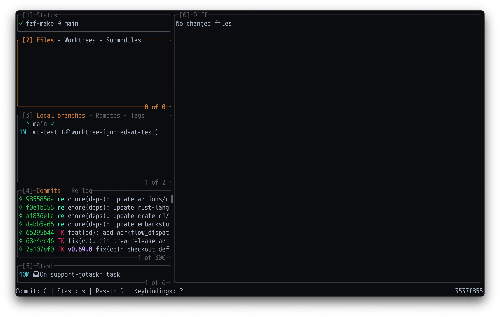
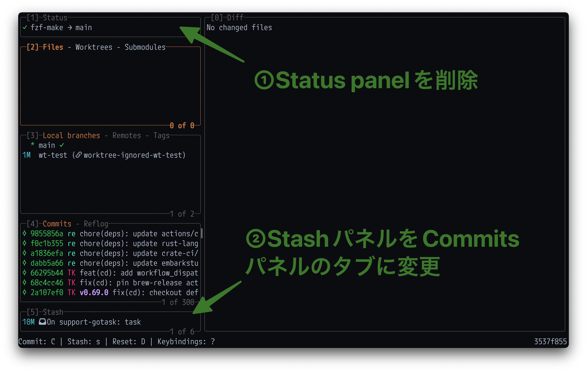

日本時間の2026/07/04にリリースされた[v0.63.0](https://github.com/jesseduffield/lazygit/releases/tag/v0.63.0)から、Lazygitのサイドパネルの配置が設定可能になった。

この機能は現在のLazygitメンテナである[@stefanhaller](https://github.com/stefanhaller)によって以下のPRで実装された。

https://github.com/jesseduffield/lazygit/pull/5702

## どう変わるのか
以下のような設定項目が追加され、自由にサイドパネルの配置を変更できる。(以下はdefaultの設定)

```yaml
gui:
  sidePanels:
    - [status]
    - [files, worktrees, submodules]
    - [branches, remotes, tags]
    - [commits, reflog]
    - [stash]
```

PR Bodyに

> You can:
> 
> - Reorder the panels
> - Hide panels you don't use
> - Regroup which panels share a slot as tabs
> - Promote a tab to its own top-level panel — e.g. pull Worktrees out of the Files panel so it's always visible

とあるように、

- パネルの並び替え
- 不要なパネルを非表示にする
- どのパネルが同じスロットを共有するかを再構成する
- タブをトップレベルパネルに昇格させる(e.g. WorktreesをFilesパネルから引き出して常に表示する)

などができるようになった。

## 個人的な嬉しみ
いくつか設定を試した結果、以下のような感じに落ち着いた。



変更前(デフォルト)はこんな感じで、



変更点は以下。



表示領域が若干広くなった。(こう見ると割と地味ではあるw)

設定は以下。

```yaml
gui:
  sidePanels:
    - [files, worktrees, submodules]
    - [branches, tags, remotes]
    - [commits, stash, reflog]

    # 以下はdefault設定
    # - [status]
    # - [files, worktrees, submodules]
    # - [branches, remotes, tags]
    # - [commits, reflog]
    # - [stash]
```

## まとめ
サイドパネルを自分好みにカスタマイズできると地味に捗るのでオススメです。
