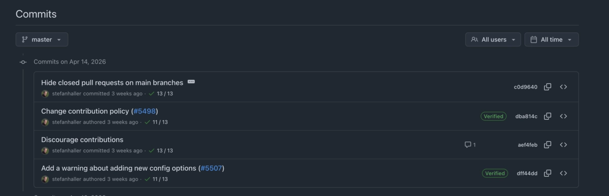

2026/04/20ごろにlazygitのcommit logを眺めていたところ気になるcommitを発見した。

lazygitにはたまにPRを送っていたのもあり気になったので変更内容を見てみたところ、以下のような内容が書かれていた。[^1]

> This project does not accept pull requests.
>
> In todays world of agentic coding I have decided that it no longer makes sense for me to look at incoming pull requests. As far as I can tell, the vast majority of these is AI-generated these days, which in itself is not necessarily a bad thing; however, there's no way for me to tell whether the person posting the PR actually understands anything about the code that is being contributed or not, and I don't feel like spending time and energy on finding out whether they do.
>
> Now you might ask why this even matters; coding agents are capable of producing amazingly high-quality code, so why is it important that the person opening the PR understands it, as long as the code works and tests are green? It does actually matter very much to me. AI generated code needs to be carefully reviewed and iterated on, and it is the contributor's job to do that, not mine. And I have no idea to what extent the contributor has done this, or whether they are even capable of it.
>
> Every PR needs work and iterations until it is mergeable, whether manually coded or AI generated (even very good ones do), and if I don't know whether the person posting the PR will act on my review feedback themselves or just pass it on to their coding agent (which I guess is the much more likely case today), then it doesn't make sense for me to work with them.
>
> For this reason I will close incoming pull requests by default from now on, without comment. Sorry if this sounds hostile, but honestly I don't feel I have much of a choice if I want maintaining this project to still be enjoyable for me.
>
> With that said, if you are indeed serious about contributing a high-quality PR to lazygit, and you are familiar with go, and you have learned enough about lazygit's code base to tell whether your changes are good, then do raise an issue and explain what you are planning to do, and somehow make it plausible that your PR will be worth my time reviewing it. In such a case I might make an exception from the default rule.
>
> In the future I might also consider adopting a vouch system similar to [Ghostty's](https://github.com/ghostty-org/ghostty/blob/main/CONTRIBUTING.md#first-time-contributors), but right now I feel the effort needed to set this up and maintain is not justified given the rather low number of high-quality contributions I have seen in recent times.
>
> Even though we no longer accept pull requests, I find it important to emphasize that Lazygit is still a community project, and non-PR contributions are still very welcome. Do file issues for bug reports or feature requests, and help shape the future of lazygit by actively participating in discussing UX designs. Also, the localization system very much depends on everybody's help with translating texts (see https://crowdin.com/project/lazygit).

以下翻訳です。
<!-- TODO: 翻訳が大丈夫そうか改めてチェックする -->

> このプロジェクトはプルリクエストを受け付けていません。
> 
> 今日のエージェンティックコーディングの世界において、届いたプルリクエストに目を通すことはもはや自分にとって意味のあることではないと判断しました。見る限り、最近届く PR の大半は AI によって生成されたもののようです。それ自体は必ずしも悪いことではありません。しかし、PR を投稿した人がそのコードについて実際に理解しているのかどうかを判別する術がなく、また、それを見極めるために時間やエネルギーを費やす気にもなれません。
> 
> そもそもなぜそれが問題なのか、と思うかもしれません。コーディングエージェントは驚くほど高品質なコードを生成できるのだから、コードが動いてテストが通るのであれば、PR を出した人がそれを理解しているかどうかは重要ではないのでは、と。しかし、私にとってはこれは非常に重要なことです。AI が生成したコードは注意深くレビューし、反復的に改善していく必要があります。そしてそれをするのは私ではなく、コントリビューター自身の仕事です。コントリビューターがそれをどの程度やっているのか、そもそもそれをできるだけの力があるのかすら、私には分かりません。
> 
> どんな PR も、手書きであれ AI 生成であれ、マージ可能な状態になるまでには修正とイテレーションが必要です (どれだけ質の高い PR であってもそうです)。にもかかわらず、PR を出した人が私のレビューコメントに対して自分で対応するのか、それとも単にコーディングエージェントに丸投げするのか (今日では後者のほうがはるかに多いと思います) が分からないのであれば、私がその人と一緒に作業することに意味はありません。
> 
> こうした理由から、今後届くプルリクエストはデフォルトでコメントなしにクローズします。敵対的に聞こえたら申し訳ないのですが、正直なところ、このプロジェクトのメンテナンスを自分にとって楽しいものであり続けさせたいのであれば、他に選択肢があるとは思えません。
> 
> とはいえ、もしあなたが本気で lazygit に高品質な PR を送るつもりがあり、Go に精通しており、かつ lazygit のコードベースを十分に理解していて自分の変更が良いものかどうか判断できるのであれば、まず Issue を立てて何をしようとしているかを説明し、その PR が自分のレビュー時間に値するものだと何らかの形で示してください。そのようなケースであれば、デフォルトのルールから例外として扱うかもしれません。
> 
> 将来的には[Ghostty](https://github.com/ghostty-org/ghostty/blob/main/CONTRIBUTING.md#first-time-contributors)のような vouch system (推薦制度) の導入も検討するかもしれませんが、ここ最近見かける高品質なコントリビューションの少なさを考えると、そのセットアップとメンテナンスに必要な労力は今のところ見合わないと感じています。
> 
> プルリクエストは受け付けなくなりましたが、Lazygit が依然としてコミュニティプロジェクトであることを強調しておきたいです。PR 以外の形のコントリビューションは引き続き大歓迎です。バグ報告や機能要望の Issue をぜひ立ててください。また、UX デザインに関する議論に積極的に参加することで lazygit の将来を形作る手助けをしてください。さらに、翻訳システムは皆さんの翻訳協力に大きく依存しています (https://crowdin.com/project/lazygitを参照)。

<!-- TODO: ライセンス等を貼る -->

## ポリシーの変更内容に対しての感想
OSSの中では一番PRを送っていたプロジェクトなので思い入れがあるのもあり、素直に寂しい気持ちになった。今まで機能追加したくなったときはまずはPRを作成して動くものを触ってみながら議論するというやりかたで[stefanhaller](https://github.com/stefanhaller)氏と

<!-- TODO: OSSがAIによってネガティブな影響を受けているのを見るのと寂しい気持ちになる -->

もちろんこの決定をしたくなるだけの負担がメンテナにかかっているのも事実だと思うし方針に関して異論はない。というのと、PRを送りたい場合はまずはissueを立てて変更内容を説明しそのPRがレビューに値するものだと示す、というやり方はバランスがよさそうだと感じた。

## AI時代のPRについて

- 時代だなあ
    - 自分もそういうPRは受け取ったことがあるのでわかる。それなら自分でやるわ、となる
    - 仕事なら評価があるからまだしも、OSSだといい品質のコードを送ったり、アウトプットに責任を持ったりするインセンティブがより一層少なくなってしまうのでコントロールが難しい
    - 相手がCoding Agentに丸投げするようならその人と一緒に作業しようとは思わないのもわかる。そういう感じなら自分でやればいいので。
    - 他人が作成したPRがセキュリティ面で問題がないことも確認しないといけないのでより一層メンテナの負荷は高い
    - 自分のプロジェクトも同じようなポリシーにした方がいいかもしれない
    - github側にもその人のレピュテーションを示すなんらかの指標が表示できたりするといいのかもしれない
- じゃあ仕事だとどうか
    - 仕事においてもPRコメントをAI Agentに丸投げされたくない理由を言語化しておくといいかも？
        - もしそれを記事に含めるなら先にチームの人にそのことは表明しておいた方が軋轢や誤解をうまず安全そう

仕事でもOSSでもレビュワーの負荷を少しでも減らすPRを心がけたい。今までと同じではあるけど、以下をやりたい。

それらしい実装を誰でも作れるようになったので、実装以外の部分をちゃんとやらないとその人と一緒に働きたくなくなることが増えそう

1. セルフレビューでケアレスミスがないか確認する
1. PR Bodyに動機、変更内容の概要、採用しなかった選択肢等をかく。
1. 差分にはコードの意図を書く（必要ならコードコメントにも書く）

[^1]: 該当commit: [Discourage contributions · jesseduffield/lazygit@aef4feb](https://github.com/jesseduffield/lazygit/commit/aef4feb501d12c670bb9bbed92d9ff102509cd84)
