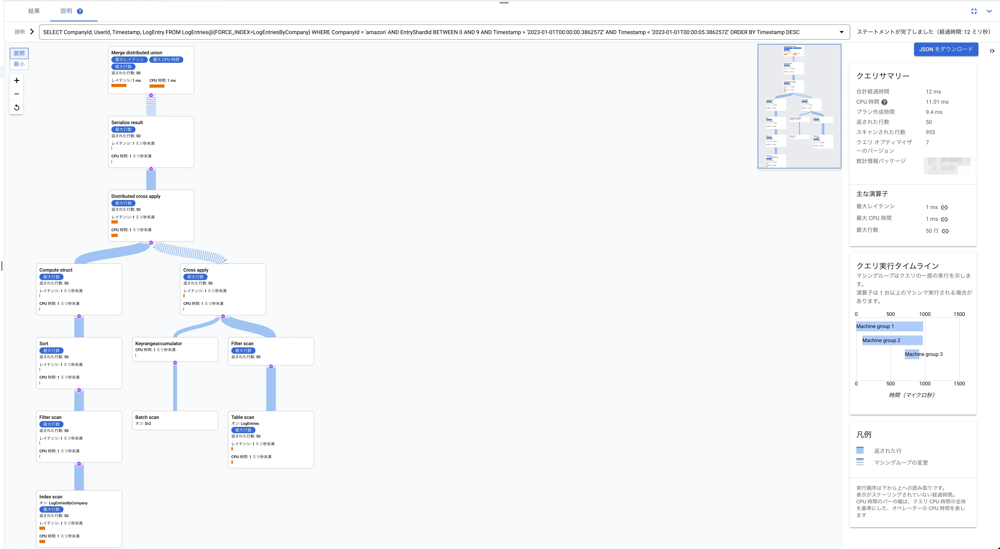

普段業務でCloud Spannerを使っているが、雰囲気で使っている自覚が大いにあるのでドキュメントやブログを読んで知らなかったことを自分用のメモとしてまとめてみる。

## [Spanner のスキーマ設計の最適化  |  Google Cloud](https://cloud.google.com/spanner/docs/whitepapers/optimizing-schema-design?hl=ja#tradeoffs_of_locality)
- キー定義とインターリーブの2つはスケーラビリティに大きな影響を与える
- Spannerにはルートテーブルとインターリーブされたテーブルの2種類のテーブルがある。[^1]

### テーブルレイアウト
Spannerテーブルの行は`PRIMARY_KEY`によって辞書順に並べかえられる。したがって以下の特性を示す。

- 辞書順のテーブルスキャンは効率的
- 十分に近い行は同じディスクブロックに格納され、一緒に読み込まれてキャッシュされる

各Spannerレプリカ内のデータは`スプリット`と`ブロック`という2つの物理階層レベルで編成される。（`TODO: ブロックがなんなのかわからなかったのであとで調べる。`）

ルートテーブルの各行をルート行と呼び、インターリーブされたテーブルの各行を子行と呼ぶ。ルート行とそのすべての子孫のコレクションは行ツリーと呼ばれる。

<!-- textlint-disable ja-technical-writing/no-doubled-joshi -->
行ツリー内のオペレーションは他のスプリットとの通信を必要としないケースが多いため効率性が高い傾向にある。ただし子行にホットスポットがある場合Spannerはホットスポットの行とそれ以降の子行を分離するためにスプリット境界を追加しようとする。そのため必ずしも効率性が高いという保証はない。
<!-- textlint-disable ja-technical-writing/no-doubled-joshi -->

### 局所性のトレードオフ
以下の理由で局所性を高めることが重要。

- 通信するサーバが多いほど一時的にビジー状態のサーバに遭遇する可能性が高くなり、レイテンシの増加につながる。
- 複数のスプリットにまたがるトランザクションは二層コミットの特性によってCPUコストとレイテンシがわずかに増加する。

### 局所性の勘所
- 分散DBである以上、一定レベルの二層コミットや非ローカルデータオペレーションは避けられない。
- すべてのオペレーションの局所性を完璧にするのではなく最も重要なルートエンティティと最も一般的なアクセスパターンについて必要な局所性を実現することが重要。その他のオペレーションについてはそのままにすることを推奨。

### インデックスのオプション
<!-- textlint-disable ja-technical-writing/ja-no-redundant-expression -->
- デフォルトではインターリーブされていないインデックスを作成されるが、インターリーブされたインデックスを作成することもできる。
<!-- textlint-disable ja-technical-writing/ja-no-redundant-expression -->
- Spannerはテーブルと同じ方法でインデックスデータを格納する。

#### 推奨事項
- インターリーブされていないインデックスはルートテーブルにデータを格納する。
- インターリーブされたインデックスはインターリーブされたテーブルにデータを格納する。そのためデータとインデックスが強制的に同じ行ツリーに格納されるため、データとインデックスの結合効率が高くなる。

そのため以下が推奨される。

- 検索範囲が単一のエンティティのときは**常に**インターリーブされたインデックスを使用する。
- 逆にデータベース内のどこからでも行を検索する必要がある場合はインターリーブされていないインデックスを使用する。


### STORING
要求されたすべてのデータがインデックス自体に含まれる場合、`STORING`句を使用してインデックスを作成することができる。これによりベーステーブルと結合することなくクエリを完了できるためより効率的に結果を取得することができる。

現在はインデックスキーは16個、合計サイズが6KiBまでに制限されているため、`STORING`句を使用することで任意のインデックスに対してデータを格納することができる。

**WRITEコストおよびストレージコストの上昇**と引き換えに**READコストを削減**することができる。

また、ドキュメントでは`STORING`の便利な応用例として`NULL_FILTERED`インデックスとの併用を紹介している。それについてはこちらの記事が大変詳しいので参照されたい。

[Cloud SpannerのNull Filtered INDEXの用途を考察する 〜サブタイプ実装〜](https://zenn.dev/facengineer/articles/15e7a68fcc2fad)

### アンチパターン
ルートテーブルをタイムスタンプ順にしてしまうとテーブルの最後に巨大なホットスポットが生まれてしまう。

タイムスタンプ順に並んだレコードが必要な場合は以下の対策が有効。

1. 他のルーとテーブルの1つにインターリーブする（ただし各ルートへの書き込みレートが十分低くなるようにする）
1. シャーディングを使用して時系列的に連続したデータを複数のスプリットに分散する

この例ではPKに`ShardId`(0~N-1)を追加する方法を紹介している。


## [スキーマ設計のベスト プラクティス  |  Spanner  |  Google Cloud](https://cloud.google.com/spanner/docs/schema-design?hl=ja#ordering_timestamp-based_keys)
次のような場合はキー列をタイムスタンプ降順に格納することでホットスポットを回避する。

- 最新の履歴を読み取る際、履歴にインターリーブ テーブルを使用しており、親行を読み取る場合
- 連続したエントリを日付の新しい順に読み込む場合に、いつまで日付をさかのぼるか不明なとき

```sql
CREATE TABLE UserAccessLog (
UserId     INT64 NOT NULL,
LastAccess TIMESTAMP NOT NULL,
...
) PRIMARY KEY (UserId, LastAccess DESC);
```

筆者はこれまでこのようなケースでは`UserAccessLog`テーブルにUUIDを付与し`LastAccess`降順なインデックスを作成することで対応することが多かった。この方法は選択肢として持てていなかったので必要になったら思い出せるとよさそう。

このケースはアクセスログなのでWRITE頻度が高いテーブルを想定していると思われる。インデックスで対応する方式と比較するとWRITEコストを下げることができる点でメリットがありそう。

と思っていたら続きにそのパターンの実装方法も書かれていた。

### 値が単調に増加または減少する列へのインターリーブされたインデックスの使用

次のようなテーブルがあるとする。

```sql
CREATE TABLE Users (
UserId     INT64 NOT NULL,
LastAccess TIMESTAMP,
...
) PRIMARY KEY (UserId);
```

<!-- textlint-disable ja-technical-writing/sentence-length -->
このテーブルに対して次のような(インターリーブされていない && 最初のキーが単調増加する)インデックスを作成した場合、`LastAccess`は単調増加する値なので最後のスプリットにホットスポットが発生してしまう。
<!-- textlint-disable ja-technical-writing/sentence-length -->
```sql
CREATE NULL_FILTERED INDEX UsersByLastAccess ON Users(LastAccess);
```

このようなケースでは次のような対処が考えられる。

1. インデックスに`ShardId`を追加する
1. インデックスをインターリーブする

## [セカンダリ インデックス  |  Spanner  |  Google Cloud](https://cloud.google.com/spanner/docs/secondary-indexes?hl=ja#add-index)
- Spannerではセカンダリインデックスに次のデータが格納される。
    - ベーステーブルのすべてのキー列
    - インデックスに含まれるすべての列
    - `STORING`句で指定されたすべての列

### NULL値の並び替え順
SpannerではNULLを最小値として扱うため昇順の場合はNULLが先頭に、降順の場合は末尾に並ぶ。

### 末尾のレコードの取得
次のようなクエリを実行する場合は結果をすばやく取得することができる。これはSpannerがテーブルの行を`PRIMARY_KEY`によって辞書順に並べかえるため。

```sql
-- テーブル定義
CREATE TABLE Songs (
    SongId INT64 NOT NULL,
    ...
) PRIMARY KEY (SongId);

-- クエリ
SELECT SongId FROM Songs LIMIT 1;
```

しかしSpannerではテーブル全体をスキャンしないと列の最大値を取得することができないため次のようなクエリはすばやく結果を返さない。

```sql
SELECT SongId FROM Songs ORDER BY SongId DESC LIMIT 1;
```

このようなケースでは次のようにPK降順のインデックスを明示的に作成することで読み取りパフォーマンスを向上させることができる。

```sql
CREATE INDEX SongIdDesc On Songs(SongId DESC);
```

## [Sharding of timestamp-ordered data in Cloud Spanner - googblogs.com](https://www.googblogs.com/sharding-of-timestamp-ordered-data-in-cloud-spanner/)

タイムスタンプ順に並んだレコードをいかに効率よく挿入、取得するかについての解説記事。

### レコードの挿入時
次のようにCompanyID、UserID、Timestampの3つのキーを持つログテーブルがあるとする。

| CompanyId(PK) | UserId(PK) | Timestamp(PK) | LogEntry |
| --- | --- | --- | --- |
| Acme | 15b7bd1f-8473 | 2018-05-01T15:16:03.386257Z | |

このスキーマにしたがって単純にデータを挿入していくとユーザー数が多い企業があるとホットスポットが発生してしまう。

そのための次のような疑似コードで表現できる`EntryShardId`を用いることで挿入時のホットスポットを回避できる。

```python
entryShardId = hash(CompanyId + timestamp) % num_shards
```

### レコードの読み取り時
次のようなインデックスを追加する。

```sql
CREATE INDEX LogEntriesByCompany ON LogEntries(EntryShardId, CompanyId, Timestamp)
```


そして以下のようなクエリを実行する。

```sql
SELECT CompanyId, UserId, Timestamp, LogEntry
FROM LogEntries@{FORCE_INDEX=LogEntriesByCompany}
   WHERE CompanyId = 'Acme'
   AND EntryShardId BETWEEN 0 AND 9
   AND Timestamp > '2018-05-01T15:14:10.386257Z'
   AND Timestamp < '2018-05-01T15:16:10.386257Z'
ORDER BY Timestamp DESC;
```

こうすることでインデックスを使って10個の論理シャードから条件にあったレコードを効率よく取得することができる。

### 余談
前章のクエリのWHERE句内で以下のように`CompanyId, EntryShardId`の順で指定していたので正しくインデックスが使えるのか気になったので試してみた。

```sql
   WHERE CompanyId = 'Acme'
   AND EntryShardId BETWEEN 0 AND 9
```

#### 準備

任意のGoogle CloudプロジェクトでSpannerインスタンスを作成し、以下のDDLを実行してテーブルとインデックスを作成する。

```sql
CREATE TABLE LogEntries (
  CompanyId STRING(36) NOT NULL,
  UserId STRING(36) NOT NULL,
  Timestamp TIMESTAMP NOT NULL,
  EntryShardId INT64 NOT NULL,
  LogEntry STRING(MAX) NOT NULL,
) PRIMARY KEY (CompanyId, UserId, Timestamp);
CREATE INDEX LogEntriesByCompany ON LogEntries(EntryShardId, CompanyId, Timestamp);
```

次にテストデータをINSERTする。

| 項目 | 条件 |
| --- | --- |
| シャード数 | 10 |
| Companyの数 | 5 |
| 従業員数 | 20 |

上記の条件で合計1000レコードを挿入するINSERT文を作成した。（スクリプトは[こちら](https://gist.github.com/kyu08/a751344fd76d4e50208164378a822dc1
)）


#### クエリの実行
これに対して次の2つのクエリを実行し、実行計画を確認した。

```sql
-- 記事で紹介されていたクエリ
SELECT
  CompanyId,
  UserId,
  Timestamp,
  LogEntry
FROM
  LogEntries@{FORCE_INDEX=LogEntriesByCompany}
WHERE
  CompanyId = 'amazon'
  AND EntryShardId BETWEEN 0 AND 9
  AND Timestamp > '2023-01-01T00:00:00.386257Z'
  AND Timestamp < '2023-01-01T00:00:05.386257Z'
ORDER BY
  Timestamp DESC;
```

```sql
-- CompanyId, EntryShardIdの順番を逆にしてみたクエリ
SELECT
  CompanyId,
  UserId,
  Timestamp,
  LogEntry
FROM
  LogEntries@{FORCE_INDEX=LogEntriesByCompany}
WHERE
  EntryShardId BETWEEN 0 AND 9
  AND CompanyId = 'amazon'
  AND Timestamp > '2023-01-01T00:00:00.386257Z'
  AND Timestamp < '2023-01-01T00:00:05.386257Z'
ORDER BY
  Timestamp DESC;
```

#### 結果
結論からいうとどちらのクエリでも同様にインデックスを利用できていた。おそらくSpannerのオプティマイザがいい感じに判断してくれていうと思われる。以下が実際の実行計画。

記事で紹介されていたクエリ


CompanyId, EntryShardIdの順番を逆にしてみたクエリ


## [Cloud Spanner におけるトランザクションのロックについて](https://cloud.google.com/blog/ja/products/databases/transaction-locking-in-cloud-spanner)

> Spanner におけるトランザクションのロックの粒度は、セル、つまり行と列の交点となります。

なのでREADの範囲(行および列)を最小限にすることでロック範囲を最小限にすることができる。

他には複数のトランザクションが同時に実行された際の優先度について詳しく解説してあった。

## [Spanner の読み取りと書き込みのライフサイクル  |  Google Cloud](https://cloud.google.com/spanner/docs/whitepapers/life-of-reads-and-writes?hl=ja)
Spannerのレプリカセットの構成については次の記事が非常にわかりやすい。

[Cloud Spannerのスプリット分散をわかった気になる](https://zenn.dev/facengineer/articles/bca8790087b0e4)

読み込みおよび書き込み時のロックの取り方について詳しく解説されていた。

### 読み取り専用トランザクション
- ロックを取得せずに実行できるため高速
- ステイル読み込みを使用できる場合はより高速にすることができる（他のオペレーションに与えるパフォーマンス影響も抑えることができる）
    - Spannerはレプリカへの同期を10秒ごとに行っているため、10秒以上前のデータをステイル読み込みできる場合は読み取りのスループットをさらに高めることができる。

### 読み取り / 書き込みトランザクション
- 読み取った行に対して共有ロックを取得する
- 書き込む行に対して排他ロックを取得する

ちなみに複数のトランザクションが同時に実行された場合の挙動については次の記事が詳しかった。

[Cloud Spanner におけるトランザクションのロックについて](https://cloud.google.com/blog/ja/products/databases/transaction-locking-in-cloud-spanner)

## [SQL のベスト プラクティス  |  Spanner  |  Google Cloud](https://cloud.google.com/spanner/docs/sql-best-practices?hl=ja#optimize-scans)

### クエリパラメータの使用
クエリパラメータを使用することで次のメリットがある。

- **キャッシュが容易になるためクエリのパフォーマンスが向上する**
- 文字列の値をエスケープする必要がないため構文エラーのリスクが減る
- SQLインジェクションを防ぐことができる

### 範囲キーのルックアップを最適化する

キーのリストが短く、連続していない場合は次のように`IN UNNEST`を使用する。

```sql
SELECT *
FROM Table AS t
WHERE t.Key IN UNNEST (@KeyList)
```

キーのリストが連続して範囲内である場合には次のように下限と上限を設定する。`[@min, @max]`の範囲をすべてスキャンするため効率的にスキャンできる。

```sql
SELECT *
FROM Table AS t
WHERE t.Key BETWEEN @min AND @max
```

### 結合を最適化する

#### 可能な限りインターリーブされたテーブルのデータを主キーによって結合する

インターリーブされた子行とそのルート行は同じスプリットに格納されることが保証されているためローカルで結合することができ、効率的に結合できるため。

#### 結合の順序を強制する

Spanner側の最適化によって結合順序が変更され（この場合は`Singers JOIN Albums`と記述したが`Albums JOIN Singers`の順序に変更されたケース）パフォーマンスが低下した場合などは`FORCE_JOIN_ORDER`ヒントを使用することで結合順序を強制することができる。

```sql
SELECT *
FROM Singers AS s JOIN@{FORCE_JOIN_ORDER=TRUE} Albums AS a
ON s.SingerId = a.Singerid
WHERE s.LastName LIKE '%x%' AND a.AlbumTitle LIKE '%love%';
```

#### JOINアルゴリズムを指定する
次のように`JOIN_METHOD`ヒントを使用することでJOINアルゴリズムを指定することができる。

```sql
SELECT *
FROM Singers s JOIN@{JOIN_METHOD=HASH_JOIN} Albums AS a
ON a.SingerId = a.SingerId
```

JOINアルゴリズムについては次の記事が詳しい。

[Cloud Spannerのパフォーマンスチューニングの勘所](https://zenn.dev/facengineer/articles/cc0cab5c7e9a1c#join%E3%82%A2%E3%83%AB%E3%82%B4%E3%83%AA%E3%82%BA%E3%83%A0)

### `LIKE`の代わりに`STARTS_WITH`を使用する
Spannerはパラメータ化された`LIKE`パターンを実行時まで評価しないのですべての行を読み取ったうえで`LIKE`式で評価し、一致しない行を除外するためパフォーマンスが悪い。

適切なインデックスが作成されている場合は`LIKE`の代わりに`STARTS_WITH`を使用するとSpannerはクエリ実行プランをより効率的に最適化することができる。

```sql
-- 非推奨
SELECT a.AlbumTitle FROM Albums a
WHERE a.AlbumTitle LIKE @like_clause;

-- 推奨
SELECT a.AlbumTitle FROM Albums a
WHERE STARTS_WITH(a.AlbumTitle, @prefix);
```

## [クエリ実行プラン  |  Spanner  |  Google Cloud](https://cloud.google.com/spanner/docs/query-execution-plans?hl=ja)
CPUの消費量が多いクエリの場合、実行計画は30日間保存されている。

確認方法は以下。

[サンプリングされたクエリプランを表示する](https://cloud.google.com/spanner/docs/tune-query-with-visualizer?hl=ja#view-sampled-queries)

クエリごとにレイテンシや返された行数、スキャン行数の平均値や実行回数確認することができるためチューニングの際にかなり便利そう。

## まとめ
Spannerの気持ちが少しわかった。これまで漫然とドキュメントを読んで頭に入らなかったり記憶が定着しなかったりしたが、ブログにアウトプットしながら読むと理解度も定着度も（モチベーションも）上がるのでやってよかった。

次はCloud Runとも仲良くなりたい。

[^1]: ①ルートテーブル②インターリーブされたテーブル③インターリーブの子を持たない通常のテーブルの3種類だと思い込んでいたが③は①として扱われるようだ。

