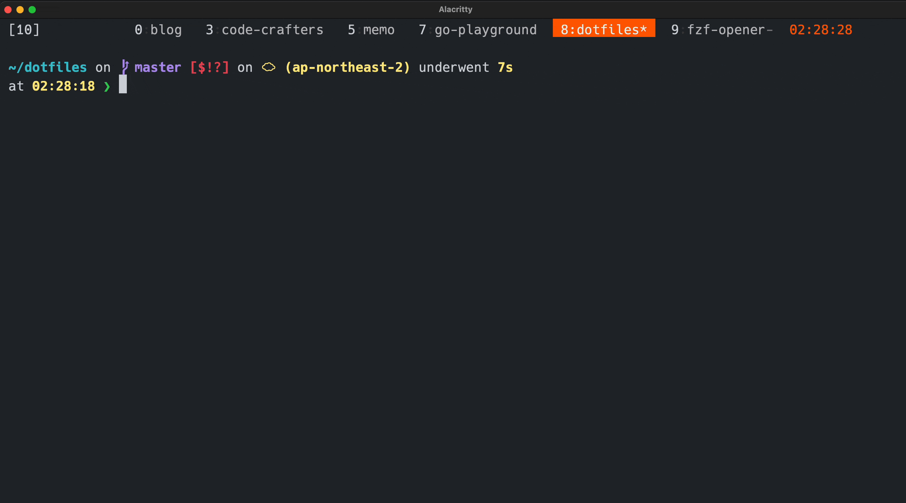

## 趣味
### OSS貢献
今年は初めてOSS貢献[^1]をできた年でもあった。2023年に行った貢献を種類ごとにリポジトリごとでまとめたものが以下。[^2]

#### ドキュメント関連

- ratatui-org/website
    - [chore(docs): fix broken link to showcase/apps](https://github.com/ratatui-org/website/pull/272)
    - [chore(docs): fix typo in showcase/third-party-widgets](https://github.com/ratatui-org/website/pull/271)
    - [docs: Add fzf-make to showcase](https://github.com/ratatui-org/website/pull/203)
    - [docs: fix a broken link 🐛](https://github.com/ratatui-org/website/pull/169)
    - [docs: Add demo gif to tutorial/json-editor 📚](https://github.com/ratatui-org/website/pull/136)
- a-kenji/tui-term
    - [chore(doc): fix typo](https://github.com/a-kenji/tui-term/pull/109)
    - [chore(doc): fix typo](https://github.com/a-kenji/tui-term/pull/108)
- orhun/PKGBUILDs
    - [Update fzf-make description](https://github.com/orhun/PKGBUILDs/pull/10)
- neovim/neovim
    - [docs: replace screen.c for undo.c in src/nvim/README.md](https://github.com/neovim/neovim/pull/25138)
- Homebrew/brew.sh
    - [Update Japanese translation](https://github.com/Homebrew/brew.sh/pull/971)

#### CI/CD関連
- hashicorp/terraform
    - [chore(GitHub Actions): fix inputs of Lock Threads, and bump version](https://github.com/hashicorp/terraform/pull/34357)
- jesseduffield/lazygit
    - [fix Generate Sponsors README](https://github.com/jesseduffield/lazygit/pull/2952)
    - [fix GitHub Actions warnings](https://github.com/jesseduffield/lazygit/pull/2950)

####  その他
- rust-lang/rust-playground
    - [Update outdated links](https://github.com/rust-lang/rust-playground/pull/992)
- biomejs/biome
    - [chore: rename rome_js_transform and rome_js_parser to biome_*](https://github.com/biomejs/biome/pull/224)
    - [chore: rename rome_js_unicode_table to biome_js_unicode_table biomejs#88](https://github.com/biomejs/biome/pull/205)
    - [chore: rename rome_flags to biome_flags, rome_aria_metadata tobiome_aria_metadata and rome_aria tobiome_aria biomejs#88](https://github.com/biomejs/biome/pull/170)
- jesseduffield/lazygit
    - [Add Makefile](https://github.com/jesseduffield/lazygit/pull/2937)
- mislav/bump-homebrew-formula-action
    - [(docs): use environment files instead of set-output](https://github.com/mislav/bump-homebrew-formula-action/pull/57)

2023年8月以降で20個のPRをマージしてもらうことができた！ほとんどが簡単なPRだったとはいえ感謝してもらえることも多かったので単純に嬉しかった。

一定数OSSに貢献できたのは嬉しいが、ドキュメントやCIの修正など比較的ハードルが低めの貢献が多かったのも事実。

流石にOSSにPRを出すことには慣れてきたので2024年は上記のような貢献もしつつ何らかのOSSのアプリケーションコードへの貢献もしていきたい。

OSSメンテナ観点では、どのプロジェクトのメンテナも非常に紳士的で優しく接してくれる方が多かったので自分も見習っていきたい。特にRustコミュニティは初心者を歓迎する雰囲気があり、PRを送った際の体験がとてもよかったので真似したい。

### Rustを書き始めた
2023年2月[^3]ごろからRustを書き始めた。きっかけはkenkooooさんのこのスライドを読んで「Elmに似てて開発者体験がよさそう」と感じたので触ってみることにした。

[満を持して始める Rust](https://speakerdeck.com/estie/man-wochi-siteshi-merurust)

入門に際して以下のようなことをやった。

1. [Tour of Rust](https://tourofrust.com/00_ja.html)を読んでなんとなく雰囲気をつかむ
1. [The Rust Programming Language](https://doc.rust-jp.rs/book-ja/)を手を動かしつつ(わからないところはいったん飛ばしつつ)一通り読む
1. RustでCLIアプリを作る

`3.` で作ったアプリをOSSとして公開した。

[kyu08/fzf-make](https://github.com/kyu08/fzf-make)[^4]

### fzf-makeを公開した
こんな感じでMakefileに定義したtargetを曖昧検索で絞り込んで実行できるツールを作った。プレビューウィンドウがあるのが地味に便利なポイントでtargetの内容を確認しつつ実行できる。

Rustの理解を深めるのと自分の普段の作業を効率化したくて作ったがその両方が割と達成できているので満足している。特に所有権やスマートポインタに関しては[The Rust Programming Language](https://doc.rust-jp.rs/book-ja/)を読んだときにはイマイチ理解できなかったが実際に自分でコードを書いてコンパイラに指摘されてコードを修正することで理解を深めることができた。[^5]

最初は身近な人に紹介して使ってもらったりしていたが、ある日面識のない日本人の開発者の方がバグ報告issue[^6]を立ててくれて、インターネットの向こう側の人に自分のアイディアが届いて気に入ってもらえて、しかもわざわざバグ報告をしてくれたという事実がとても嬉しかった。

当然個人の趣味開発なので副業などとは違い時給を得て開発しているわけではないが、ものづくりを通して他者に喜んでもらうということが自分にとって最高の喜びだとわかっただけでも非常に良い経験だった。自分がOSSコミュニティに貢献したいと考えているのも究極は「人に喜んで欲しいから」なのかもしれない。

その後も何人かの人がstarしてくれたりTwitter(現X)で言及してくれたり[^7]、issueを立ててくれたり、時にはPRを送ってくれたりして自分が書いたツールを通して海外のエンジニアとも交流できたのは自分にとって非常に刺激的だった。

これから開発したい機能や修正したいバグはまだまだあるので来年以降も引き続き開発を続けていきたい。Homebrewをはじめ、いくつかのパッケージマネージャでインストールできるのでぜひ使ってみてください。あとスターくれると大変嬉しいです！よろしくお願いします！

[kyu08/fzf-make](https://github.com/kyu08/fzf-make)

### Neovimへの寄付
筆者はNeovimには仕事・趣味のプロジェクトなど自分が行うすべての開発に収まらずちょっとしたタスク管理やブログ執筆などあらゆる場面でとにかくお世話になっている。

Neovim自体はOSSなので無償で利用できるわけだが、あるときNeovimコミュニティの成果にフリーライドに近い状態[^8]になっている自分に気付いてからNeovimをはじめとしたOSSへの自分の関わり方に対し違和感を感じるようになったのでまずは経済的な支援でNeovimに貢献してみようと思い、GitHub Sponsorsを通じてNeovimに対して5$/Monthの寄付を開始した。[^9][^10]

冗談抜きにNeovimのメンテナあっての自分の開発生活なのでこれは来年も続けたい。(本当のところはもっと稼いでもっと寄付したい)

### ブログ
2023年は20個の記事を書いた。たまに「あの記事読んだよ！」的な反応をもらうことがあって嬉しかった。Twitterで話しかけたり感想を伝えてくれたりするのは嬉しいのでお待ちしています。

以下のような目的でやっているいて、後者はともかく前者は効果を実感できているので来年も適度に続けていきたい。

- アウトプットを通して自分の理解と記憶への定着を深める
- 知見を共有して見た人の役に立つ

### fzf-bookmark-openerを公開した
ブックマークをfzfで絞り込んで開くことができるCLIツール。自分が欲しかったので作った。

[kyu08/fzf-bookmark-opener](https://github.com/kyu08/fzf-bookmark-opener)[^11]

同時期に書いた[kyu08/gcp-url-generator](https://github.com/kyu08/gcp-url-generator)と組み合わせて業務でよく使っている。特定のGCPプロジェクトの特定のGCPサービスのコンソールをターミナルから開きたいことが多いので重宝している。

[ktr0731/go-fuzzyfinder](https://github.com/ktr0731/go-fuzzyfinder)のおかげで100行程度のコードでやりたいことが実現できて大変助かった。

### 買ってよかったもの
- Nuphy Air60 v2
- klack
- コアラマットレスのマットレス
- オーダーメイド枕
- Salomon XT-6
- [なすの天ぷら](https://md-holdings.com/product/list5/4977856205339.html)

大晦日に元気があったら記事として書きます。

## 仕事
### やったこと
SaaSプロダクトのバックエンドエンジニアとして主に負債解消プロジェクトに取り組んでいた。

- Scalaで書かれたアプリケーションのGoへの移行
- DatastoreからCloud Spannerへの移行
- E2Eテストの整備

などを行った。マイクロサービス何もわからないのでオライリーのマイクロサービス本あたりを読んで勉強したい。

### 学びなど
- 12月ごろからこれまでよりは大きめのプロジェクトを任せてもらっている。これまで担当したプロジェクトよりは自分で考える幅が広いのもありかなり楽しく働けている。引き続きより大きな信頼を勝ち取って自分の仕事の幅を広げていけるように頑張っていきたい。
- ローカルでテストできる環境が整っていると開発速度が爆上がりすることを実感した。多少整備に時間がかかったとしてペイすることが多いと思うので他のプロジェクトでもうまいこと時間を確保して整備していけるとよさそう。
- DBに関連する色々を雰囲気でやってしまっていると自覚があるので年末年始はRDBの基礎的な原理[^12]や業務でメインで使っているDBであるCloud Spanner[^13]の理解を深めていきたい。

## 2024年の抱負
- 引き続き仕事をモリモリがんばる。
- OSS貢献を続ける。何らかのOSSのアプリケーションコードにも貢献する。

## まとめ 
最後まで読んでくれてありがとうございました！良いお年を〜

2024年もがんばるぞー

[^1]: 初めてOSS貢献したときの記事はこちら。 [OSSに初めてPRを送ってマージされた話](../my-first-oss-contribution)
[^2]: (主に来年の自分向け)このスクリプトを使ってデータを集めた。[GitHubで自分がOSSに送ってマージされたPRを集計するやつ.md](https://gist.github.com/kyu08/138f8d15c2badc8243ca2e126545ca36)
[^3]: [tour-of-rustのメモリポジトリ](https://github.com/kyu08/tour-of-rust)が2023/2頃にできていたのできっとこの頃から書き始めたはず。そういえばkeenさんのこのメモリの記事がすごくわかりやすかった。[メモリとスタックとヒープとプログラミング言語](https://keens.github.io/blog/2017/04/30/memoritosutakkutohi_puto/)
[^4]: モチベーションになるのでスターください！拡散もしてくれると泣いて喜びます！
[^5]: そういえば[rust-lang/rustlings](https://github.com/rust-lang/rustlings)というコンパイルエラーを修正していくことでRustの理解を深めるというコンセプトのリポジトリがあるので作りたいものはないがRustの理解を深めたい人にはおすすめかもしれない。（筆者はREADMEを読んだだけで触ったことはない）
[^6]: https://github.com/kyu08/fzf-make/issues/21
[^7]: https://twitter.com/orhunp_/status/1692511841270841502
[^8]: [songmuさんも言っている](https://twitter.com/songmu/status/897317241909157888)ようにOSSを使っていることを公言することもOSSプロジェクトにとってはプラスになるとは思うが、それぐらいでは済まないくらいNeovimに自分の開発人生を豊かにしてもらっている自覚がある。
[^9]: 初めてNeovimに寄付をしたときの話はこちら。[GitHub Sponsorsを通してNeovimに寄付をした](../sponsored-neovim)
[^10]: ちなみにNeovimへの寄付の使途はopen collective上で公開されている。 https://opencollective.com/neovim
[^11]: 紹介記事はこちら[yamlに定義したbookmarkをfzfで選択してブラウザで開くCLIツールをGoで作った](../fzf-bookmark-opener)
[^12]: [SQLのインデックスとそのチューニングについてのオンラインブック](https://use-the-index-luke.com/ja)や [図解 DB インデックス](https://zenn.dev/suzuki_hoge/books/2022-12-database-index-9520da88d02c4f)あたりを読んでみようと思っている。
[^13]: 地道に[公式ドキュメント](https://cloud.google.com/spanner/docs/create-query-database-console?hl=ja)を読んでいくつもり
