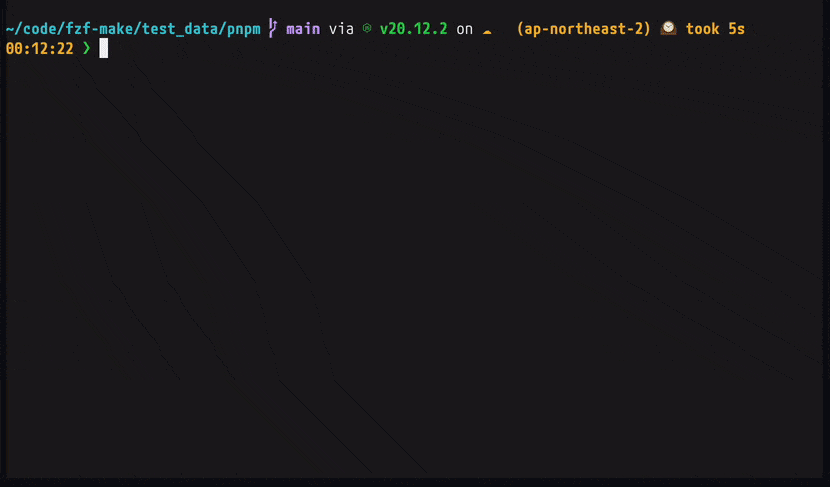
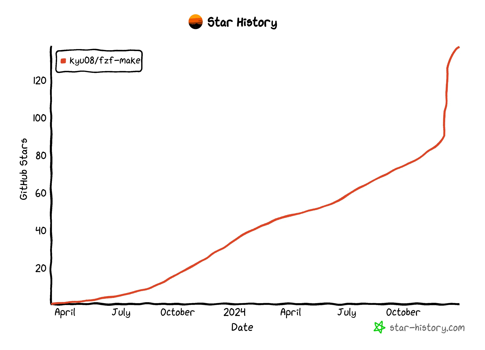
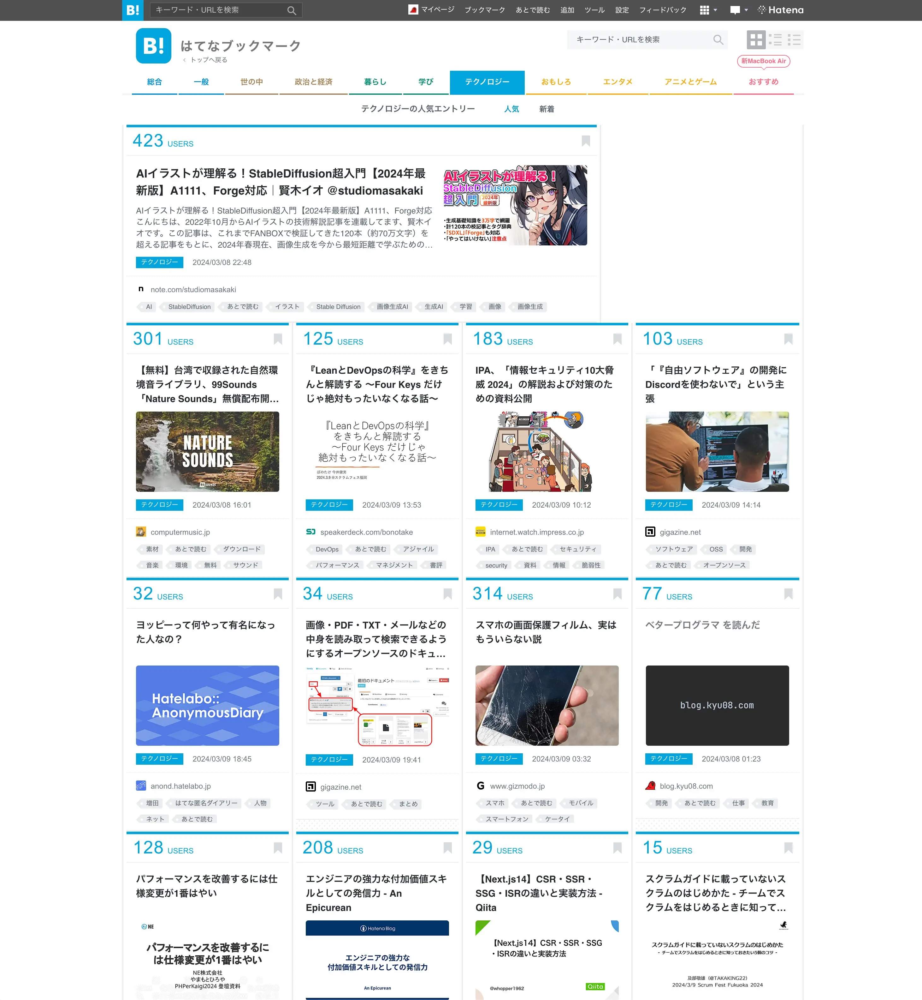

年の瀬なので今年を振り返る。

## OSS
### PRでの貢献
[49件のPRを作成](https://github.com/pulls?q=is%3Apr+archived%3Afalse+is%3Aclosed+author%3Akyu08+is%3Apublic+-user%3Akyu08+created%3A2024-01-01..2024-12-31+)[^1]し43件のPRがマージされた。(4件がclosedで2件がopenのまま)

簡単に分類すると以下のような感じ。詳細は別記事に書く予定。[^2]

- バグ修正: 3件
- ドキュメントの修正: 11件
- lint系の修正: 4件
- typo修正: 9件
- 機能追加: 7件
- CIのバージョンアップ: 5件
- 自作TUIのbrew release関連: 3件
- その他: 1件

今年の抱負の1つとしてこう書いていたがこれは達成できたといってよさそう。嬉しい。

> OSS貢献を続ける。何らかのOSSのアプリケーションコードにも貢献する。
>
> https://blog.kyu08.com/posts/looking-back-on-2023/#2024%E5%B9%B4%E3%81%AE%E6%8A%B1%E8%B2%A0

基本的には仕事中や趣味開発中にバグを見つけたり、追加したほうがよさそうな機能を思いついたり、ドキュメントの誤りに気付いたタイミングでPRを送っていた。

振り返るとOSS貢献を通して次のような成長を得られた。

- 馴染みのないプロジェクトのコードを読むのに慣れてきた。困ったり疑問があったらとりあえずドキュメントを読んだりissueやPRを検索したりcloneしてコードを読む、というのを自然とできるようになってきた。
    - 以前はとりあえず日本語のブログを探したりAIに聞いたりしていたが上記の動きができるようになってから困りの解消速度が上がった感触がある。
    - 特にRustで個人開発をしていると使いたいライブラリにドキュメントやexampleが存在しておらずそうするしかなかったというのもあるが、そのおかげで結果的に情報収集力が上がったように思う。
- (OSSプロジェクトでは基本的に英語でコミュニケーションを行うので)英語でのやりとりに対する抵抗がなくなった。DeepLに頼ることも多々あるので来年はその割合を減らしていけると英語力の向上に繋がっていいかもしれない。

OSS貢献を始める前は「自分がissueを立てたりPRを送ったりしなくても世界中にはたくさんの優秀なエンジニアがいるので自分が貢献する余地はないだろう」などど考えていたが、意外と自分のような普通の開発者でも貢献の余地があることを実感できた。

具体的には、ある程度利用者がいるOSSプロジェクトであっても意外と自分が思いついた改善のアイディアが採用されたり、超有名なOSSでもドキュメントに間違いがあったりする。

機能追加の例を挙げると[dlvhdr/gh-dash](https://github.com/dlvhdr/gh-dash)に対する以下のPRではローディング中に`No PRs were found ...`のようなメッセージが表示されていたのでローディング状態を表すスピナーを表示するようにした。

[feat: showing a loading message #364 - dlvhdr/gh-dash](https://github.com/dlvhdr/gh-dash/pull/364)

gh-dashは2024/12/30現在で7.4kスターを獲得しているOSSプロジェクトでスター数から類推するにそれなりに利用者もいると思われるが機能追加で貢献できたのは当時の自分からすると意外だった。(有名なプロジェクトなので自分が貢献する余地はないだろう、という先入観があった)

また、ドキュメント修正の例だと[Add missing version specifications for go install #1343 - grpc/grpc.io](https://github.com/grpc/grpc.io/pull/1343)でgRPCのプラグインのインストールコマンドを修正したり[docs: Fix installation command via Homebrew #10416 - zed-industries/zed](https://github.com/zed-industries/zed/pull/10416)でzedのインストールコマンドの不備を修正する変更が受け入れられた。

このように大規模な有名OSSであっても意外と自分が貢献する余地があると感じられたのはよかった。2025年も「自分なんかができることはないだろう」と自分の可能性を狭めずに積極的に貢献していきたい。

また、OSS貢献はメンテナや利用者に感謝してもらえるし熱量が高い人と議論したり協力したりできるのでとても楽しい。これからも楽しみながら貢献を続けていこうと思う。

### 寄付
[GitHub Sponsorsの寄付先にratatuiを追加した](https://blog.kyu08.com/posts/renew-oss-sponsoring/)でも書いた通り毎月[ratatui](https://github.com/ratatui/ratatui)と[neovim](https://github.com/neovim/neovim)に5$ずつ寄付しはじめた。

また、自分がソフトウェアエンジニアを目指して就活をしている際に[JavaScript Primer](https://jsprimer.net/)に大いに助けていただいたことをふとしたときに思い出したので[azu](https://github.com/sponsors/azu)さんにoneshotで10$寄付させていただいた。非情報系の大学/大学院に進んでいた自分にとってはとてもありがたい存在だった。

## 個人開発
サマリ:
- fzf-makeのstar数が100を突破した
- fzf-makeがhomebrew-coreに取り込まれた
- goでWeb APIサーバを作る際のパッケージ構成について検討した

### fzf-make

個人開発に関して言うと2024年はひたすらfzf-makeの改善を続けていた。

[fzf-make](https://github.com/kyu08/fzf-make)とはタスクランナー側で定義したコマンドをfuzzy finder形式で選択できるCLIツールで、現在は以下のタスクランナーに対応している。

- make
- pnpm
- yarn
- just

プレビューウィンドウが表示されるのでコマンドの内容を確認しながら選択できるのが特徴。履歴機能もあるので前回実行したコマンドを簡単に再実行することもできる。(`fzf-make repeat`)

2024年は[筆者が108件のPRを作成&マージし、](https://github.com/pulls?q=is%3Apr+archived%3Afalse+author%3Akyu08+is%3Apublic+repo%3Akyu08%2Ffzf-make+created%3A2024-01-01..2024-12-31+is%3Amerged)41個のバージョンがリリースされ、[筆者とrenovateを含めて8人の貢献者により184のcommitが追加された。](https://github.com/kyu08/fzf-make/compare/v0.13.0...v0.53.0)時折issueを立ててくれたりPRを送ってくれる方もいて大変ありがたい限り...！🙏

自分や自分の身の回りのエンジニアに使ってもらえてるのでFBをもらいやすいこと、Rustを書くのが楽しいことが要因で熱量高く取り組めている。

行った主要な機能追加は以下の通り。

- コマンドの実行履歴機能の追加[`@v0.19.0`](https://github.com/kyu08/fzf-make/releases/tag/v0.19.0)
- pnpm scriptsのサポート[`@v0.39.0`](https://github.com/kyu08/fzf-make/releases/tag/v0.39.0)
- yarn scriptsのサポート[`@v0.43.0`](https://github.com/kyu08/fzf-make/releases/tag/v0.43.0)
- 利用中のバージョンよりも新しいバージョンが存在する場合の通知機能[`@v0.48.0`](https://github.com/kyu08/fzf-make/releases/tag/v0.48.0)
- プレビューウィンドウのためにbatコマンドを実行する方式からsyntectを利用してsyntax highlightを行うように変更(パフォーマンスが向上した)[`@v0.50.0`](https://github.com/kyu08/fzf-make/releases/tag/v0.50.0)
- justのサポート[`@v0.52.0`](https://github.com/kyu08/fzf-make/releases/tag/v0.52.0)

来年はnpm、taskfileのサポートやaptでの配信などにも着手しようと画策中。

また、ある程度機能が揃ってきたタイミングでユーザー数を増やすアクションをしようと思い、zenn、Reddit, Hacker Newsに記事を投稿した。

- Zenn: [[make,pnpm,yarn,justに対応]コマンドをfuzzy finder形式で選択できるCLIツール fzf-makeの紹介](https://zenn.dev/kyu08/articles/974fd8bc25c303)
- Reddit: [fzf-make - A command runner with fuzzy finder and preview window for make, pnpm - reddit](https://www.reddit.com/r/commandline/comments/1h7btkl/fzfmake_a_command_runner_with_fuzzy_finder_and/)
- Hacker News: [Show HN: fzf-make – a command runner with a fuzzy finder for make, pnpm and yarn - Hacker News](https://news.ycombinator.com/item?id=42357587)

広報活動の甲斐もあってかGitHubのstar数が100を突破した。

記事へのリアクションはHacker News < Zenn < Redditの順で多かったが、流入数が一番多かったのはHacker Newsだった。おそらくアクティブユーザーのケタが違いそう。

さらには夢の1つだった自分のツールがhomebrew-coreに取り込まれるということも達成できた。実は本家homebrewに取り込まれるためには[ある程度有名でユーザー数が多いこと、などの基準がある](https://docs.brew.sh/Acceptable-Formulae#niche-or-self-submitted-stuff)ためいつかfzf-makeがある程度有名になったといえるタイミングでPRを送ろうと[考えていた。](https://github.com/kyu08/fzf-make/issues/195)

が、あるときたまたまhomebrewのメンテナによって[fzf-makeがhomebrew/homebrew-coreに追加されるPR](https://github.com/Homebrew/homebrew-core/pull/200454)を発見しfzf-makeがhomebrewに取り込まれたことを知ることとなった。自分としては思わぬ早めのクリスマスプレゼントのような感じで本当に嬉しかった。

その喜びと感謝を伝えたところメンテナの方からこんなコメントをもらった。

> In addition to maintaining Homebrew, I search for awesome software that we don't currently ship so that I can add it for distribution. Was happy to find fzf-make and ship it! おめでとう〜！
> 
> https://github.com/kyu08/fzf-make/issues/195#issuecomment-2533563544

自分がつくったソフトウェアがhomebrewメンテナの方に必要だと思ってもらえて純粋に嬉しかったし、たった一言でもわざわざ日本語で祝福してくれたのも大変心に響いた。

### GoでWeb APIサーバを作る際のパッケージ構成について検討した
業務のWeb APIサーバーの実装の課題と改善策を考えているときにふと「現時点での自分の理想のGo APIサーバーのアーキテクチャ」のぼんやりとした像はあれど実装したことがないことに気付いたので書いてみることにした。

https://github.com/kyu08/go-api-server-playground

Twitterのクローンアプリを題材にした。主にレイヤー分けの方法に注力しつつ次のような技術キャッチアップも兼ねて作った。(その他の使用技術は[README](https://github.com/kyu08/go-api-server-playground)参照)

- gRPC
- 構造化ログ
- runnを使ったE2Eテスト
- docker composeを自分でイチから書く
- sqlcを使ってsqlからコード生成

なんとなく形になりかけたところで忙しくなり中途半端になってしまったので来年どこかで再開したい。

## ブログ
サマリ:
- 17本の記事を書いた
- [『ベタープログラマ』 を読んだ](https://blog.kyu08.com/posts/better-programmer/)がはてぶのトップページに載った
- [こんな感じ](https://github.com/kyu08/blog/pull/186)でデザインを変更した。

3月に書いた[『ベタープログラマ』 を読んだ](https://blog.kyu08.com/posts/better-programmer/)がたくさんの人の読んでいただけて、はてぶのトップページに掲載された。

優秀なエンジニアの振る舞いについて様々な角度から考察されていて大変参考になった。

他に印象に残っている記事は以下。

- [CS50.jpでCSに入門した](https://blog.kyu08.com/posts/cs50-jp/)
- [Cloud Spanner について知らなかったことを書く](https://blog.kyu08.com/posts/learn-about-spanner/)
- [『Goならわかるシステムプログラミング 第2版』を読んだ](https://blog.kyu08.com/posts/go-system-programming/)

ブログでのアウトプットを通して自分の学びを整理したり、記憶に定着させることができている実感があるので来年も続けていく。

## 読書など
読んだ本や受講した講座:

- CS50
- ベタープログラマ
- いちばんやさしいアジャイルの開発の教本
- 読み手につたわる文章 - テクニカルライティング
- Goならわかるシステムプログラミング第2版

CS50を受講し、『Goならわかるシステムプログラミング第2版』を読んだことでCSの基礎的な部分を学ぶことができた。両方とも手を動かしながら学べる形式だったので楽しく理解を深めることができた。[^3]

そこで得た学びをもとに、次は『コンピュータシステムの理論と実装第2版』をやっていく。その次はネットワーク系にも手を出したい。

## 生活
### 運動と早寝早起き

運動と早寝早起きによって頭がスッキリしてパフォーマンスが上がる感覚があったので今年の春くらいから意識的に取り組んだ。

リングフィットは運動のハードルを下げられるし楽しく運動できて良い反面、有酸素運動をするのであれば普通にランニングした方が運動強度を高めやすくて良さそう。（が、冬の時期は着替えが面倒だし寒いのでなかなか走りに行けなかった）

あとは早めに風呂に入ると早めに眠くなるので早寝早起きしやすい、という当たり前すぎることを感じた。

### 舌下治療をはじめた
11月中旬から開始した。来年の2月ごろには効果が出るらしいので楽しみ。

## 買ってよかったもの
- スタンディングデスク(FlexispotのE7)
- MX Ergo S
    - MX Ergoから乗り換えたが静かでボタンの押し心地も良くなっていて満足。
- LogicoolのWebカメラ(C980GR)
- デスク用の足元パネルヒーター
- 脱衣所に置く小型セラミックヒーター
- THE NORTH FACEのダウン

## 仕事
- チーム内のコミュニケーションやドキュメンテーションなどチーム改善にコミットする時間が去年までよりも長かった。チームを変えることの難しさやうまくいったときの達成感を感じることができてよかった。
- これまでよりも不確実性と向き合った。目的不確実性がある中でのプロジェクトの進め方、アサインやタスクの着手順などについて考えることが多かったのがいい経験だった。改めて『エンジニアリング組織論への招待』を読み返そうと思う。

## 2025年の抱負
- 仕事関係で大きめの変化があるのでしっかりとバリューを出して事業貢献できるように頑張っていきたい。
- CSの勉強を続けてソフトウェアエンジニアの土台となるような知識を固めていきたい。来年はこのあたりに注力する予定。
    - OS
    - ネットワーク
    - コンテナ技術(というかk8s)

## おわりに
振り返ると結構いろいろやれた。来年もやっていき。

去年の振り返り: [2023年を振り返る](https://blog.kyu08.com/posts/looking-back-on-2023/)

[^1]: Ownerが自分以外のPublic Repositoryを対象に集計。
[^2]: 別記事を書くときのための自分用のメモ https://gist.github.com/kyu08/29f27ea93e8566759c89db001c47b3cb
[^3]: CS50の課題でC言語の大変さを学べたのもいい思い出。
