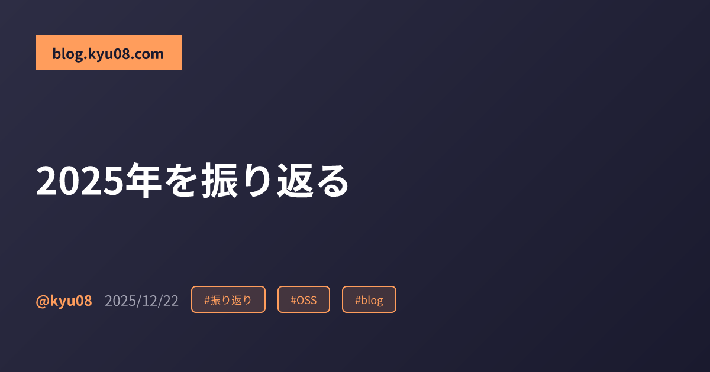

年の瀬なので1年を振り返る。

## OSS
### PR
GitHubとGerritで55件のPR[^1]を作成し49件のPRがマージされた。([GitHub](https://github.com/pulls?q=is%3Apr+archived%3Afalse+is%3Aclosed+author%3Akyu08+is%3Apublic+-user%3Akyu08+created%3A2025-01-01..2025-12-31+)[^2] [Gerrit](https://go-review.googlesource.com/q/owner:kyu.subsub@gmail.com))

去年の数字が以下だったのでPR作成数、マージされたPR数ともに微増した。

> 49件のPRを作成し43件のPRがマージされた。

PR一覧は以下のような感じ。[^3]

#### 機能追加
- [jesseduffield/lazygit - Add "CopyToClipboard" command to ConfirmationController](https://github.com/jesseduffield/lazygit/pull/4810)
- [jesseduffield/lazygit - Add new command "Checkout previous branch"](https://github.com/jesseduffield/lazygit/pull/4728)
- [nabekou29/pair-lens.nvim - feat: add Go expression_switch_statement and type_switch_statement support](https://github.com/nabekou29/pair-lens.nvim/pull/2)

#### ドキュメント関連
- [Homebrew/homebrew-cask - cursor: update homepage link](https://github.com/Homebrew/homebrew-cask/pull/200288)
- [rust-lang/this-week-in-rust - Add project update: "fzf-make v0.65.0"](https://github.com/rust-lang/this-week-in-rust/pull/7158)
- [ratatui/.github - Fix typo Javascript -> JavaScript](https://github.com/ratatui/.github/pull/2)
- [genkit-ai/docsite - Fix incorrect field name in express authentication example](https://github.com/genkit-ai/docsite/pull/158)
- [humanlayer/12-factor-agents - Fix typo](https://github.com/humanlayer/12-factor-agents/pull/73)
- [humanlayer/12-factor-agents - Delete unnecessary \]](https://github.com/humanlayer/12-factor-agents/pull/72)
- [go-task/task - chore: delete unnecessary whitespace](https://github.com/go-task/task/pull/2394)
- [go-task/task - docs: add fzf-make to "Community Integrations"](https://github.com/go-task/task/pull/2393)
- [jesseduffield/lazygit - Update the badges of golangci-lint and homebrew in README.md](https://github.com/jesseduffield/lazygit/pull/4807)
- [jesseduffield/lazygit - Update CONTRIBUTING.md to clarify translation contribution process](https://github.com/jesseduffield/lazygit/pull/4806)
- [nvim-orgmode/orgmode - docs: fix absences of line break](https://github.com/nvim-orgmode/orgmode/pull/985)
- [bnjbvr/cargo-machete - doc: rename job name in example workflow](https://github.com/bnjbvr/cargo-machete/pull/168)
- [rust-lang/cargo - docs: update version notice for deprecation removal](https://github.com/rust-lang/cargo/pull/15511)
- [geek-rabb1t/geek-rabb1t.github.io - typoを修正](https://github.com/geek-rabb1t/geek-rabb1t.github.io/pull/1)
- [h3pei/trace-pr.nvim - docs: describe the default value of trace_by_commit_hash_when_pr_not_found explicitly in README.md](https://github.com/h3pei/trace-pr.nvim/pull/4)
- [golangci/golangci-lint - docs: explicitly describe that the migrate command automatically migrate linters.presets](https://github.com/golangci/golangci-lint/pull/5697)
- [catppuccin/lazygit - doc: remove deprecated selectedRangeBgColor key from example](https://github.com/catppuccin/lazygit/pull/53)
- [yykamei/block-merge-based-on-time - Add ready_for_review as the workflow trigger to the example in README.md](https://github.com/yykamei/block-merge-based-on-time/pull/2192)
- [yuki-yano/zeno.zsh - docs(readme): replace exa with eza](https://github.com/yuki-yano/zeno.zsh/pull/81)
- [nand2tetris/web-ide - Fix typo in projects/src/project_08/21_nested_call.ts(initliazes -> initializes)](https://github.com/nand2tetris/web-ide/pull/559)
- [cloudspannerecosystem/yo - Add installation method for Go 1.16+](https://github.com/cloudspannerecosystem/yo/pull/147)
- [golang - 703735: GoUsers: add Canary Inc.](https://go-review.googlesource.com/c/wiki/+/703735)
- [golang - 703736: GoUsers: fix the position of CloudSign](https://go-review.googlesource.com/c/wiki/+/703736)

#### バグ修正
- [derailed/k9s - feat(pulse): map hjkl to navigate as help shows](https://github.com/derailed/k9s/pull/3699)

#### CI、開発環境等の変更
- [jesseduffield/lazygit - Add synchronize event to the hooks of "Check Required Labels"](https://github.com/jesseduffield/lazygit/pull/4974)
- [jesseduffield/lazygit - Use ignore directive to ignore test files not to be passes to gofumpt](https://github.com/jesseduffield/lazygit/pull/4936)
- [jesseduffield/lazygit - Update go to 1.25](https://github.com/jesseduffield/lazygit/pull/4844)
- [jesseduffield/lazygit - Run label check workflow only on label events and open pr event](https://github.com/jesseduffield/lazygit/pull/4830)
- [jesseduffield/lazygit - Enhance PR/Issue templates readability](https://github.com/jesseduffield/lazygit/pull/4829)
- [jesseduffield/lazygit - Pass only Git-tracked Go files to gofumpt](https://github.com/jesseduffield/lazygit/pull/4809)

#### 翻訳
- [rust-lang/surveys - \[Japanese\] replace "prioritising work" with "problems to productivity" in 2024 survey](https://github.com/rust-lang/surveys/pull/329)

#### 自作ツールのbrew release関連
- [Homebrew/homebrew-core - fzf-make 0.66.0](https://github.com/Homebrew/homebrew-core/pull/260001)
- [Homebrew/homebrew-core - fzf-make 0.65.0](https://github.com/Homebrew/homebrew-core/pull/249550)
- [Homebrew/homebrew-core - fzf-make 0.64.0](https://github.com/Homebrew/homebrew-core/pull/249255)
- [Homebrew/homebrew-core - fzf-make 0.63.0](https://github.com/Homebrew/homebrew-core/pull/248909)
- [Homebrew/homebrew-core - fzf-make 0.62.0](https://github.com/Homebrew/homebrew-core/pull/246767)
- [Homebrew/homebrew-core - fzf-make 0.61.0](https://github.com/Homebrew/homebrew-core/pull/242247)
- [Homebrew/homebrew-core - fzf-make: add task to available runner in description](https://github.com/Homebrew/homebrew-core/pull/234337)
- [Homebrew/homebrew-core - fzf-make 0.60.0](https://github.com/Homebrew/homebrew-core/pull/233946)
- [Homebrew/homebrew-core - fzf-make: update desc](https://github.com/Homebrew/homebrew-core/pull/223065)
- [Homebrew/homebrew-core - fzf-make 0.59.0](https://github.com/Homebrew/homebrew-core/pull/223063)
- [Homebrew/homebrew-core - fzf-make 0.58.0](https://github.com/Homebrew/homebrew-core/pull/222737)
- [Homebrew/homebrew-core - fzf-make 0.57.0](https://github.com/Homebrew/homebrew-core/pull/222421)
- [Homebrew/homebrew-core - fzf-make 0.56.0](https://github.com/Homebrew/homebrew-core/pull/205485)
- [Homebrew/homebrew-core - fzf-make 0.55.0](https://github.com/Homebrew/homebrew-core/pull/203296)
- [Homebrew/homebrew-core - fzf-make 0.54.0](https://github.com/Homebrew/homebrew-core/pull/203265)

### 寄付
この記事を書いたときから継続して[Neovim](https://github.com/sponsors/neovim)と[ratatui](https://github.com/sponsors/ratatui)に5$/monthずつ寄付し続けている。

https://blog.kyu08.com/posts/renew-oss-sponsoring/

だいたい累計$150くらい寄付したことになる。少しでも長く持続してくれると嬉しいのでこれからも続けていく。

### 振り返り
- 去年と同じくらいのペースでPRを送ることができた。（平均約4.5件/月ペース）
- LazygitのGitHubのトップページのContributors一覧入りを果たした。
    
    - GitHubではcommit数が多い順に12人目くらいまでのアイコンがContributorsに表示される。
    - 細々とcontributionを続けたところの9番目にcommitが多い人になれた。（2025/12/23現在）
    - しばらくはこれを目標にlazygitへのcontributionを続けていたので嬉しい。
    - CIの修正やGoのバージョンアップなど、地味めなPRがメインだったがいくつか機能追加PRもマージしてもらえた。（[branchパネルで`-`を押すと`git checkout -`相当のことができる機能](https://github.com/jesseduffield/lazygit/pull/4728)と[エラー内容をクリップボードにコピーできるようにする機能](https://github.com/jesseduffield/lazygit/pull/4810)）
- GoWikiへのcontributionに際してGerritを初めてつかった。
    - GitHubとかなかなかメンタルモデルが違う感じだったので結構手間取った。
    - 参考になったリソースなどをいつか記事にしたい。

OSSメンテナに感謝されるのは嬉しいし、見つけた問題を自分の手で解決するのも楽しいので引き続きやっていきたい。

社内でもOSSは楽しいぞーという話を何回かしたところ、それをきっかけにしてOSS貢献にトライしてくれる方が何名かいたのも嬉しかった。

## 個人開発
### fzf-make

https://github.com/kyu08/fzf-make

タスクランナー側で定義したコマンドをfuzzy finder形式で選択できるCLIツールを趣味でRustで開発している。

現在は以下のタスクランナーに対応している。

- make
- pnpm
- yarn
- just
- task

gifを見てもらえれば分かる通り、プレビューウィンドウでコマンド内容を確認しながらコマンドを選択できるのが特徴の一つ。

#### スター数

2025/12/23現在では245スターを獲得している。

[Star History](https://www.star-history.com/#kyu08/fzf-make&type=date&legend=top-left)によると2024/12/19時点では129スターだったので1年で大体倍くらいになった。🎉

来年も適度なペースで細々とメンテしていきます。(npm対応は早めにやりたい...！)

#### 今年の変更点
2025年は[筆者が74件のPRを作成&マージし](https://github.com/pulls?q=is%3Apr+archived%3Afalse+author%3Akyu08+is%3Apublic+repo%3Akyu08%2Ffzf-make+created%3A2025-01-01..2025-12-31+is%3Amerged+)、[12個のバージョンがリリースされ、筆者とrenovateを含めて5人の貢献者により102のcommitが追加された。](https://github.com/kyu08/fzf-make/compare/v0.54.0...v0.65.0)

TUIツールを個人開発をしているとなかなかユーザーの存在を感じづらいので昨年に引き続きissueを立てたりPRを送ってくれたりTwitterで言及してくれる方がいてとても嬉しい。🙏

もちろん使ってるよー！と言ってもらえるだけでも大変うれしいです！ぜひ[スター](https://github.com/kyu08/fzf-make)もお願いします！

今年行った主要な機能追加は以下の通り。

- コマンドに引数を渡せるようにする[`@v0.58.0`](https://github.com/kyu08/fzf-make/releases/tag/v0.58.0)
- go-task/taskをサポート[`@v0.60.0`](https://github.com/kyu08/fzf-make/releases/tag/v0.60.0)
- コマンドのコピー機能を追加[`@v0.66.0`](https://github.com/kyu08/fzf-make/releases/tag/v0.66.0)

来年こそはnpm対応を入れたい。（npm対応のPRを送ってくれている方がいるので早ければ年始くらいにはリリースできるかもしれない）

### sunaba
これまで素振り用のrepositoryはトピックごと（触りたいライブラリや読んでいる本など）ごとに作成していたが、まとめて管理したくなったので素振りごった煮repositoryを作成した。

https://github.com/kyu08/sunaba

今までは都度repositoryを作成していたが、ディレクトリを作成するだけでよくなったので若干楽になった。

## ブログ
### 書いた記事
今年は14本の記事を書いた。

- [IQUNIX Magi65を買った](https://blog.kyu08.com/posts/magi65/)
- [『コンピュータシステムの理論と実装 第2版』を読んだ](https://blog.kyu08.com/posts/nand2tetris/)
- [傾斜付きロープロファイルキーキャップNuPhy Oblivionを買った](https://blog.kyu08.com/posts/oblivion-keycaps/)
- [cargoプロジェクトで依存関係を継続的に管理する](https://blog.kyu08.com/posts/manage-cargo-dependencies/)
- [関数型まつり2025に参加した](https://blog.kyu08.com/posts/fp-matsuri-2025/)
- [Keychron V4 Max を買った](https://blog.kyu08.com/posts/keychron-v4-max/)
- [追いKeychron V4 Max](https://blog.kyu08.com/posts/second-keychron-v4-max/)
- [『Tidy First?』を読んだ](https://blog.kyu08.com/posts/tidy-first/)
- [VimConf 2025 Smallに参加した](https://blog.kyu08.com/posts/vim-conf-2025/)
- [『デッドライン』を読んだ](https://blog.kyu08.com/posts/the-deadline/)
- [『つくって、壊して、直して学ぶ Kubernetes入門』を読んだ](https://blog.kyu08.com/posts/bbf_kubernetes/)
- [『コンセプトから理解するRust』を読んだ](https://blog.kyu08.com/posts/understanding-rust-from-concepts/)
- [『RustによるWebアプリケーション開発 設計からリリース・運用まで』を読んだ](https://blog.kyu08.com/posts/rust-web-app-book/)
- [Gerritで自分が作成したCL一覧を確認する方法](https://blog.kyu08.com/posts/gerrit-find-cls-you-created/)

### ブログの変更
今年はブログのデザインや仕組みについてもいくつか変更を加えた。

1. OGPを動的生成するようにした
1. Heading要素のデザインを変えた
1. プレビュー環境を整えた
1. ブログカードの表示

### OGPの自動生成
CIで記事のタイトルを読み取ってOGP画像を自動生成 + commitするようにした。

https://github.com/kyu08/blog/pull/239

こんな感じの画像が自動生成される。

Twitterで投稿したときに追加されるタイトル要素とOGPのメタ情報が被らないようになっているのが地味なこだわりポイント。

ついでにこんな感じでPRにコメントとして表示されるようにしたので投稿前に確認できる。（日本語だとたまーに特定の記号などが豆腐になってしまうのチェックしておきたい）

### Heading要素のデザインを変えた

これまではレベルの異なるHeading要素の区別が付きづらかったので`## OSS`のようにHeading要素のレベルに合わせて`#`が表示されるデザインにした。

| BEFORE |  |
| --- | --- |
| **AFTER** |  |

[@voluntas](https://x.com/voluntas)さんの[このツイート](https://x.com/voluntas/status/1981896805672501760)をみていいなーと思ったので真似してみた。

### プレビュー環境を整えた
PRコメントにプレビュー環境のリンクが投稿されるようにした。出先などでも記事の校正がしやすくなった。

https://github.com/kyu08/blog/pull/235

## 読書など
- [コンピュータシステムの理論と実装 第2版](https://www.oreilly.co.jp/books/9784814400874/)
- [Tidy First?](https://www.oreilly.co.jp/books/9784814400911/)
- [デッドライン](https://bookplus.nikkei.com/atcl/catalog/99/140252/)
- [つくって、壊して、直して学ぶ Kubernetes入門](https://www.shoeisha.co.jp/book/detail/9784798183961)
- [コンセプトから理解するRust](https://gihyo.jp/book/2022/978-4-297-12562-2)
- [RustによるWebアプリケーション開発 設計からリリース・運用まで](https://www.kodansha.co.jp/book/products/0000398182)
- [Clean Architecture 達人に学ぶソフトウェアの構造と設計](https://tatsu-zine.com/books/clean-architecture)

読みかけのものは割愛。

タイトルからも分かる通りComputer Science、 プロマネ、Kubernetes、Rustが今年の興味領域の中心だった。長期的に役立ちそう系と仕事ですぐ使える系とただ単に興味がある系をバランスよく摂取できた気がする。

ひとまずRust欲が落ち着いたので来年はComputer Science系をやりつつ、Goの深堀りにも時間を使っていきたい。Computer Scienceに関してはネットワークと並行プログラミング周りを深掘ろうと思っている。

### ブログカードの表示
こんな感じでリンク先の情報を表示するようにした。便利。

https://github.com/kyu08/blog/pull/246

## 勉強会
- 関数型まつり2025
- VimConf 2025 Small

に参加した。

https://blog.kyu08.com/posts/fp-matsuri-2025/

https://blog.kyu08.com/posts/vim-conf-2025/

勉強になったり刺激を得られたりしてよかった。来年はGoの勉強会にも参加してみようと思う。

## 生活
### ジム
8月からジムに通い始めた。腰が痛くなりやすいので腰痛防止が主な目的。

無事に腰痛とはお別れでき、筋肉も4ヶ月で4kg増やすことができているので引き続きやっていき。活動できる量も増えるしやはり筋肉は正義なのだと実感した。

### 睡眠
今年の春くらいから就寝時間が0時半くらいになった。それまでは2時とかに寝て次の日なんかボーッとするなーということが多かったのでいい感じになってよかった。

朝散歩で日の光にあたったり運動や出社で体力を使うようにしたのが自分の睡眠にはいい影響があった気がする。（たぶん）

### 食事
これまではリモートで働いているとよく17時前後に集中力が皆無になってしまい、ちょっとゴロゴロしてから空腹を感じてご飯を食べる、というようなことをしていた。

ある日お昼ご飯をお腹いっぱい食べたところ夕方の集中力低下タイムがなくなったことに気づいた。シンプルに夕方に血糖値的なものが下がりすぎて集中力が落ちていた模様。地味に生産性が落ちていたので改善できて嬉しい。

### 舌下治療
去年の秋頃始めた舌下治療の結果がでて今年の春の花粉シーズンは例年よりも楽だった。

来年はもっと楽になることを期待。

### サッカー
今年からJリーグ（カップ戦も含む）観戦にいくようになった。

非日常でめっちゃ楽しい。

## 仕事
転職し、2/1から新しい職場で働きはじめた。

プロダクトがたくさんのお客様に価値提供をできている実感があり、モチベーション高く働けている。

また、上期に関わったプロジェクトの成果を認めていただきMVPを受賞することができた。

会社全体としても好調なのでより一層事業成長に貢献していけるように全方面で頑張っていきたい。

技術的には引き続きGo、Google Cloud、Spannerなどを触っている。

このブログではあまり会社について詳しく話せていませんが、エンジニア採用を強化中ですので少しでも興味を持ってくれた方はTwitterのDMとかで連絡をください。ご飯やカジュアル面談などの調整をさせていただきます。（もちろんDMで聞きたいことを聞いていただいても大丈夫です）

[Engineer Entrance Book](https://recruit.canary-app.jp/engineer-entrance-book)にもかなり詳しく情報がまとまっているのでぜひご覧ください。🙇

## 2026年の抱負
- 事業成長により貢献する
- GoとComputer Scienceの理解を深める

## おわりに
2026年もやっていき。

過去の振り返り記事はこちら。
- [2024年を振り返る](/posts/looking-back-on-2024/)
- [2023年を振り返る](/posts/looking-back-on-2023/)
- [2020年をかんたんに振り返る](/posts/20201231-review-of-2020/)

[^1]: 便宜的にPRと表記しているが、GerritではCL(たしかChange List)と呼ばれる。
[^2]: Ownerが自分以外のPublic Repositoryを対象に集計。
[^3]: https://gist.github.com/kyu08/138f8d15c2badc8243ca2e126545ca36 を使って集計した。
