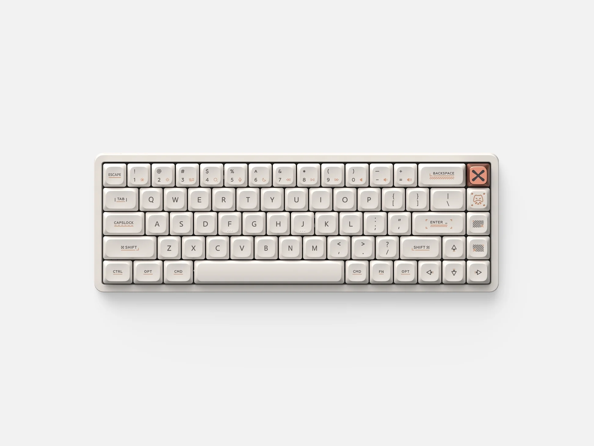
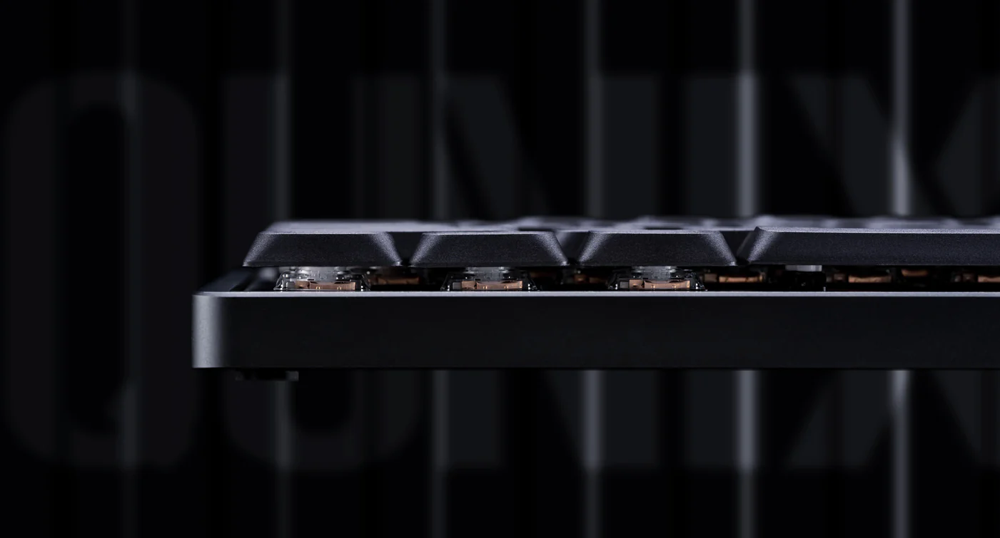
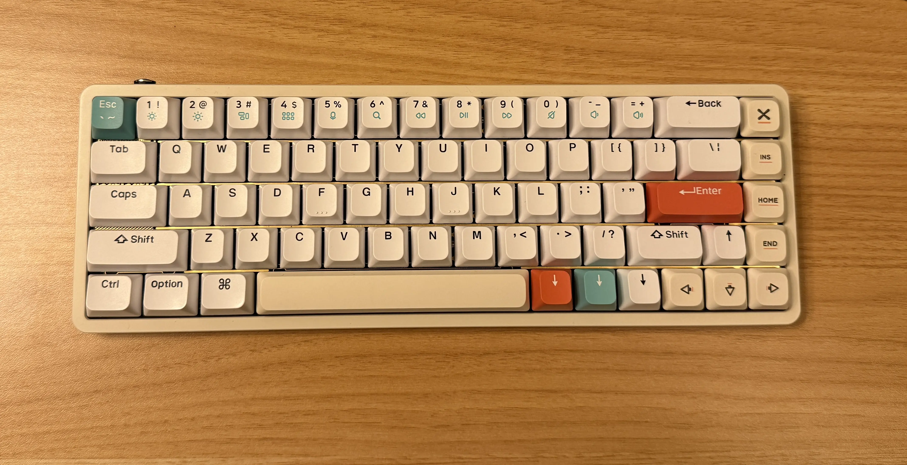

ある日YouTube Shortsで流れてきて打鍵感と打鍵音がよさそうで気になっていた[IQUNIX Magi65](https://iqunix.com/products/magi65)を買ってみた。

画像は公式サイトより引用: [Magi65 Aluminum Low Profile Mechanical Keyboard](https://iqunix.com/products/magi65)

価格は送料込みで$128(20,169円)だった。注文から14日後に届いた。中国から送られてきたので妥当そう。（？）

Magi65はコトコト系の打鍵音 & いい感じの打鍵感なので普段使っている7sPro[^1]とはまた違った感じで気分転換になって楽しい。

打鍵音はこんな感じ。[https://www.youtube.com/watch?v=EClom7Y_hO0](https://www.youtube.com/watch?v=EClom7Y_hO0)

重さも900gと適度にあるので安定感がありつつも持ち運びもそこまで辛くない。

ロープロファイルのキーボードには傾斜がないキーキャップが使われていることが多いがMagi65も例に漏れず傾斜のないタイプのキーキャップが採用されていた。

画像は公式サイトより引用: [Magi65 Aluminum Low Profile Mechanical Keyboard](https://iqunix.com/products/magi65)

傾斜があったほうが打ちやすい派なのでNuPhy Halo65のキーキャップが使えたらいいなーと思いおもむろに装着してみたところなぜか普通に使えてしまったのでそのまま使ってみている。（色味が合ってないのが若干アレではあるが打ちやすさには代えられないのでよしとした[^2]）

あと通常プロファイルのキーボードよりも高さがないので尊師スタイルでも使っても手が疲れにくいのも嬉しいポイント。

欲を言えばスペースキーが3つくらいに割れていて傾斜のあるキーキャップの選択肢が多いと嬉しい。（ハイパー高望み）

ロープロファイルのコトコト系キーボードが気になる方にはオススメです。

[^1]: スイッチは[Yushakobo Fairy Silent Linear Switch](https://shop.yushakobo.jp/products/5659)を使っている。Magi65と比べるとより静音で打鍵感も軽いので疲れなくてこれはこれで良い。
[^2]: Cherry Profileのキーキャップも装着してみたがそちらは高さが合わなかったのか、R2の列のキーキャップの戻りが悪くなってしまい使えなかった
