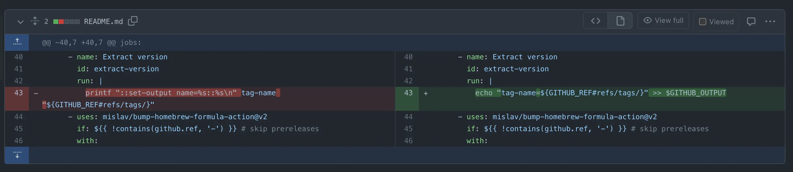
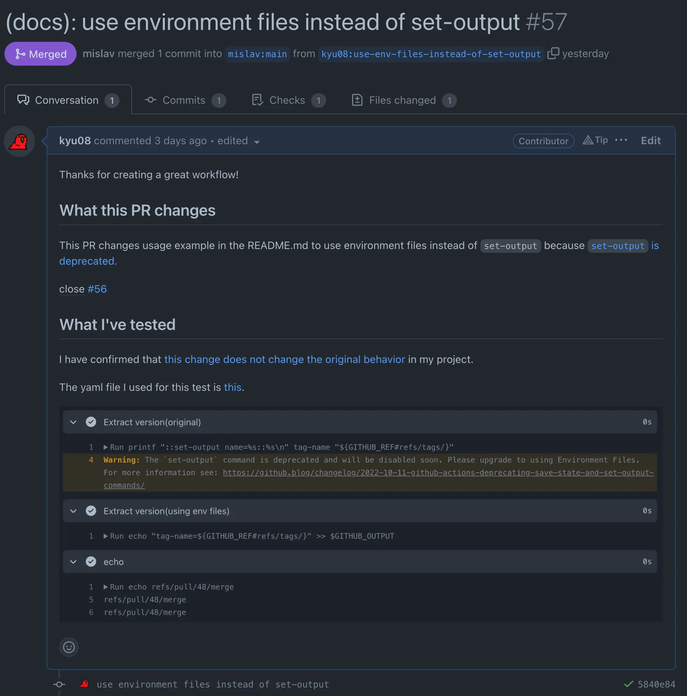
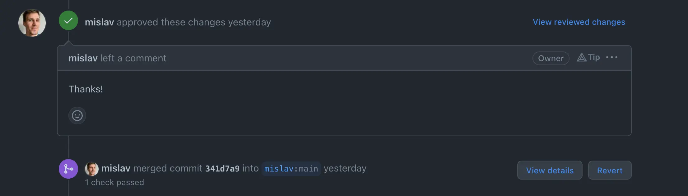
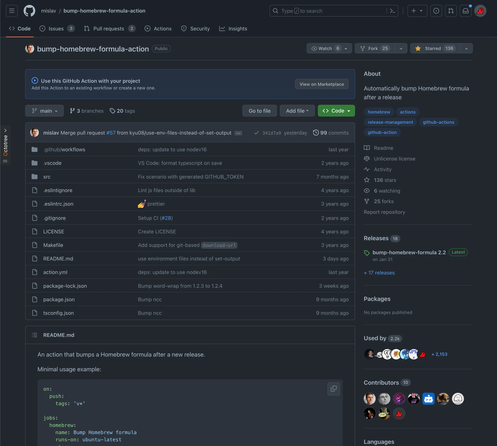
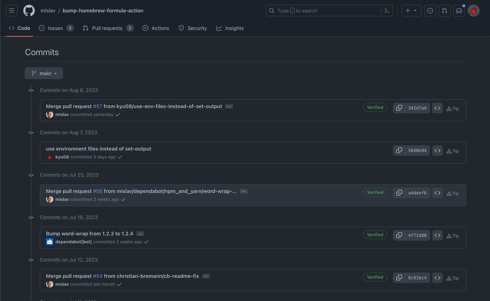

個人開発のプロジェクトで使えそうなGitHub Actionsを物色していたところちょうど自分でも修正できそうな箇所があったのでPRを送ってみたところ無事にマージしてもらうことができた。

実際にマージされたPRはこちら。

https://github.com/mislav/bump-homebrew-formula-action/pull/57

## PRの作成

修正内容としては非推奨となった`set-output`[^1]をenvironment filesに置き換えるという簡単なもの。
ちょうど業務で同様の修正を行っていたので特に詰まることなく修正できた。

修正内容はたった1行だったが、非同期だし時差もあるしでコミュニケーションの往復が増えることはお互い避けたいはずなのでできるだけ一発でマージしてもらえるように丁寧に背景や動作確認のログを書いた。(自分としても早くマージしてもらえた方が嬉しいし)

## 若干ソワソワしながら過ごしていると
PRを送った1日後には見事マージしてもらえた。念願の初OSS contribution！やったね！

2.2kものrepositoryで使われてるworkflowのcontributorsに自分のアイコンが載るのは結構嬉しい。(自分のプロジェクト[^2]でも利用し始めたタイミングだったのでちゃっかりUsed byにもアイコンが載っているｗ)

commit logに載っている様子。嬉しい。

## ということで
これからもOSSコミュニティへの貢献やっていくぞ〜！

[^1]: https://github.blog/changelog/2022-10-11-github-actions-deprecating-save-state-and-set-output-commands/
[^2]: https://github.com/kyu08/fzf-make
