『コンピュータシステムの理論と実装 第2版』を読んだので感想を書く。

## 本書の構成
<!-- TODO: こんなことをやる -->
<!-- TODO: 各章に課題とテストがある -->
<!-- TODO: この章は好きな言語でかける -->

## 第1章 ブール論理
Nandを使って以下の論理回路をHDL[^1]を使って実装した。

- not
- and
- or
- xor
- マルチプレクサ
- デマルチプレクサ
- not(16bit)
- and(16bit)
- or(16bit)
- マルチプレクサ(16bit)
- 8入力or
- 4入力マルチプレクサ(16bit)
- 8入力マルチプレクサ(16bit)
- 4入力デマルチプレクサ
- 8入力デマルチプレクサ

マルチプレクサの実装に悩んだがいい感じの実装を思いついたときの爽快感がすごかった。

焦らず真理値表を書きながら進めたのでマルチプレクサの実装以外はそこまで悩まなかった。

## 第2章 ブール算術
以下の論理回路を作成した。
- 半加算器
- 全加算器
- 16bit同士の加算
- 16bitの入力に1をインクリメントする回路
- ALU(Arithmetic Logic Unit: 算術論理演算装置) 

学び:

- 内部ピンにインデックスアクセスするには次のように書く必要がある。
    ```hdl
    Mux16(a=calculateResult, b=notCalculateResult, sel=no, out=out, out[0..7]=out0To7, out[8..15]=out8To15, out[15]=ng);
    ```
- 愚直な実装をしている箇所があったが、Mux16でスマートに書き直せることを知って感動した。

## 第3章 メモリ
この章では、DFF(Data Flip-Flop)を用いて1-bit registerを作成し、それを組み合わせて16-bit registerを作成し、さらにそれを組み合わせてRAMを作成した。

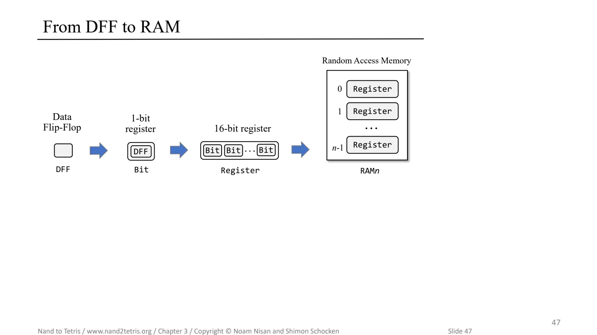
https://drive.google.com/file/d/1boFooygPrxMX-AxzogFYIZ-8QsZiDz96/view P47より引用

読み書き可能なメモリを作成したことで、コンピューターを作っている感が強まってきた。

作成した回路は具体的には以下。

- Register(1 Bit)
- Register(16 Bit)
- RAM(8 Bit)
- RAM(64 Bit)
- ProgramCounter
- RAM(512 Bit)
- RAM(4K Bit)
- RAM(16K Bit)

学びメモ:

- 第2章までは時間に依存しない回路のみを扱っていたがこの章では過去の状態を保持する回路を作成した。
- ここでは時間をクロックという単位で区切って扱う。
- **非同期チップ(組み合わせチップ)**: 入力値の組み合わせのみに反応し時間の進行には影響を受けない
- **同期チップ(順序チップ)**: 以前の時間単位での変化に対応する用に設計されたチップ
- 同期チップを利用することでシステム内のチップ間で信号が伝播するのにかかる時間を無視できる。
- ただしクロックサイクルは「システム内のチップ間で信号が伝播するのにかかる時間の最大値」と「1チップ内で最も処理時間がかかる演算を完了するのにかかる時間」の合計値よりも大きく設定する必要がある。

DFFは`out(t+1) = in(t)`で表される出力を持つ。DFFを用いることで過去の状態を論理回路上で表現できる。

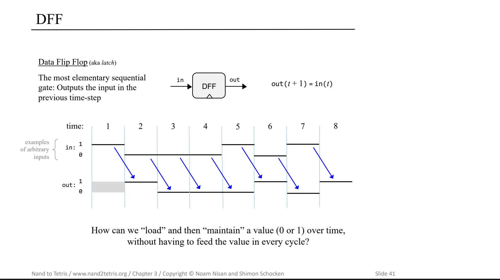
https://drive.google.com/file/d/1boFooygPrxMX-AxzogFYIZ-8QsZiDz96/view P41より引用

次のようにマルチプレクサとDFFを組み合わせることで1-bit registerを作成できる。

```hdl
CHIP Bit {
    IN in, load;
    OUT out;

    PARTS:
    Mux(a=dffOut, b=in, sel=load, out=mux);
    DFF(in=mux, out=out, out=dffOut);
}
```

1-bit registerは時刻`t`において`load`ビットがアサートされると`out(t+1)`が`in(t)`の値になり、アサートされていない場合は`out(t+1)`は`out(t)`の値になる。レジスタを利用することで過去の状態を保持できる結果、計算の結果を保持できる。

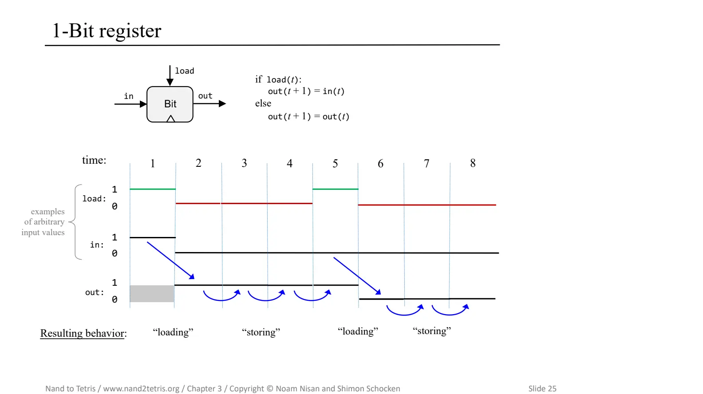
https://drive.google.com/file/d/1boFooygPrxMX-AxzogFYIZ-8QsZiDz96/view P25より引用

## 第4章 機械語
第4章では以下のプログラムを機械語で書いた。

- 掛け算を行うプログラム
- キーボードが押されているときだけ画面を黒くするプログラム

学びメモ:

- **機械語**:
    - ハードウェアプラットフォームが実行するように設計されている基本的な命令セット
    - 高水準言語は表現力やプラットフォーム間の互換性を目標に設計される一方で機械語は特定のハードウェアで直接実行され、そのハードウェアを完全に制御できるように設計されている。
    - 機械語は決められた形式に従い**プロセッサ**と**レジスタ**を用いて**メモリ**を操作するように設計されている。
    - バイナリ形式、記号形式の2パターンで記述できる。
- **メモリ**:
    - データや命令を保存するハードウェアデバイス。各セルは**メモリ位置**や**メモリレジスタ**と呼ばれ、それぞれ固有の**アドレス**を持つ。
- **プロセッサ**:
    - プロセッサは**中央演算装置(CPU)** と呼ばれ、あらかじめ決められた基本的な命令セットを実行できる。
    - プロセッサは選択されたレジスタとメモリ位置からデータを取り出し、選択されたレジスタとメモリ位置に出力を書き込む。
    - プロセッサは**ALU**と**レジスタ**、**バイナリ命令の解析と実行を可能にする論理ゲート**によって構成される。
- **レジスタ**:
    - プロセッサとメモリはそれぞれ独立したチップとして実装されており一方から他方へデータを移すには比較的時間がかかる。そのためほとんどのプロセッサにはいくつかのレジスタが備わっており、高速なローカルメモリとして機能する。
    - CPUに存在するレジスタは2つのタイプに分類される。
        - データを保持する**データレジスタ(Dレジスタ)**
        - アドレスを保持する**アドレスレジスタ(Aレジスタ)**
    
Hackコンピュータは以下のようなアーキテクチャを持つ。

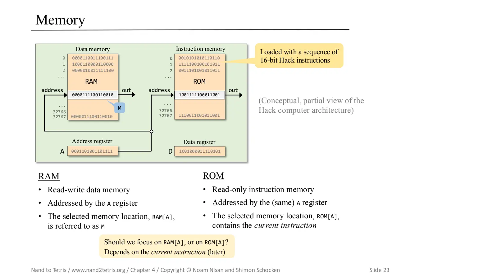
https://drive.google.com/file/d/1HxjPmIZkFHl-BVW3qoz8eD9dqEuEyuBI/view P23より引用

### アセンブラの役割

機械語はバイナリ形式、記号形式の2パターンで記述できると上述したが、記号形式で`@x`のように変数を宣言した場合にその変数を実際のメモリのどこに置くかを知るのが**アセンブラ**である。アセンブラのおかげで記号形式のプログラム側は実装詳細を意識することなく変数を初期化、利用できる。

### 命令タイプ

Hack言語には2つの命令タイプがある。
- **A命令**
    - A命令はAレジスタに15ビットの値を設定する。
    - A命令は1ビットのオペコード + 15ビットの値で構成される。(Hack機械語ではA命令のオペコードは`0`)
    - A命令は3つの目的で使用される。
        - プログラムによってコンピュータに定数を入力する
        - Aレジスタのアドレスを設定することでその次のC命令でRAMレジスタを操作できる
        - Aレジスタにジャンプ先のアドレスを設定することでその次のC命令でジャンプを実行できる
- **C命令**
    - C命令では次の3つを指定する。
        - どういう計算をするか(comp)
        - 計算された値をどこに保存するか(dest)
        - 次に何をするか(jump)
    - Hack機械語では一番左端の1ビットが1
    - C命令は次のような形式で構成される。`111accccccdddjjj`
        - 111: 先頭の1がオペコードで、左から2,3ビット目は使用されないが慣例として`1`が設定されている。
        - a: ALUへの入力がAレジスタからの値化Mからの値か決定する(1ビット)
        - c: compフィールド。(6ビット)ALUに対して計算内容を指定する。
        - d: destフィールド。(3ビット)計算結果の値をどこに保存するかを表現する。左から順にDレジスタ、Aレジスタ、`RAM[A]`に値を保存するかを表現する。

### 外部デバイス

Hackのハードウェアプラットフォームでは画面とキーボードの2つの外部デバイスに接続できる。どちらのデバイスも**メモリマップ**を通してコンピュータと会話する。(メモリの中に画面とキーボード用のメモリ領域があり、そこに画面の各ピクセルの値や押下されているキーのキーコードが格納される。)

### Hackプログラムの例

以下は掛け算を行うHackプログラムのソースコード。(Hackアーキテクチャで動作する機械語で書かれている) ハードウェアの構成要素を理解しながら手続き型チックに記述する必要があるため難しかったが理解が進んだ。

```asm
// 0に対して(R0-1)回R1を足すことで掛け算を実現する

  // n = 0
  @n
  M=0

  // R2 = 0
  @R2
  M=0
(LOOP)
  // if n == R0 then goto END
  @n
  D=M
  @R0
  D=D-M
  @END
  D;JEQ

  // R2 += R1
  @R2
  D=M

  @R1
  D=D+M

  // R2 = D
  @R2
  M=D

  // n++
  @n
  M=M+1

  // go to LOOP
  @LOOP
  0;JMP
(END)
  @END
  0;JMP
```

## 第5章 コンピュータアーキテクチャ
第5章では、これまでの章で作成した論理回路を組み合わせてついに1つの汎用コンピュータを作成する。このコンピュータは第4章に登場した機械語のプログラムを実行できる。

- **ノイマン型アーキテクチャ**:
    - CPUがメモリデバイスと相互作用する。
    - 入力デバイスからデータを受け取り出力デバイスへデータを送信する。
    - コンピュータのメモリ二保存サれるデータはコンピュータが計算したデータだけではなくコンピュータに何を行うべきかを指示する「命令」も含まれる。
- **メモリ**:
    - 物理的にはアドレス指定可能な固定サイズの**レジスタ**の並びで、それぞれが固有のアドレスを持つ。
    - 概念的にはアドレス空間はデータと命令の保存という2つの役割を果たす。
    - ランダムに選択されたメモリレジスタに瞬時に到達できるという要件からRandom Access Memoryと呼ばれている。
        - たしかにRAMはレジスタの木構造になっていたのである程度大きいRAMでも数ホップで指定したレジスタにアクセスできそうだ。
    - データ専用のメモリ領域を**データメモリ**、命令専用のメモリ領域を**命令メモリ**と呼ぶ。
- **CPU**:
    <!-- textlint-disable ja-technical-writing/ja-no-redundant-expression -->
    - CPUは現在読み込まれているプログラムの命令を実行する。
    - 各命令はCPUに対して以下を指示する。
        - どの計算を実行するか
        - どのレジスタにアクセスするか
        - 次のどの命令をフェッチして実行するか
    - CPUはこれらのタスクを**ALU**、**レジスタ**、**制御ユニット**を使って実行する。
    <!-- textlint-disable ja-technical-writing/ja-no-redundant-expression -->

第5章の課題ではこれまでの章で作成した論理回路を組み合わせて以下を作成した。

- Memory
- CPU
- Computer

正直CPUの実装、デバッグがはかなり大変だったが公式が提供してくれているテストツールとデバッガのお陰で効率的にバグを見つけることができた。

こんな感じで各ピンの出力や期待する結果とのdiffを比較的見やすい形式で表示してくれるのでありがたかった。

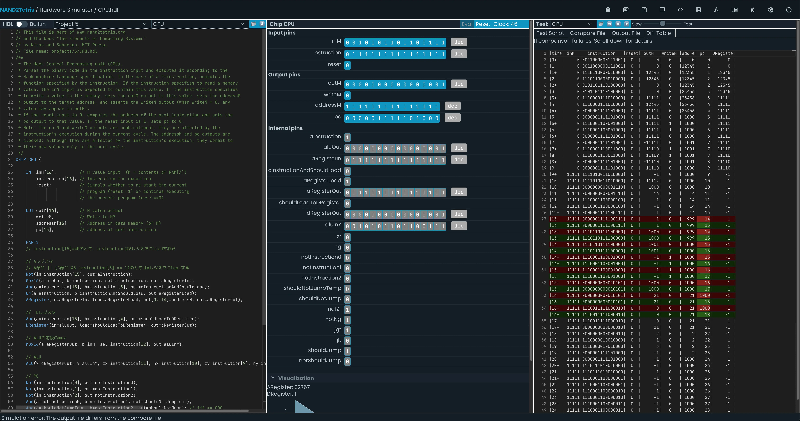

ここで作成したCPUの回路は次のようなもの。ここではヒントとして大まかな回路設計が与えられておりそれを参考にしつつ足りない部分を埋めていく形で実装を進めた。

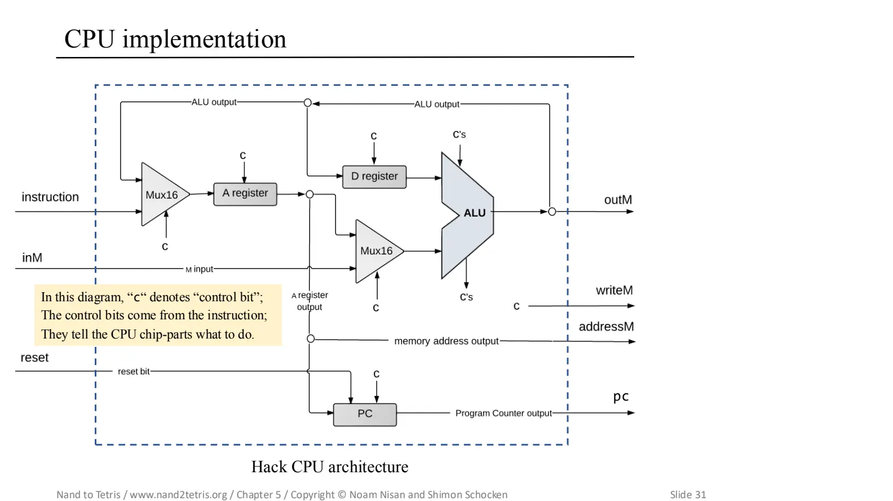
https://drive.google.com/file/d/1Z_fxYmmRNXTkAzmZ6YMoX9NXZIRVCKiw/view P31より引用

## 第6章 アセンブラ
<!-- TODO: 機械語のバイナリ表現の例をのせる -->

第6章では第5章で書いた機械語の記号表現をバイナリ表現に変換するアセンブラを開発する。

- 変数やラベルのアドレス管理を行うために**シンボルテーブル**を利用する。シンボルテーブルには以下のような情報が格納される。
    - ラベルの位置 e.g. `(LOOP)`
    - 変数のアドレス e.g. `@i`(Hack機械語では変数は16以降のアドレスに順に割り当てられる)
    - 定義済みシンボルのアドレス e.g. `@SCREEN`, `@KBD`

### シンボル処理
アセンブリプログラムではシンボルが定義サれる前にシンボルラベルを使用できる。（goto命令の行き先を指定するのに利用する）

この挙動も考慮しつつバイナリを生成するには**2パス・アセンブラ**と呼ばれる手法を用いる。

- 第1パス: シンボルテーブルを作成しすべてのラベルシンボルをテーブルに追加する。
- 第2パス: 変数シンボルを処理し、シンボルテーブルを使用してバイナリコードを生成する。

第6章からは好きな言語で実装できるのでRustで実装した。構文解析系はenumがある言語だと書きやすくて良い。

## 第7章 仮想マシンI：処理
第7章ではVM変換器の一部を実装した。第8章で残りの部分を実装してVM変換器が完成する。ここまでの課題の中では一番大変で丸3日かかった。

### HackプラットフォームのVMアーキテクチャとその利点
Hackプラットフォームにおいて、Hackプログラムは2段階コンパイルによって機械語に変換される。(更にその後アセンブラが機械語(記号表現)を機械語(バイナリ表現)に変換する)


中間コードは**仮想マシン(Virtual Machine; VM)** と呼ばれる抽象化されたコンピュータ上で実行されるように設計されている。

高水準言語のプログラムを直接機械語に変換する方式だとハードウェアプラットフォームごとにコンパイラを作成する必要がある。この場合、コンパイラはソース言語(高水準言語)とターゲット言語(機械語)の両方に依存するためそれぞれの変更に追従する必要がある。

2段階でコンパイルする方式を採用するとコンパイラはソース言語の詳細に、VM変換器はターゲット言語の詳細にのみ依存するため**変更への追従コストを下げることができる。**
この方式ではコンパイラはハードウェアプラットフォームによらず利用することができ、ハードウェアごとにVM変換器さえ実装すればよい。そのため**クロスプラットフォーム対応が比較的容易になる**という利点がある。

VMフレームワークは上記の利点の代償として**効率性が低下する**という欠点がある。2段階の変換プロセスで生成するコードは直接コンパイルで生成するコードよりも冗長なことが多く、効率性が落ちる。

### VM言語の設計
VM言語の設計にはバランスが重要で以下の要求を同時に満たす必要がある。

- 高水準側からの要求: 高水準言語のコードを表現できるだけの表現力と構造性を持たなければならない
- 低水準側からの要求: VMコードから生成される機械語がコンパクトで効率的になるようにVMコードは十分に低水準でなければならない

このような一見矛盾するような要件を**スタックマシン**が解決する。スタックマシンに基づく中間のVM言語を用いることで**高水準言語の表現力**と**低水準言語の効率性**という相反する要求を満たすことができる。

### スタックマシンの挙動
スタックマシンの中心は**スタック**と呼ばれるLIFOのデータ構造にある。ここではいくつかの操作について説明する。(ここではスタックは下方向に成長するように記述する)

#### push操作の例
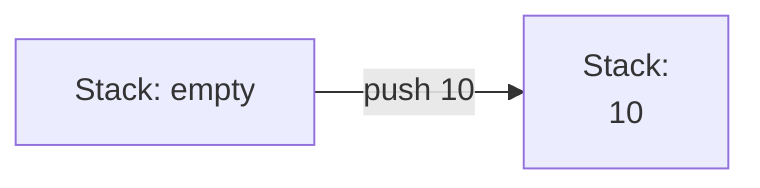

pushを行うとスタックの先頭に値が追加される。スタックでは**SP(スタックポインタ)** という値を使ってスタックの先頭位置を保持している。SPはpush操作を行う際に値を追加する領域を指し示している。スタックのメモリアドレスが0からスタートすると仮定すると今回の例ではアドレス0に値がpushされたときにSPの値が0から1になる。

| アドレス | 値  |
| ---      | --- |
| 0        | 10  |
| 1        |     |


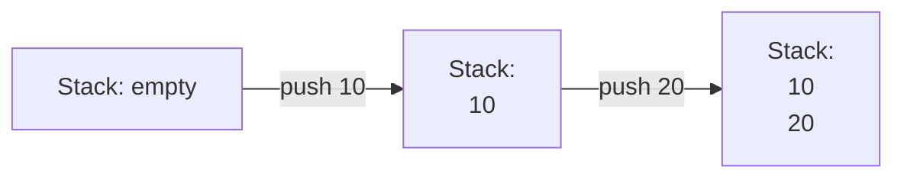

push操作を行うとスタックの先頭に値が追加される。このときSPの値は1から2になる。

#### pop操作の例
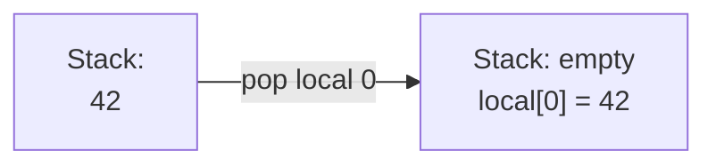
`pop segment_name index`と記述するとスタックの先頭の値を取り除き、指定したメモリセグメント、インデックスの位置に値を書き込む。

pop操作はスタックの先頭の値を取り除く。

#### 算術演算(add)の例
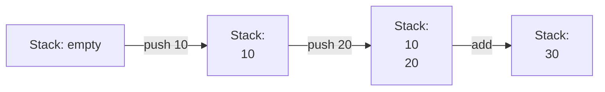

算術演算の例として`x+y`を行うケースを考える。

この処理は次のような流れで行われる。

1. スタックからオペランド`x`, `y`をpopする
1. `x+y`を計算する
1. 計算結果をスタックにpushする

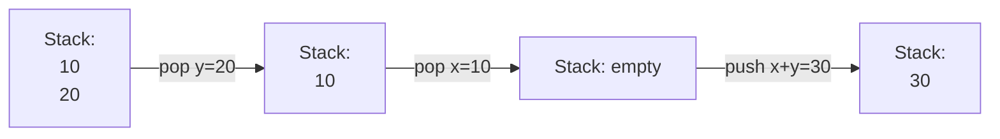

この方法を拡張することで一般的な算術演算をスタックマシンで評価できる。

第7章では、以下の演算子を実装した。

- `push`
- `pop`
- 算術演算子
    - `add`
    - `sub`
    - `neg`
    - `eq`
    - `gt`
    - `lt`
    - `and`
    - `or`
    - `not`

### 仮想メモリセグメント
ここで実装するVMにはシンボル変数は存在しない。そのかわりに変数は`static`, `local`, `argument`, `this`, `that`, `pointer`, `temp`のような名前を持つ**仮想セグメント**の要素として表現される。たとえばコンパイラは高水準言語プログラムで見つかった最初のスタティック変数を`static 0`に、その次に見つかったスタティック変数を`static 1`に、というように変換する。

ここでのVM実装では以下のような仮想メモリセグメントを持つ。

> |名前|場所|使用法|
> |---|---|---|
> |SP|RAM[0]|スタックポインタ：スタック最上位の次のメモリアドレス|
> |LCL|RAM[1]|localセグメントのベースアドレス|
> |ARG|RAM[2]|argumentセグメントのベースアドレス|
> |THIS|RAM[3]|thisセグメントのベースアドレス|
> |THAT|RAM[4]|thatセグメントのベースアドレス|
> |TEMP|RAM[5-12]|tempセグメントを保持|
> |R13, R14, R15|RAM[13-15]|VM変換器が生成するアセンブリコードに変数が必要な場合、これらのレジスタを使用可能|
> 
> P175より引用

`LCL`, `ARG`, `THIS`, `THAT`には各セグメントのベースアドレスが格納されている。たとえば次のように指定されていた場合、`pop this 2`はスタックの先頭の値を`RAM[2202]`に書き込む。

| アドレス | 値   | 備考 |
| ---      | ---  | ---  |
| 0        | 256  | SP   |
| 1        | 2000 | LCL  |
| 2        | 2100 | ARG  |
| 3        | 2200 | THIS |
| 4        | 2300 | THAT |

### VM変換器の動作例
例として実際の変換例を示す。

```vm
push constant 7
push constant 8
add
```

今回作成した実装では上記のvmコードは次のようなアセンブリコードに変換される。

```asm
// init
@256
D=A
@SP
M=D
// body
// push
@7
D=A
@SP
A=M
M=D
@SP
M=M+1
// push
@8
D=A
@SP
A=M
M=D
@SP
M=M+1
// add
@SP
A=M
A=A-1
A=A-1
D=M
@SP
A=M
A=A-1
D=D+M
@SP
A=M
A=A-1
A=A-1
M=0
@SP
A=M
A=A-1
M=0
@SP
M=M-1
M=M-1
@SP
A=M
M=D
@SP
M=M+1
// end
(END)
@END
0;JMP
```

VM変換器の実装はハードウェアの構造を意識しながらだいぶ手続き的なコードを書く必要があるので大変だった。(記述量も多いしミスるポイントも多い。)

現代のおいては低レイヤを隠蔽してくれる便利な仕組みがあるおかげでソフトウェアエンジニアが少ない記述量でアプリケーションを動かすことができていることを実感した。

ただ、隠蔽されているからこそ自主的に潜っていかないと構造の理解を深めるのが難しかったりするので引き続きやっていきたい。

## 第8章 仮想マシンII：制御
第7章では

> - `push`
> - `pop`
> - 算術演算子
>     - `add`
>     - `sub`
>     - `neg`
>     - `eq`
>     - `gt`
>     - `lt`
>     - `and`
>     - `or`
>     - `not`

以下の演算子を実装したが、第8章では以下の演算子を実装し、VM変換器を完成させた。

- `label`
- `goTo`
- `ifGoTo`
- `call`
- `function`
- `return`

これを実装することで次の操作が可能になりよりプログラムっぽい処理を行えるようになる。

- 任意のラベル位置へのジャンプ
- if分岐
- 関数の宣言と呼び出し

### 関数の呼び出し(`call`)
Hackプラットフォームにおいては`call {function_name}`コマンドを使って関数呼び出しを行う。

スタックを利用することで関数の呼び出しと戻り値の取得をシンプルに行うことができる。

ここでは`func_a`から`func_b`を呼び出すシナリオを例に関数呼び出しをスタックで実現する際の操作を説明する。

1. (`func_a`から`func_b`を呼び出す)
1. `func_a`の以下の呼び出し側の情報をスタックにpush(これらの情報は**フレーム**と呼ばれる)(画像の灰色の部分)
    1. リターンアドレス(: `func_b`の呼び出しが完了して`return`する際に戻るアドレス)
    1. `func_a`のLCLセグメントのベースアドレス
    1. `func_a`のARGセグメントのベースアドレス
    1. `func_a`のTHISセグメントのベースアドレス
    1. `func_a`のTHATセグメントのベースアドレス
1. ARG, LCLセグメントの値を更新
1. `func_b`のコマンドが定義されているアドレスにジャンプ
1. リターンアドレスラベルをコードに挿入

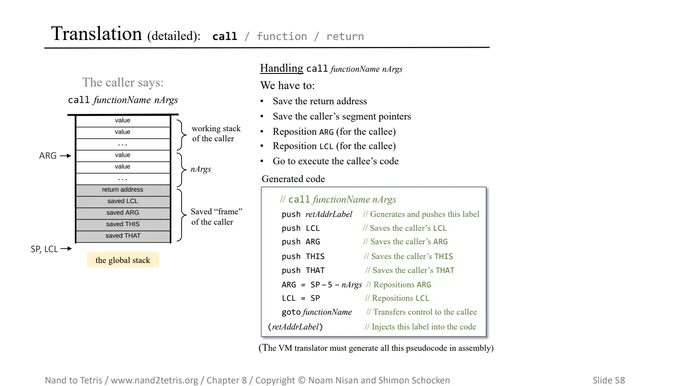
https://drive.google.com/file/d/1BexrNmdqYhKPkqD_Y81qNAUeyfzl-ZtO/view P58より引用


### 関数からのreturn(`return`)
呼び出された関数の終了は`return`コマンドで行う。このコマンドが呼ばれることで呼び出し側に処理が戻る。

ここでは`func_a`から`func_b`を呼び出した際に`func_b`から`func_a`に戻るシナリオを例にスタックの操作を説明する。

1. frameのアドレスを一時変数に格納
1. リターンアドレスを一時変数に格納
1. `ARG`に返り値を格納
1. `SP`を`ARG+1`に設定
1. `THAT`, `THIS`, `ARG`, `LCL`を復元
1. リターンアドレスにジャンプ

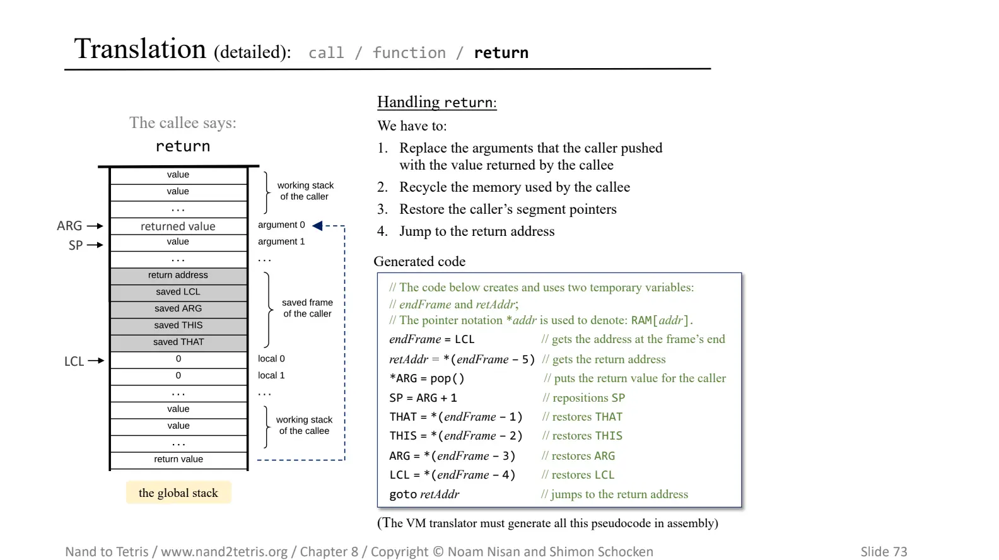
https://drive.google.com/file/d/1BexrNmdqYhKPkqD_Y81qNAUeyfzl-ZtO/view P73より引用

## 第9章 高水準言語
第10章、第11章でコンパイラを実装するJackの仕様を解説した章。

Javaに近い感じの文法。

```java
class Main {
   function void main() {
      var Array a; 
      var int length;
      var int i, sum;

      let length = Keyboard.readInt("How many numbers? ");
      let a = Array.new(length); // constructs the array
     
      let i = 0;
      while (i < length) {
         let a[i] = Keyboard.readInt("Enter a number: ");
         let sum = sum + a[i];
         let i = i + 1;
      }

      do Output.printString("The average is ");
      do Output.printInt(sum / length);
      return;
   }
}
```

## 第10章

## 感想
- 解説が丁寧なので前提知識は特に必要なくスムーズに読めた。
- 各章に課題とテストコードがあるので手を動かしてテストを通しながら理解を深めることができる。
- ドキュメントが充実しているので非本質な困りに時間を使うことが少なく、課題に集中できた。

## 学び、得た経験

<!-- TODO: P205の第2に...第3に...の箇所は低レイヤを学ぶことの素晴らしさを表しているので書く(低水準ソフトウェアにおける優れた設計の美しい例に触れる、知識豊富でより優れた高水準プログラマーになることができる) -->
<!-- TODO: 同様に未知の技術への恐れとか及び腰になる感覚が減った（自分にとって低レイヤプログラミングは未知を学び続けることなので） -->
## まとめ

[^1]: nand2tetrisではHDL(Hardware Description Language)という言語を使って論理回路を記述する。
