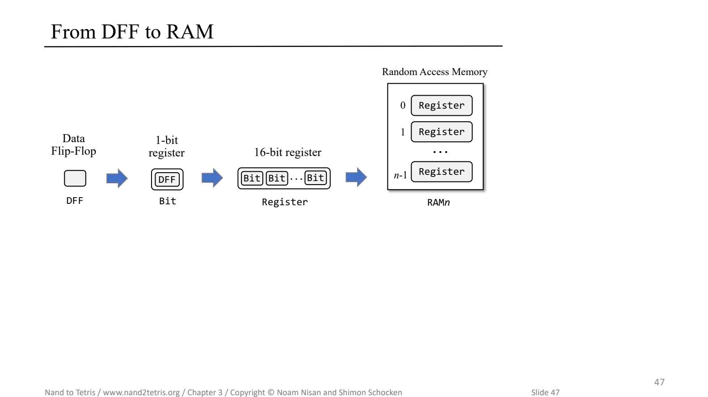
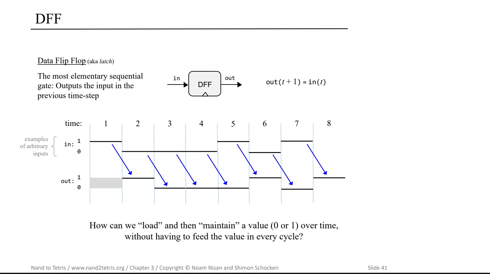
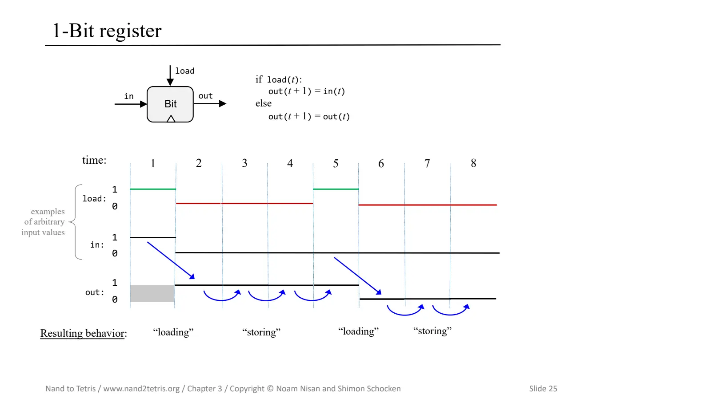
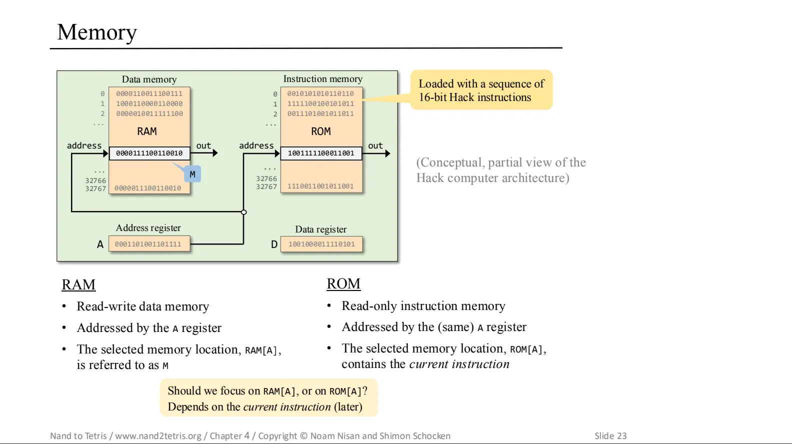
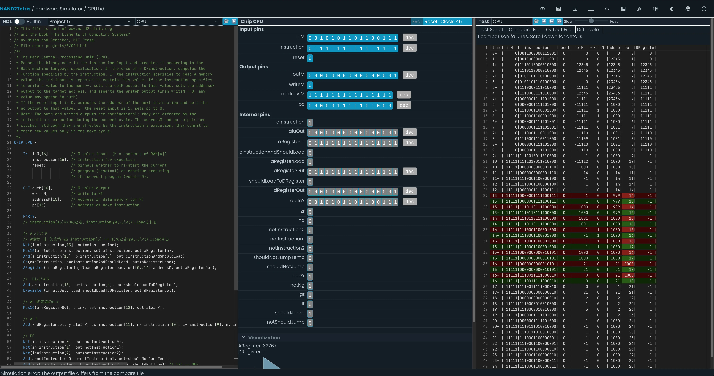
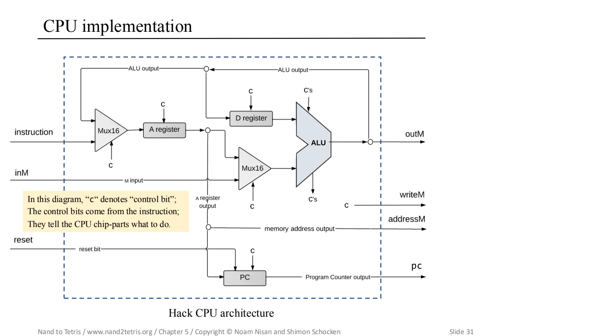

『コンピュータシステムの理論と実装 第2版』を読んだので感想を書く。

## 本書の構成
<!-- TODO: こんなことをやる -->
<!-- TODO: 各章に課題とテストがある -->
<!-- TODO: この章は好きな言語でかける -->

## 第1章 ブール論理
Nandを使って以下の論理回路をHDL[^1]を使って実装した。

- not
- and
- or
- xor
- マルチプレクサ
- デマルチプレクサ
- not(16bit)
- and(16bit)
- or(16bit)
- マルチプレクサ(16bit)
- 8入力or
- 4入力マルチプレクサ(16bit)
- 8入力マルチプレクサ(16bit)
- 4入力デマルチプレクサ
- 8入力デマルチプレクサ

マルチプレクサの実装に悩んだがいい感じの実装を思いついたときの爽快感がすごかった。

焦らず真理値表を書きながら進めたのでマルチプレクサの実装以外はそこまで悩まなかった。

## 第2章 ブール算術
以下の論理回路を作成した。
- 半加算器
- 全加算器
- 16bit同士の加算
- 16bitの入力に1をインクリメントする回路
- ALU(Arithmetic Logic Unit: 算術論理演算装置) 

学び:

- 内部ピンにインデックスアクセスするには次のように書く必要がある。
    ```hdl
    Mux16(a=calculateResult, b=notCalculateResult, sel=no, out=out, out[0..7]=out0To7, out[8..15]=out8To15, out[15]=ng);
    ```
- 愚直な実装をしている箇所があったが、Mux16でスマートに書き直せることを知って感動した。

## 第3章 メモリ
この章では、DFF(Data Flip-Flop)を用いて1-bit registerを作成し、それを組み合わせて16-bit registerを作成し、さらにそれを組み合わせてRAMを作成した。


https://drive.google.com/file/d/1boFooygPrxMX-AxzogFYIZ-8QsZiDz96/view P47より引用

読み書き可能なメモリを作成したことで、コンピューターを作っている感が強まってきた。

作成した回路は具体的には以下。

- Register(1 Bit)
- Register(16 Bit)
- RAM(8 Bit)
- RAM(64 Bit)
- ProgramCounter
- RAM(512 Bit)
- RAM(4K Bit)
- RAM(16K Bit)

学びメモ:

- 第2章までは時間に依存しない回路のみを扱っていたがこの章では過去の状態を保持する回路を作成した。
- ここでは時間をクロックという単位で区切って扱う。
- **非同期チップ(組み合わせチップ)**: 入力値の組み合わせのみに反応し時間の進行には影響を受けない
- **同期チップ(順序チップ)**: 以前の時間単位での変化に対応する用に設計されたチップ
- 同期チップを利用することでシステム内のチップ間で信号が伝播するのにかかる時間を無視できる。
- ただしクロックサイクルは「システム内のチップ間で信号が伝播するのにかかる時間の最大値」と「1チップ内で最も処理時間がかかる演算を完了するのにかかる時間」の合計値よりも大きく設定する必要がある。

DFFは`out(t+1) = in(t)`で表される出力を持つ。DFFを用いることで過去の状態を論理回路上で表現できる。


https://drive.google.com/file/d/1boFooygPrxMX-AxzogFYIZ-8QsZiDz96/view P41より引用

次のようにマルチプレクサとDFFを組み合わせることで1-bit registerを作成できる。

```hdl
CHIP Bit {
    IN in, load;
    OUT out;

    PARTS:
    Mux(a=dffOut, b=in, sel=load, out=mux);
    DFF(in=mux, out=out, out=dffOut);
}
```

1-bit registerは時刻`t`において`load`ビットがアサートされると`out(t+1)`が`in(t)`の値になり、アサートされていない場合は`out(t+1)`は`out(t)`の値になる。レジスタを利用することで過去の状態を保持できる結果、計算の結果を保持できる。


https://drive.google.com/file/d/1boFooygPrxMX-AxzogFYIZ-8QsZiDz96/view P25より引用

## 第4章 機械語
第4章では以下のプログラムを機械語で書いた。

- 掛け算を行うプログラム
- キーボードが押されているときだけ画面を黒くするプログラム

学びメモ:

- **機械語**:
    - ハードウェアプラットフォームが実行するように設計されている基本的な命令セット
    - 高水準言語は表現力やプラットフォーム間の互換性を目標に設計される一方で機械語は特定のハードウェアで直接実行され、そのハードウェアを完全に制御できるように設計されている。
    - 機械語は決められた形式に従い**プロセッサ**と**レジスタ**を用いて**メモリ**を操作するように設計されている。
    - バイナリ形式、記号形式の2パターンで記述できる。
- **メモリ**:
    - データや命令を保存するハードウェアデバイス。各セルは**メモリ位置**や**メモリレジスタ**と呼ばれ、それぞれ固有の**アドレス**を持つ。
- **プロセッサ**:
    - プロセッサは**中央演算装置(CPU)** と呼ばれ、あらかじめ決められた基本的な命令セットを実行できる。
    - プロセッサは選択されたレジスタとメモリ位置からデータを取り出し、選択されたレジスタとメモリ位置に出力を書き込む。
    - プロセッサは**ALU**と**レジスタ**、**バイナリ命令の解析と実行を可能にする論理ゲート**によって構成される。
- **レジスタ**:
    - プロセッサとメモリはそれぞれ独立したチップとして実装されており一方から他方へデータを移すには比較的時間がかかる。そのためほとんどのプロセッサにはいくつかのレジスタが備わっており、高速なローカルメモリとして機能する。
    - CPUに存在するレジスタは2つのタイプに分類される。
        - データを保持する**データレジスタ(Dレジスタ)**
        - アドレスを保持する**アドレスレジスタ(Aレジスタ)**
    
Hackコンピュータは以下のようなアーキテクチャを持つ。


https://drive.google.com/file/d/1HxjPmIZkFHl-BVW3qoz8eD9dqEuEyuBI/view P23より引用

### アセンブラの役割

機械語はバイナリ形式、記号形式の2パターンで記述できると上述したが、記号形式で`@x`のように変数を宣言した場合にその変数を実際のメモリのどこに置くかを知るのが**アセンブラ**である。アセンブラのおかげで記号形式のプログラム側は実装詳細を意識することなく変数を初期化、利用できる。

### 命令タイプ

Hack言語には2つの命令タイプがある。
- **A命令**
    - A命令はAレジスタに15ビットの値を設定する。
    - A命令は1ビットのオペコード + 15ビットの値で構成される。(Hack機械語ではA命令のオペコードは`0`)
    - A命令は3つの目的で使用される。
        - プログラムによってコンピュータに定数を入力する
        - Aレジスタのアドレスを設定することでその次のC命令でRAMレジスタを操作できる
        - Aレジスタにジャンプ先のアドレスを設定することでその次のC命令でジャンプを実行できる
- **C命令**
    - C命令では次の3つを指定する。
        - どういう計算をするか(comp)
        - 計算された値をどこに保存するか(dest)
        - 次に何をするか(jump)
    - Hack機械語では一番左端の1ビットが1
    - C命令は次のような形式で構成される。`111accccccdddjjj`
        - 111: 先頭の1がオペコードで、左から2,3ビット目は使用されないが慣例として`1`が設定されている。
        - a: ALUへの入力がAレジスタからの値化Mからの値か決定する(1ビット)
        - c: compフィールド。(6ビット)ALUに対して計算内容を指定する。
        - d: destフィールド。(3ビット)計算結果の値をどこに保存するかを表現する。左から順にDレジスタ、Aレジスタ、`RAM[A]`に値を保存するかを表現する。

### 外部デバイス

Hackのハードウェアプラットフォームでは画面とキーボードの2つの外部デバイスに接続できる。どちらのデバイスも**メモリマップ**を通してコンピュータと会話する。(メモリの中に画面とキーボード用のメモリ領域があり、そこに画面の各ピクセルの値や押下されているキーのキーコードが格納される。)

### Hackプログラムの例

以下は掛け算を行うHackプログラムのソースコード。(Hackアーキテクチャで動作する機械語で書かれている) ハードウェアの構成要素を理解しながら手続き型チックに記述する必要があるため難しかったが理解が進んだ。

```asm
// 0に対して(R0-1)回R1を足すことで掛け算を実現する

  // n = 0
  @n
  M=0

  // R2 = 0
  @R2
  M=0
(LOOP)
  // if n == R0 then goto END
  @n
  D=M
  @R0
  D=D-M
  @END
  D;JEQ

  // R2 += R1
  @R2
  D=M

  @R1
  D=D+M

  // R2 = D
  @R2
  M=D

  // n++
  @n
  M=M+1

  // go to LOOP
  @LOOP
  0;JMP
(END)
  @END
  0;JMP
```

## 第5章 コンピュータアーキテクチャ
第5章では、これまでの章で作成した論理回路を組み合わせてついに1つの汎用コンピュータを作成する。このコンピュータは第4章に登場した機械語のプログラムを実行できる。

- **ノイマン型アーキテクチャ**:
    - CPUがメモリデバイスと相互作用する。
    - 入力デバイスからデータを受け取り出力デバイスへデータを送信する。
    - コンピュータのメモリ二保存サれるデータはコンピュータが計算したデータだけではなくコンピュータに何を行うべきかを指示する「命令」も含まれる。
- **メモリ**:
    - 物理的にはアドレス指定可能な固定サイズの**レジスタ**の並びで、それぞれが固有のアドレスを持つ。
    - 概念的にはアドレス空間はデータと命令の保存という2つの役割を果たす。
    - ランダムに選択されたメモリレジスタに瞬時に到達できるという要件からRandom Access Memoryと呼ばれている。
        - たしかにRAMはレジスタの木構造になっていたのである程度大きいRAMでも数ホップで指定したレジスタにアクセスできそうだ。
    - データ専用のメモリ領域を**データメモリ**、命令専用のメモリ領域を**命令メモリ**と呼ぶ。
- **CPU**:
    <!-- textlint-disable ja-technical-writing/ja-no-redundant-expression -->
    - CPUは現在読み込まれているプログラムの命令を実行する。
    - 各命令はCPUに対して以下を指示する。
        - どの計算を実行するか
        - どのレジスタにアクセスするか
        - 次のどの命令をフェッチして実行するか
    - CPUはこれらのタスクを**ALU**、**レジスタ**、**制御ユニット**を使って実行する。
    <!-- textlint-disable ja-technical-writing/ja-no-redundant-expression -->

第5章の課題ではこれまでの章で作成した論理回路を組み合わせて以下を作成した。

- Memory
- CPU
- Computer

正直CPUの実装、デバッグがはかなり大変だったが公式が提供してくれているテストツールとデバッガのお陰で効率的にバグを見つけることができた。

こんな感じで各ピンの出力や期待する結果とのdiffを比較的見やすい形式で表示してくれるのでありがたかった。



ここで作成したCPUの回路は次のようなもの。ここではヒントとして大まかな回路設計が与えられておりそれを参考にしつつ足りない部分を埋めていく形で実装を進めた。


https://drive.google.com/file/d/1Z_fxYmmRNXTkAzmZ6YMoX9NXZIRVCKiw/view P31より引用

## 第6章 アセンブラ
第6章では第5章で書いた機械語の記号表現をバイナリ表現に変換するアセンブラを開発する。

- 変数やラベルのアドレス管理を行うために**シンボルテーブル**を利用する。シンボルテーブルには以下のような情報が格納される。
    - ラベルの位置 e.g. `(LOOP)`
    - 変数のアドレス e.g. `@i`(Hack機械語では変数は16以降のアドレスに順に割り当てられる)
    - 定義済みシンボルのアドレス e.g. `@SCREEN`, `@KBD`

### シンボル処理
アセンブリプログラムではシンボルが定義サれる前にシンボルラベルを使用できる。（goto命令の行き先を指定するのに利用する）

この挙動も考慮しつつバイナリを生成するには**2パス・アセンブラ**と呼ばれる手法を用いる。

- 第1パス: シンボルテーブルを作成しすべてのラベルシンボルをテーブルに追加する。
- 第2パス: 変数シンボルを処理し、シンボルテーブルを使用してバイナリコードを生成する。

第6章からは好きな言語で実装できるのでRustで実装した。構文解析系はenumがある言語だと書きやすくて良い。

## 感想
- 解説が丁寧なので前提知識は特に必要なくスムーズに読めた。
- 各章に課題とテストコードがあるので手を動かしてテストを通しながら理解を深めることができる。
- ドキュメントが充実しているので非本質な困りに時間を使うことが少なく、課題に集中できた。

## まとめ

[^1]: nand2tetrisではHDL(Hardware Description Language)という言語を使って論理回路を記述する。
