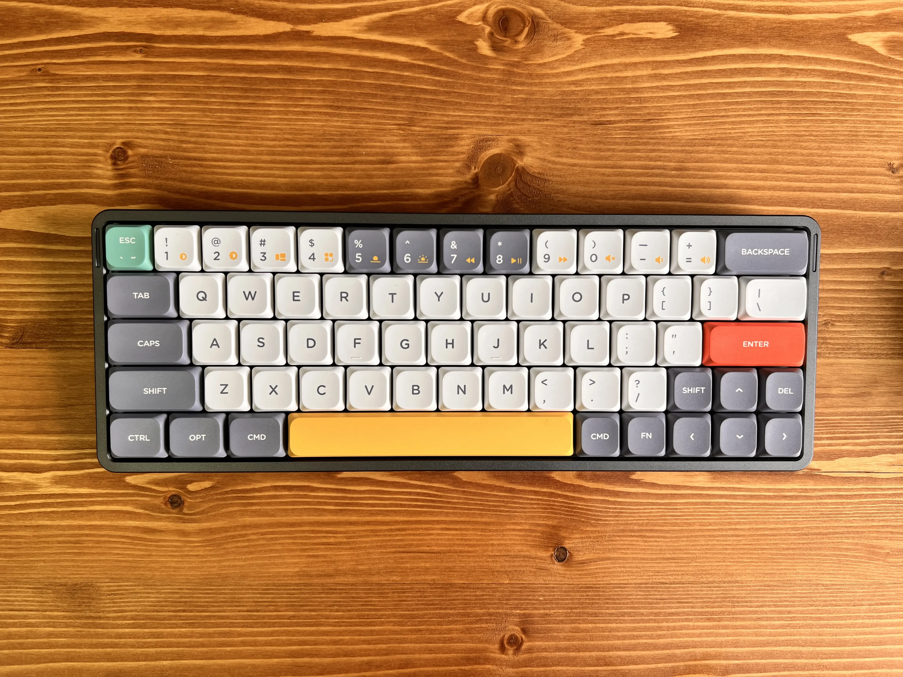
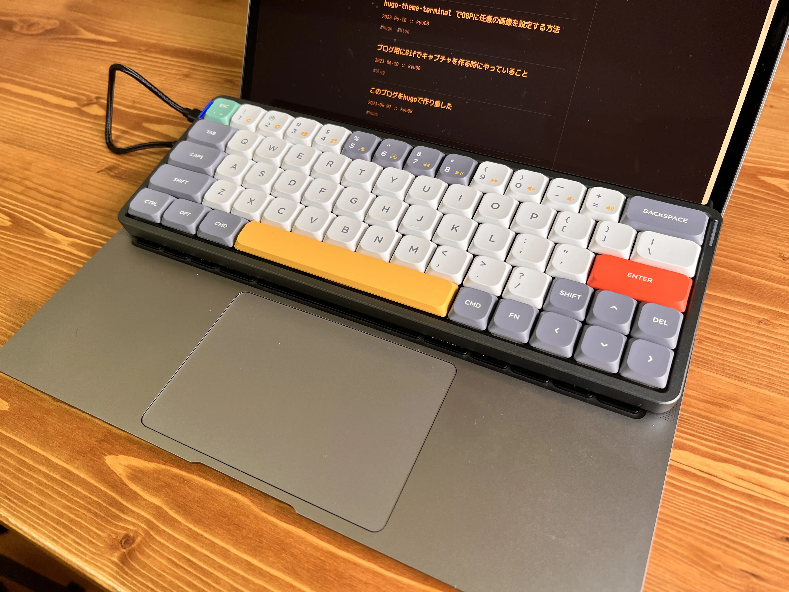
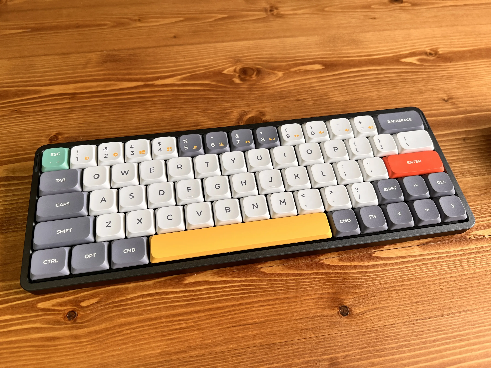
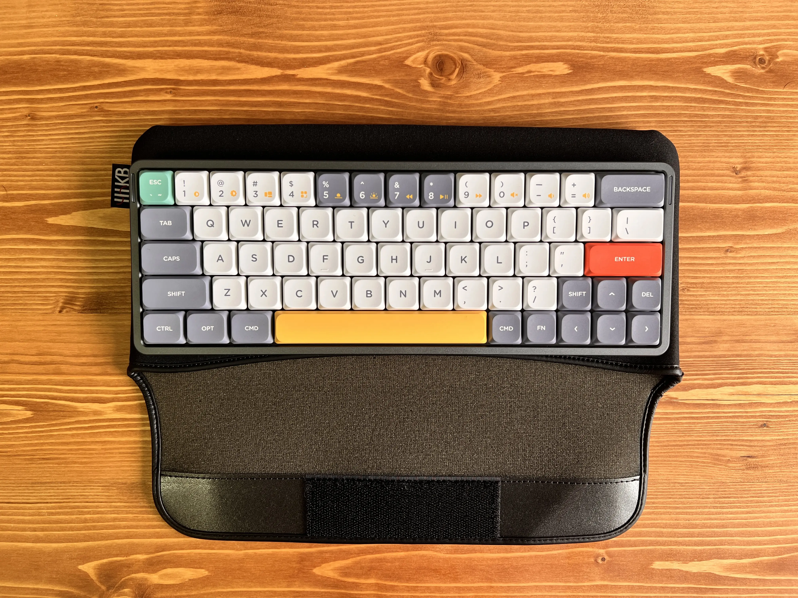
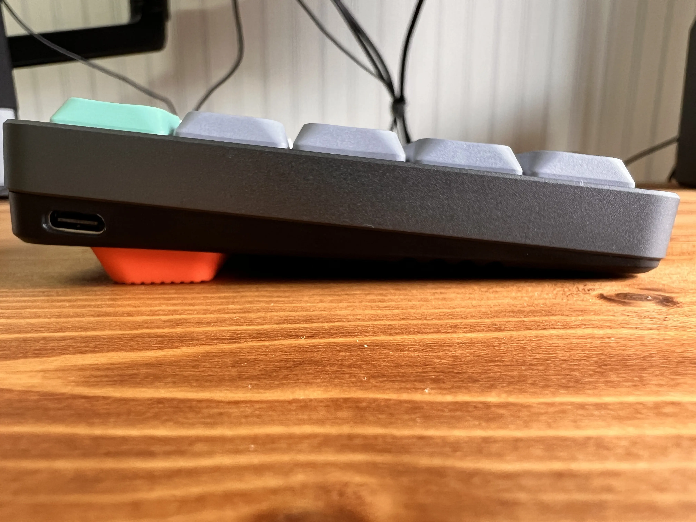

NuPhy Air60を買ったので簡単にレビューする

## 買った理由
普段は7sProを使っているが出社のときに持っていくのが大変だったり尊師スタイルで作業したりしずらかったりするので出社用・家での尊師スタイル用にキーボードを探していた。

コンパクトなキーボードが好みなので60%で探したいたところNuPhy Air60を見つけ、社の先輩がAir75を使っていたので少し触らせてもらったところ打鍵感がいい感じだったので購入を決めた。

## NuPhy Air60のいいところ
### (macのキーボードと比べて)打ちやすい
macの付属キーボードのような薄いタイプよりもメカニカルキーボードなどのようなキーストロークが深めなキーボードが好きなので(ロープロファイルとはいえ)比較的打ちやすい。

### 打鍵感 & 打鍵音がいい
コトコト系で心地よい感じ。 以前Keychron K6を一瞬だけ使っていたときは底打ち感があって指が痛くなりやすかったがそういうことも現状ない。

打鍵音はオフィスで何も気にせず使える程度には静か。

### デザインがかわいい
かわいい

### コンパクト
60%なのでそれはそうという感じだがコンパクトで使いやすい。(65%のキーボードは一番右の列を間違って押してしまいがちなのでつらい)

ちなみに持ち歩く際はバード電子から発売されている [HHKBスマートケース2](https://www.pfu.ricoh.com/direct/hhkb/hhkb-option/detail_smartcase2.html) に入れて持ち運んでいる。ぴったりフィットしている。

## 気になったポイント
唯一惜しいと思ったのはキーキャップがフラットで傾斜がついてないこと（軽く調べた感じロープロファイルだと傾斜がついてないのがスタンダードっぽいのでNuPhy Air60特有の微妙なところかと言われると微妙ではある）

普段はスカルプチャードなキーキャップ[^1]を7sProに装着して使っているのでなかなか慣れない & 若干手が疲れる。(とはいえmacのキーボードよりははるかに打ちやすい)

## まとめ
NuPhy Air60は打鍵感がよく持ち運びもしやすくてとても気に入っている。

あとは家で作業しているときもキーボードを変えると気分転換になることを発見したのでときどき意味もなくキーボードを入れ替えてみている。

NuPhyが気になった方は方はこちらのリンクを踏むと10%オフのクーポンが発行されるみたいなのでぜひ。(2023/6/18まで有効) [http://nuphy.refr.cc/kyusubsub](http://nuphy.refr.cc/kyusubsub)

[^1]: 列によって傾斜や高さが異なるキーキャップのこと。キーキャップの形状についてはこちらの記事が大変詳しい https://buildersbox.corp-sansan.com/entry/2019/08/16/110000
