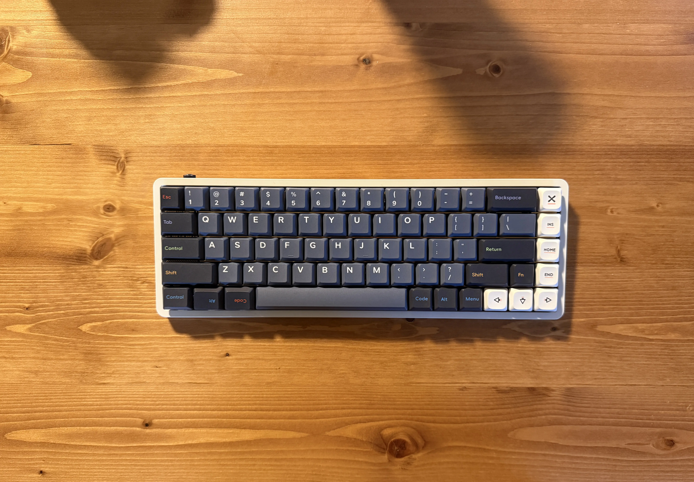

傾斜付きロープロファイルキーキャップであるNuPhy Oblivionを買った。

https://nuphy.com/collections/keycaps/products/oblivion

価格は送料込みで$53.98(8,000円)だった。注文から6日後に届いた。

[IQUNIX Magi65を買った](/posts/magi65)でも書いていた通りロープロファイルでも傾斜付きのキーキャップがないかな〜と思っていたところ突如としてOblivionのリリース情報がTwitterで流れてきたので買ってMagi65に装着してみた。[^1]

## 良かった点
- 傾斜があって打ちやすい
- (NuPhy Halo65のキーキャップと比べて)打鍵音が少し静かになった
- ロープロファイル用なだけあって干渉せずに問題なく使える

手前の白いのがオリジナルのフラットなキーキャップ。

これが今回購入したoblivionのキーキャップ。Cherry Profileに近い形状で傾斜がついている。

## 気になった点
- ホーミングキーの凹凸(よくFキーとJキーについてるアレです)が結構低いので若干わかりづらい。が、慣れればそんなに問題なさそう

[^1]: HHKBっぽく使いたい都合で普段使わないキーを間違って押さないようにあえてキーキャップを交換していない。
