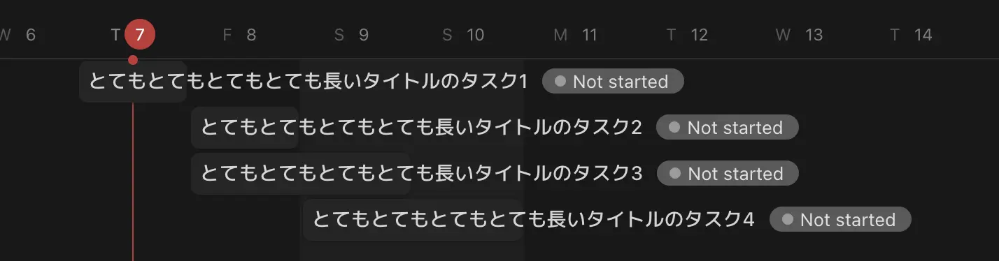
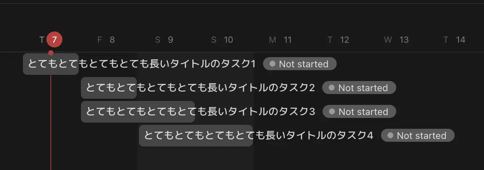
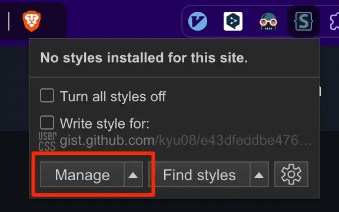
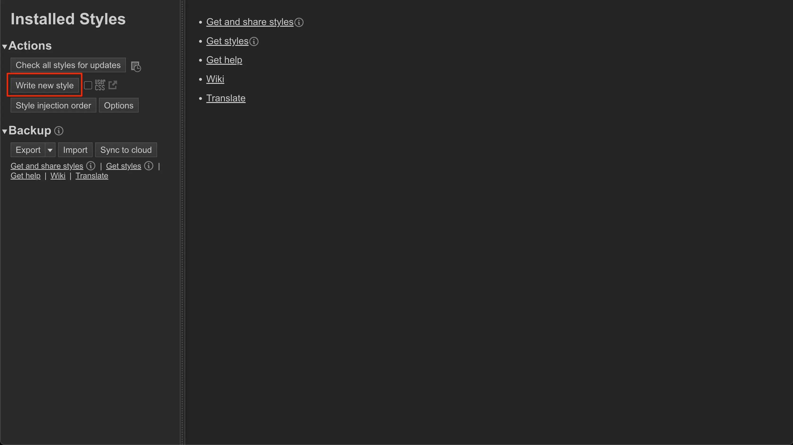
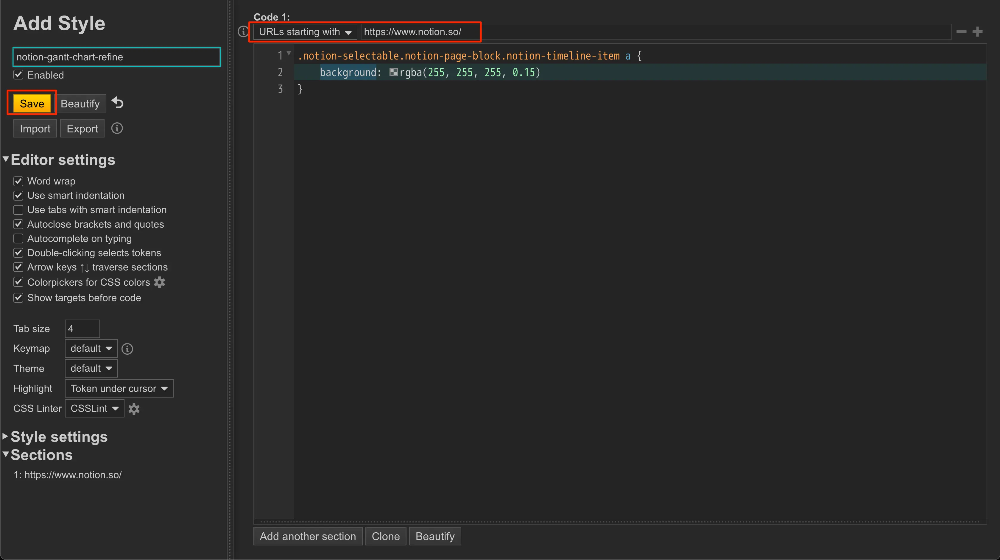

## できること
Notionのガントチャートが見づらいのをなんとかするスクリプト

### Before


### After


## 前提条件
NotionをChromium系のブラウザで利用していること

## やり方
1. 下記のリンクからStylusをインストール
    https://chromewebstore.google.com/detail/stylus/clngdbkpkpeebahjckkjfobafhncgmne?hl=ja
1. Manageをクリックして管理画面を開く
    
1. Write new styleをクリック
    
1. 次のCSSを入力しURLのブロックに`URLs starting with: https://www.notion.so/`を指定しSaveをクリック
    ```css
    .notion-selectable.notion-page-block.notion-timeline-item a {
        background: rgba(255, 255, 255, 0.15)
    }
    ```
    
1. みやすくなる
    

