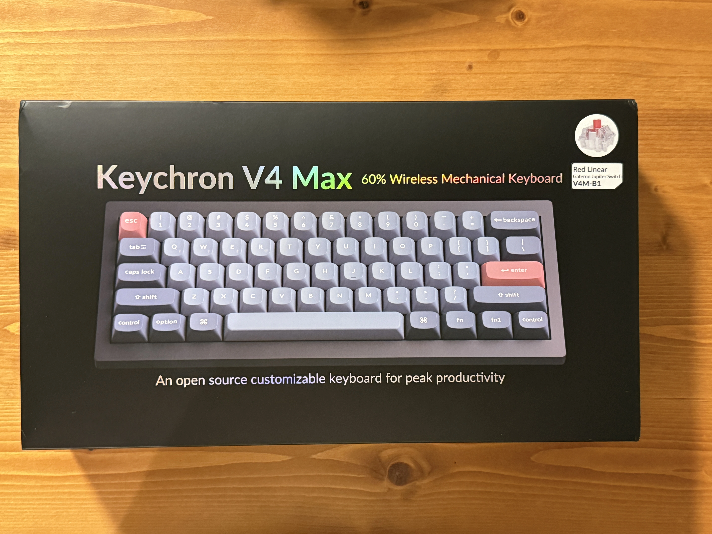
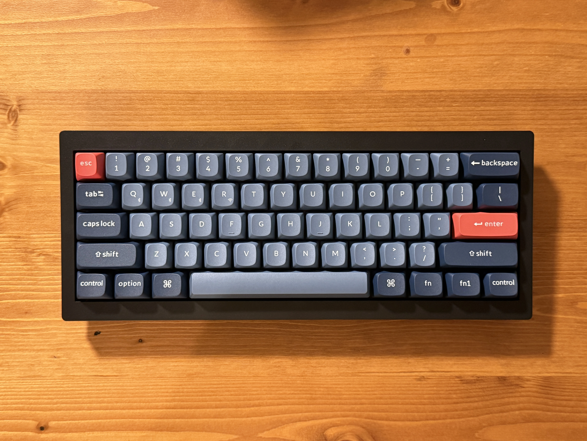

[Keychron V4 Max を買った](/posts/keychron-v4-max)で紹介したV4 MAXはオフィス用のV4 MAXになった。あまりにも使い心地がいいので家用のV4 MAXを買い足した。

前回はキーキャップとスイッチが家に余ってたのでベアボーンを買ったが、もう在庫はないし20$足せばキーキャップがついてくるので今回はフルセットの方を買った。（どうせ赤軸は苦手だからどのみちキースイッチは買うつもりだった）

送料込みで$112.99(¥17,400 JPY)だった。

8/24に発送連絡がきて8/28に届いた。中国からの発送なのに早くてすごい。

開封してちょっと触ってみたがやはり赤軸は苦手な感じだったのでオフィスにおいてあるV4 MAXと同じくKailh Box Silent Pink軸をAmazonで買った。[^1]

60%で本体重量が軽めで打鍵感が良さげな既製品キーボードが意外と少ないのでディスコンになる前に買えてよかったー。[^2]

[^1]: ディスコンらしいけどなんとかまだ在庫があって助かった〜
[^2]: たしかこのモデルも発売から2,3年経ってた気がするので買えてラッキー
