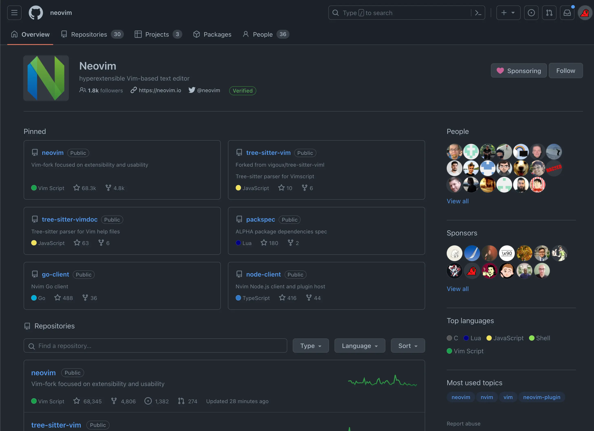
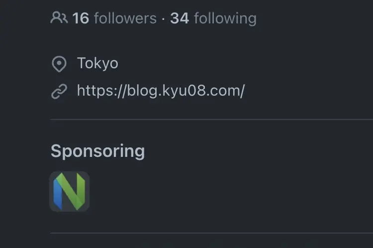

Neovimに対してGitHub Sponsorsを通してOne-time[^1]の寄付をしたという話。

Neovimには仕事・趣味のプロジェクトなど自分が行うすべての開発に収まらずちょっとしたタスク管理やブログ執筆などあらゆる場面でとにかくお世話になっている。

なんでもカスタマイズしたくなってしまうこだわりの強い自分には非常にあっていて数多のプラグインを使って快適に開発を行っている。

大変お世話になっているOSSプロジェクトなのでいつかPRで貢献したいな〜と思いつつ何の気なしにNeovimのリポジトリを眺めていたら「そういえばGitHub Sponsorsでの金銭的な支援も立派なcontributionじゃん！」と思ったのでとりあえず寄付することにした。

## 案外あっさりできた
今回はひとまずOne-timeで20$だけ寄付してみることにした。

初めてGitHub Sponsorsを使ってみたが必要なのは
- 請求先住所の入力
- クレジットカード情報の入力

くらいだったので5分もかからずにできた。

手続きが完了するとこんな感じでSponsorsに自分のアイコンが表示される。(嬉しい)

さらには自分のプロフィール画面にNeovimのアイコンが表示される。組織の一員感がでて地味にいいですねこれ。(結構嬉しい)

日頃から「OSSにお世話になっている分コードを書いて恩返ししたい...。けどなかなかすぐに解決できそうなissueも見当たらない[^2]」みたいなことを思っていたのでまずは寄付という形でOSSに貢献できてよかった。

今後はPRでもOSSコミュニティに貢献していくぞという気持ちになった。

## と思っていた矢先
個人開発のプロジェクトで使えそうなGitHub Actionsを物色していたところ早速自分でも修正できそうな箇所があったのでOSSに初めてPRを送ってみた。

https://github.com/mislav/bump-homebrew-formula-action/pull/57

その時の記事はこちら。 [OSSに初めてPRを送ってマージされた話](../my-first-oss-contribution)

## 今後
Neovimの話に戻るが冷静にもし自分がJetBrainsのIDEユーザーだったら毎年ライセンスを購入するのは厭わないだろうにNeovimを使い倒させてもらっている自分が今回のOne-timeの寄付だけじゃ全然足りなくね？という気持ちになった。

なのでこれからはJetBrainsのライセンスと同じくらいの額(10$/monthくらい？)はmonthlyで寄付していこうと思う。

いずれはPRでもNeovimに貢献していきたいが、直近のPRを軽くみた感じluaやCが書けた方がよさそうだった。

自分が今一番書ける言語はGoなので何かGoを使ったOSSに貢献できないかな〜と思っていたところ自分がよく使っているTUIのgit clientであるLazygit[^3]がGo製でかつドキュメントも整っていた[^4]のでまずはコードリーディングからチャレンジしてみようと思う。

[^1]: 定期的な寄付ではなく、一度きりの寄付
[^2]: 一時期Good First Issueを漁りまくったりしてみたが、typo修正やUT追加などの一部を除いてはプロジェクトについての理解が浅い状態で貢献できそうなissueはあまり見当たらなかった。やはり全体のアーキテクチャや実際の動作を理解した上でなんらかのissueに取り組むのがいいんだろうなと思ったので腰を据えて特定のプロジェクトへのcontributionを狙っていこうと考えを改めた。
[^3]: https://github.com/jesseduffield/lazygit
[^4]: [CONTRIBUTING.md](https://github.com/jesseduffield/lazygit/blob/master/CONTRIBUTING.md)のようなドキュメントが整備されているだけでなく、authorのjesseさんが実際にLazygitに機能を追加する様子を収めた動画も公開されていたりと貢献に対してかなりオープンな印象
