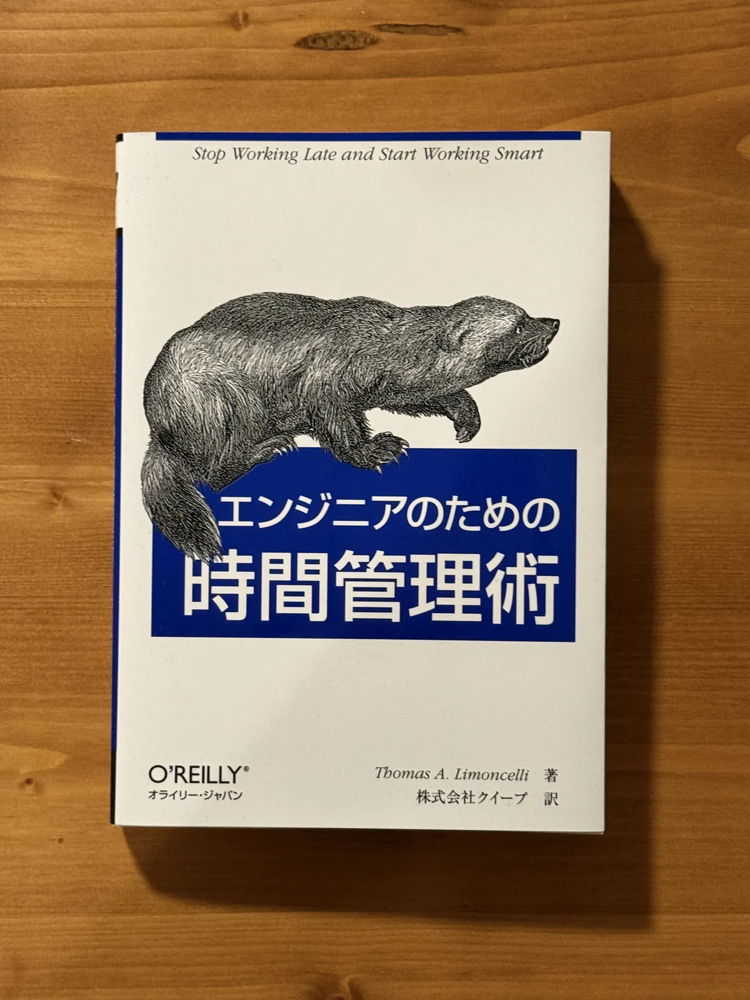
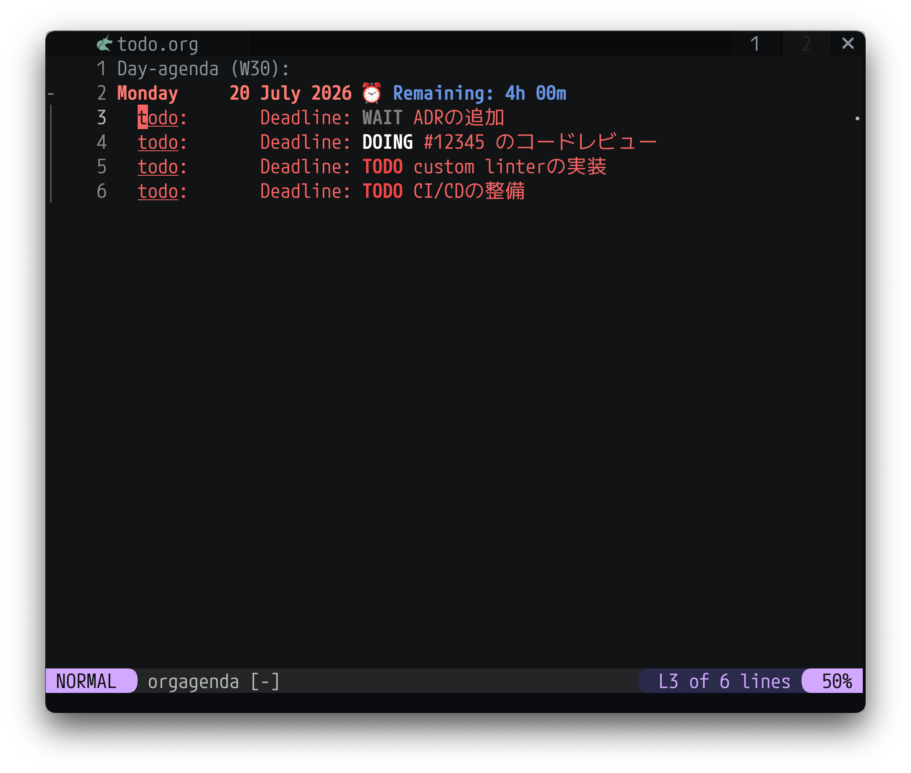
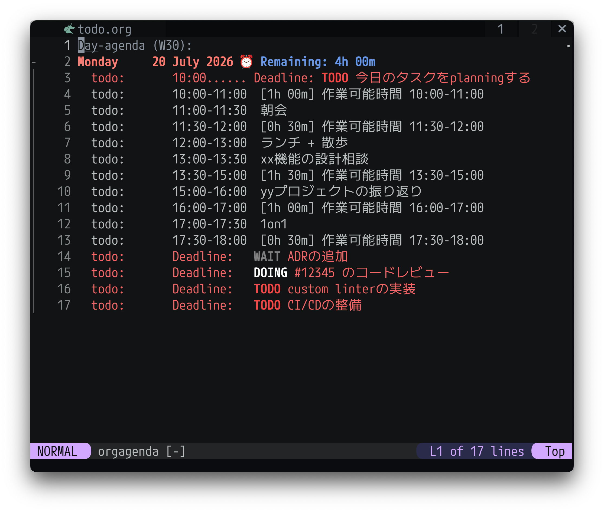
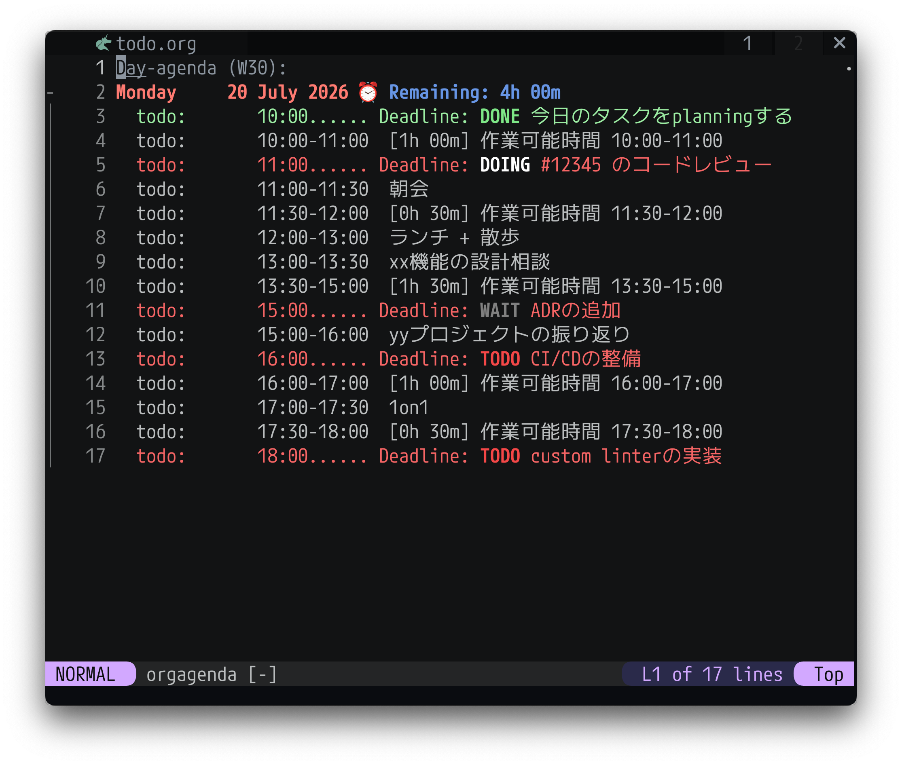
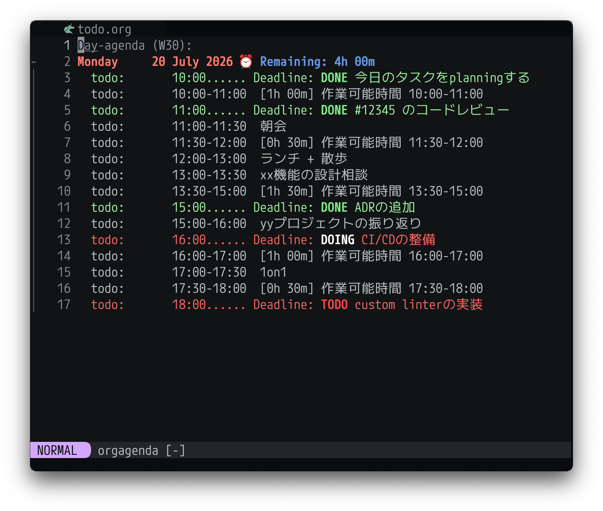

タスク管理についてもう少しいい感じにしたいなーというぼんやりとした課題感があったので、何か参考になることが書いてあるといいな、と思い[エンジニアのための時間管理術](https://www.oreilly.co.jp/books/9784873113074/)を読んでみた。

参考になったところをまとめておく。(なお引用部分末尾の`(P8)`のような数字は引用部分のページ番号を表す。

<!-- TODO: 2. それぞれに対してかけそうなトピックをかいていく -->
<!-- TODO: 3. 文量調節 -->
<!-- TODO: 4. 推敲 -->
<!-- TODO: 見出しのタイトルは適当につけたやつなので見直す -->

<!-- ## 6つの重要なテーマ(PⅥ, P4) -->

## プロセスを信頼する
> 本書のいくつかの章では、毎朝5分間かけて1日の計画を立てることを勧めています。皮肉なことに、忙しい日ほどその5分間を削ってしまいたくなりますが、そういうときこそ、5分間の計画が最も効果を発揮するのです。筆者は「プロセスを信頼しろ」と自分に言い聞かせて、計画を立てています。そしていつも、そうしておいてよかったとあとから実感するのです。
>
> 「後回しにしよう」とか、「1日の計画を立てるのに5分間もかけている暇はない」といったマイナス思考に支配されているときでも、モットーには、頭をポジティブ思考に切り替え、マイナス思考を追い出す力があります。(P8)

忙しい日こそプランニングが重要になるので、例外なく毎日その日の計画を立てるのが重要。

あとは書かれている通りだが、忙しくて気持ちに余裕がないときでもルーティンを守れると自己効力感が湧いてきたり小さな達成感を感じてポジティブな気持ちになったりするのでその意味でも毎日ちゃんとやるのは大事そう。

毎日無理なく続けるための工夫としては自動化できる部分は自動化して少ないエネルギーでタスクを管理できるようにしたり、お気に入りの道具を使ったりするのが大事なように思う。自分の場合はキーボードだけで操作できるUIが好きなのでNeovim上でタスク管理を行っている。(詳しくは次のセクションで説明する) 人によってはお気に入りの紙とペンを使ったり、Notionを使ったり、それ用のデスクトップアプリを自作したりするのもいいかもしれない。

<!-- ## 自分の要求を...(P30) -->
<!-- ついつい「自分の思考を言語化するのは基本的にはその人の責務」と思い込んでしまいがちだが、それに恐怖を感じる人もいる、というやつ。 -->
<!---->
<!-- 特にエンジニア以外の職能の人と話すときは気をつけたいやつ...。 -->

<!-- ## いざやってみると意外と大したことがない、ということはよくある(P35) -->
<!-- あとは遅れれば遅れるほどタスクは増えることが多い（送れたことの謝罪やスケジュールやリソースの調整の必要性が発生する、など） -->

## サイクルシステム
P65付近では、著者が10年以上にわたって実践しているタスク管理手法である「サイクルシステム」について説明されている。気になる方は本書を読んでいただくとして、ここで紹介されているアイディアのうち、自分が取り入れているのは主に以下。

1. タスクとその日のスケジュールを一箇所で管理する
1. 1日の始めにその日取り組むタスクとその完了予定時刻を記入する
1. 1日の終わりに未完了のタスクを次の日のタスクとして持ち越す

これを自分は[nvim-orgmode/orgmode](https://github.com/nvim-orgmode/orgmode)という、org-modeを再現したNeovimプラグインを使って実現している。

を表示している様子")

上の画像のような感じで、その日の

1. タスクと完了予定時刻と`TODO`/`DOING`/`WAIT`/`DONE`などのステータス(上の画像では赤または緑で表示されている行)
1. mtgなどの予定
1. 作業可能時間
1. 作業可能時間のうち現在の残り時間(L2の`⏰ Remaining: 4h 00m`のようなやつ)

を表示するようにしている。

自分は以下のような流れで使っている。[^1]

### 1. 初期状態

初期状態は上の画像のような感じで、前日の夜時点で翌日に移動したタスクだけが表示されている。

### 2. その日の予定を登録

一日の始まりにその日の予定をnvim-orgmode/orgmodeに反映する。[^2]具体的な処理は以下。

1. [icalBuddy](https://formulae.brew.sh/formula/ical-buddy)を使ってmacのCalendar.appからその日の予定を取得
1. その日の予定からその日作業に使える時間(≒mtgがない時間の合計)を算出
1. `1.`と`2.`に加えて`今日のタスクをplanningする`というタスクをnvim-orgmode/orgmodeが認識できるformatで出力

### 3. 各タスクの完了予定時刻を記入

その日に完了したいタスクの完了予定時刻を登録し、`今日のタスクをplanningする`を`DONE`に変更する。

### 4. タスクを進める + 終わらなかったものは翌日に持ち越す

あとはこんな感じで適宜タスクを`DONE`にしていき、一日の最後に残ったタスクは次の日に持ち越す[^3]、という流れ。

### 今のところの所感

春頃までは完了予定時刻を入れたり、その日の作業可能時間を計算したりしておらず、1日の終わりになってやっと危機感から仕事の集中力が上がってくる、というあまりよくない感じの日が多かった。

3ヶ月くらい今の方法で運用してみているが、タスクの完了予定時刻を入れるようにしてから常に各タスクの完了予定時刻までに終えられるようにタイムアタックしている感覚になり、集中力が増した気がしている。

**タスクごとの時間管理をする、というアイディアが自分にとってはこの本での一番の発見だった。**(人によっては当たり前のようにやっているとは思うが自分はこれまでちゃんとできていなかった)

<!-- ## 残業について(P74) -->

<!-- ## 見積もりについて -->
<!-- > 所要時間は常に多めに見積もりべきであり、その方が安全である。所要時間を長く見積もりすぎたとしても、約束の納期に現実的に収まる所要時間に見積もりを減らすことができる。(P76) -->
<!---->
<!-- (エンジニア何年目だよ、という感じだが)ついつい見積もりは少なめに言いたくなってしまうので意識的に長めに見積もるようにしている...。(が、全然忘れておりまわりから指摘してもらって適切な見積もりを引き直す、ということもあるので良くない...) -->

## タスクの進め方
> 1つの作業を終えたら、次の作業を開始します。勢いを持続させてください。(P79)

> 作業項目をリストの先頭にあるものから片付けていくことは、先延ばしを避けるためのよい方法です。(P120)

1日の始めにその日のタスクプランニングをしたら、あとは上から勢いをもってひたすら片付けていく。

書いていて思ったがこれも意外と実践できておらず、途中で軽めのタスクを挟んだりしたくなりがち。機械的に上から進めるようにしばらく意識してみる。

<!-- ## 公私で価値観が違っても良い(P110) -->
<!-- 仕事に熱中していると、ついついプライベートの時間も仕事と同じマインドセットで取り組んでしまい、悪い方向に転ぶことがある。 -->

## 誰かに状況を説明することはストレスの解消になる
> 誰かに状況を説明することは、ストレスの解消にはもってこいです。何のアドバイスも得られなくても、少なくとも聞いてもらえたという気持ちになります。多くの場合は、それで気持ちが軽くなります。(P137)

> 誰かになにかをはっきりと説明すると、問題を解決するのに役立ちます。誰かに問題を説明していて、その解決策に気付いたことが何度あるでしょう。(P137)

めっちゃ経験がある。例えばひとりPJだとスケジュール管理もタスクの実行も自分でやる必要があるが、自分の選択に自信がないときに今の状況や取りうる選択肢とそのメリデメ、そこからなぜ何を選択したかを話すだけでかなり楽になったことがあった。

自分の状況とそこに対する選択を人に説明することで、「どう考えても今の選択が一番合理的」とか「この部分は自信がない、ってことはもう少し深く考えたほうがいいかも」のような感じで自分の選択を客観視できる。

## まとめ
[原著(Time Management for System Administrators)](https://www.oreilly.com/library/view/time-management-for/0596007833/)は21年前(2005年)に書かれた本なようだが、2026年現在でも参考にできる点が多く、自分のタスク管理を改善できたので読んでよかった。

272ページとそこまで文量が多くないのと、内容もわかりやすい口調で書かれておりサクサクと読むことができた。

紹介した部分以外にもいいことがたくさん書いてあるので気になった方はぜひ手に取ってみてはいかがでしょうか。

[^1]: ちなみに、ここで紹介している機能にはnvim-orgmode/orgmode標準のものもあれば、自分でscriptを書いて追加している機能もある。
[^2]: [L3MON4D3/LuaSnip](https://github.com/L3MON4D3/LuaSnip)というsnippet pluginを使って実現している。
[^3]: もちろんPJによっては、ただ翌日に持ち越すだけではなく、PJのステークホルダーにQCDの相談をする必要があるケースもあるとは思います。
