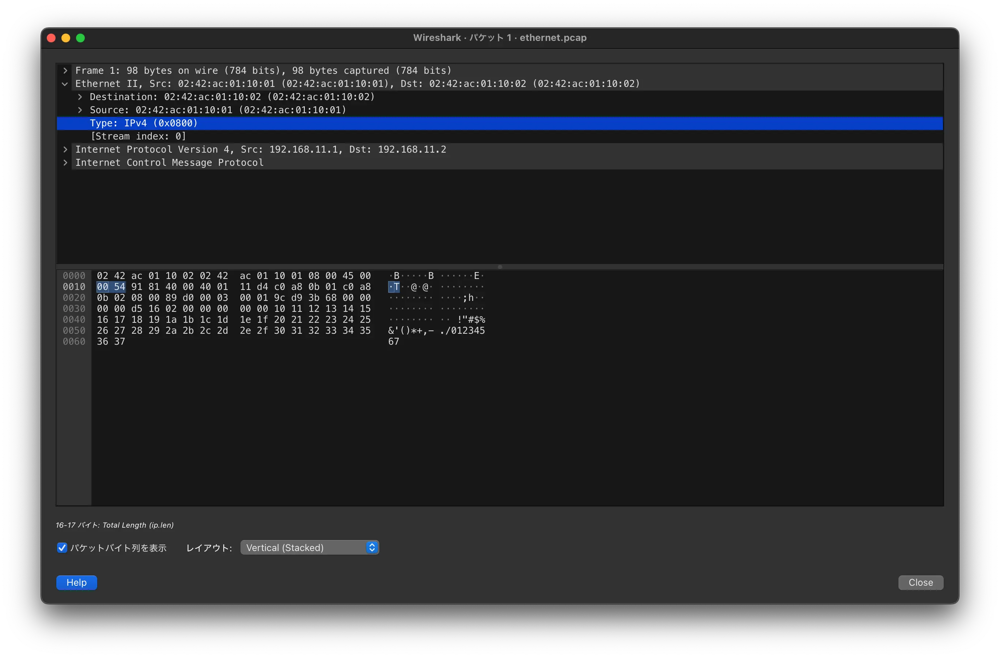
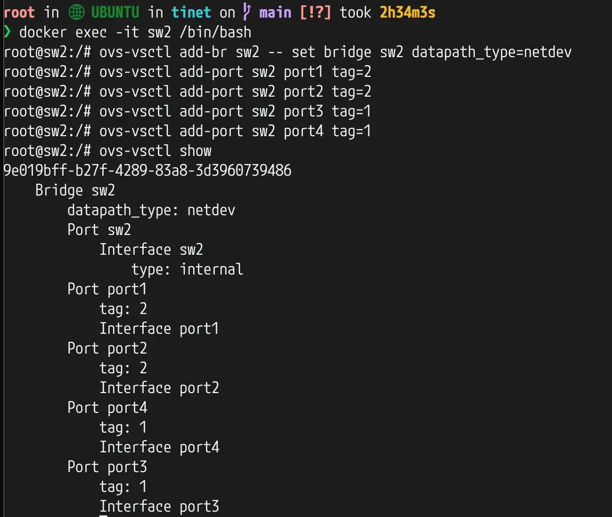

<!-- TODO: モチベーションと本書の概要を軽くかく -->

## Chapter2 レイヤー2プロトコルを知ろう
### データリンク層の役割
- **データリンク層**は、**同じネットワークにいる端末を識別**し、**物理層の上でビット列を正確に伝送する**仕組みを提供している。
- 物理層はコンピューターで扱う0と1で構成される「デジタルデータ」とLANケーブルや電波で扱う「信号」とを相互に変換する役割を担っている。
- データリンク層はデジタルデータ全体の整合性をチェックすることによって物理層だけでは訂正できないエラーを検知し、デジタルデータの信頼性を高めている。
- 現代のネットワークで使用されているレイヤー2プロトコルは、有線LANだったら`IEEE802.3`で定義されている通称「イーサネット」で、無線LANだったら`IEEE802.11`で定義されている通称「Wi-Fi」である。

### イーサネット
- イーサネットでは、**どのようなフォーマットでカプセル化を行い**、**どのようにしてエラーを検知するのか**が定義されている。
- イーサネットによってカプセル化されるパケットは、**イーサネットフレーム**と呼ばれる。
- イーサネットのフレームフォーマットには「イーサネットⅡ規格」と「IEEE802.3規格」の2種類があるが、広く使われているのは前者。

### イーサネットⅡのフレームフォーマット

- プリアンブル
    - フレームの先頭にある8バイトのビット列で、受信側にフレームの開始を知らせる役割を持つ。
    - 7つの`10101010`が続いたあとに`10101011`が来る。
- 宛先/送信元MACアドレス
    - それぞれ6バイトのビット列で、フレームの宛先と送信元のMACアドレスを表す。
    - MACアドレスは48ビットの値で、通常は16進数で表記される。e.g. `02:42:ac:01:11:00`
- タイプ
    - 2バイトの値で、ネットワーク層（第3層）で使用されているプロトコルの種類を表す。
    - 例えば、IPv4は`0x0800`、IPv6は`0x86DD`など。
- イーサネットペイロード
    - 46バイトから1500バイトの可変長のデータを含む。
    - 46バイト未満の場合は、パディングと呼ばれる0で埋められる。
    - 逆に1500バイトを超える場合はトランスポート層やネットワーク層えデータを分割して1500バイトに収める。
- FCS
    - Frame Check Sequence（FCS）は、4バイトの値で、イーサネットフレームが壊れていないかをチェックする。

プリアンブル、宛先/送信元MACアドレス、タイプを合わせて**イーサネットヘッダー**といい、FCSのことを**イーサネットトレーラー**と呼ぶ。

キャプチャしたイーサネットフレームをWiresharkで表示した様子が以下。宛先MACアドレス、送信元MACアドレス、タイプの順で格納されていることがわかる。なお、プリアンブルとFCSは表示されていない。

宛先MACアドレスが6バイトであることがわかる。

送信元MACアドレスが6バイトであることがわかる。

タイプにIPv4が指定されている。

### ARP（Address Resolution Protocol）
- ネットワークの世界において、アドレスを示すものは2つしかない。
    - **MACアドレス**
        - NIC（Network Interface Card）そのものに設定するアドレスで、データリンク層で動作する。
    - **IPアドレス**
        - OSに設定するアドレスで、ネットワーク層で動作する。
- この2つのアドレスを紐づけ、データリンク層とネットワーク層の架け橋的な役割を担っているプロトコルが**ARP（Address Resolution Protocol）** である。
    - 具体的には、目標IPアドレスを使ってMACアドレスを取得するためのプロトコルである。

ARPでは以下のような順でMACアドレスを取得する。

ブロードキャストを毎回行ってしまうとネットワークが混雑してしまうため、ARPリクエストを送信したPCは、受信したMACアドレスを**ARPテーブル**に登録する。次回以降はARPリクエストを送信せずにARPテーブルからMACアドレスを参照する。

以下は実際のARPリクエストをWiresharkで解析した様子。

Destinationにブロードキャストアドレスが指定されている。

送信元MACアドレスにダミーの`00:00:00:00:00:00`が指定されている。

<!-- NOTE: 以下はMACアドレスを重複させたときの挙動説明用のスクショだが使わなかった  -->
<!--  -->

### L2スイッチング
L2スイッチは、**複数の有線LAN端末に接続しイーサネットフレームを転送する**ネットワーク機器。

**L2スイッチング**とは、イーサネットヘッダーに含まれる送信元MACアドレスとポート番号を管理することでイーサネットフレームの転送先を切り替える技術である。

送信元MACアドレスとポート番号を管理するテーブルのことを**MACアドレステーブル**と呼ぶ。

#### MACアドレステーブルにエントリが登録される流れ
L2スイッチsw1にcl1, cl2, cl3, r1が接続されておりcl1とcl2がイーサネットフレームを送信し合う場面を例に説明する。

1. cl1はcl2に対するイーサネットフレームを作りLANケーブルに流す。（この時点ではMACアドレステーブルは空）
1. cl1のイーサネットフレームを受け取ったsw1はそのフレームの送信元MACアドレスとフレームを受け取ったポート番号をMACアドレステーブルに登録する。
1. sw1はこの時点ではcl2がどのポートに接続されているかを知らない。そこでcl1から受け取ったイーサネットフレームのコピーをcl1が接続されているポート以外のすべてのポートに送信する。この動作のことを**フラッディング**という。
1. コピーパケットを受け取ったcl2はcl1に対するイーサネットフレームを作り、LANケーブルに流す。フラッディングによりcl3, rt1もイーサネットフレームを受け取るが、自身に関係のないフレームと判断し破棄する。
1. cl2からイーサネットフレームを受け取ったsw1はcl2のMACアドレスとポート番号をMACアドレステーブルに登録する。
1. これ以降はフラッディングを行うことなくcl1とcl2の間でイーサネットフレームを転送できるようになる。
1. sw1はcl1あるいはcl2が一定時間通信しなくなるとMACアドレステーブルの関連するエントリを削除する。削除するまでの時間は（エージングタイム）に機器によって異なるが、任意の時間に設定できる。

### VLAN（Virtual Local Area Network）
**VLAN（Virtual Local Area Network）は、1台のL2スイッチを仮想的に複数のL2スイッチに分割する技術。**

L2スイッチのポートにVLANの識別番号となる`VLAN ID`という数字を設定し異なる`VLAN ID`が設定されているポートにはイーサネットフレームを転送しない、という仕組みで実現されている。

#### ポートVLAN
**ポートVLANは1つのポートに対して1つのVLANを割り当てる技術**である。
上述の通り異なる`VLAN ID`が設定されているポート同士では通信ができない。フラッディングもそれぞれのVLANごとに行われる。

#### タグVLAN
**タグVLANとは、イーサネットフレームにVLAN情報を`VLANタグ`として付与する技術**である。

**タグVLANを使用すると1つのポートで複数のVLANのイーサネットフレームを処理できるようになる。**そのため物理的なポート数を増やすことなく、複数のVLANを構成できる。

以下は検証環境でポートVLANを設定した様子。この例ではport3, 4に`VLAN ID: 1`が、port1, 2に`VLAN ID: 2`が設定されている。

以下はタグVLANを設定したスイッチから送信されたイーサネットフレームをキャプチャした様子。
Typeに `802.1Q Virtual LAN`が指定されており、その後ろに`VLAN ID`などが指定されていることがわかる。

## まとめ
