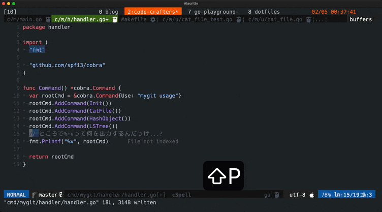
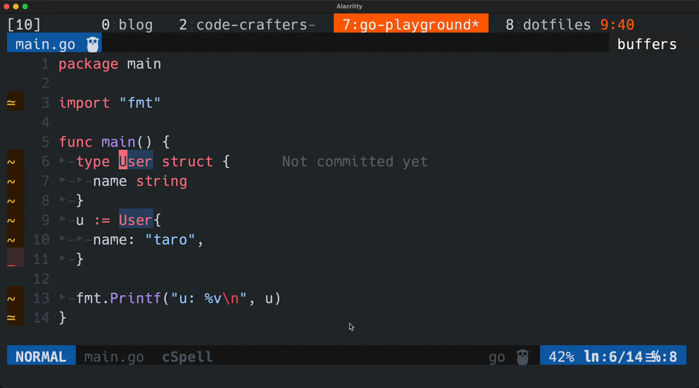
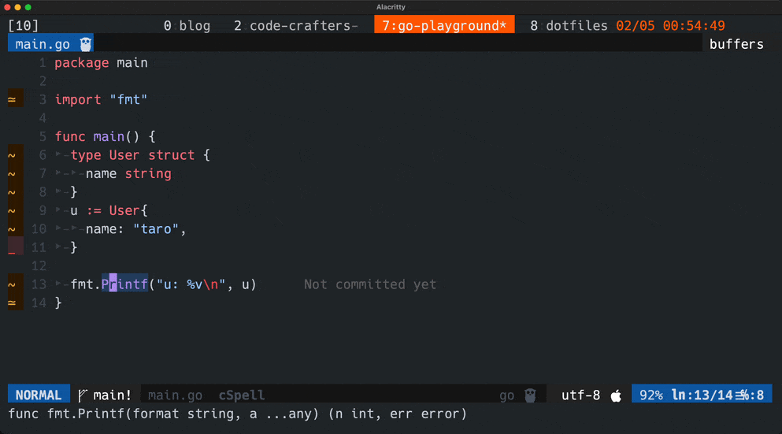
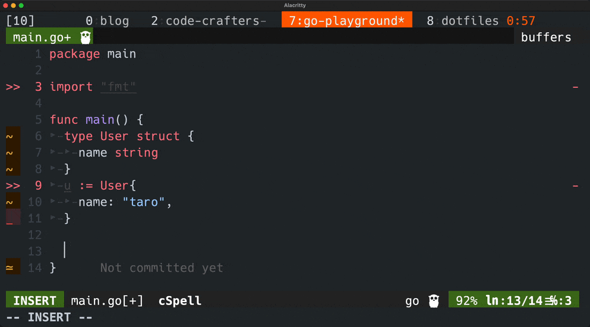

+++
title = "Tmux+NeovimでJetBrains IDEのScratchみたいな機能を実現している話"
date = "2023-02-05T01:15:48+09:00"
author = "kyu08"
authorTwitter = "kyu08_" #do not include @
cover = "https://blog.kyu08.com/cover.png"
tags = ["開発環境", "ターミナル", "zsh", "cli", "Neovim", "Tmux"]
keywords = ["", ""]
description = ""
showFullContent = false
readingTime = true
hideComments = true
color = "" #color from the theme settings
+++

任意の構成のSandbox的な環境をTmuxのwindowとして用意するようにしたところターミナルから出ずにサクっと動作検証とかが行えてハッピーになったよ、という記事。ここではvanillaなGoのプロジェクトの例を紹介しますが、お好みの構成でSandbox環境を作ってみてください。

全然大したことをやっているわけではないですがTmux, Neovimやそれらのプラグインの普及活動になれば嬉しいので書いてみます。

## 動作イメージ
こんな感じでvanillaのGoプロジェクトをTmuxのwindowに開いておいて、確認したくなったときにすぐwindowを切り替えてコードを書いて実行結果を確認できるようにしている。(Gifの例はGoの書式指定子`%+v`の動作を忘れて試してみているところ)



Gifでやっていることは以下

1. GoのSandbox環境を開いたNeovimが起動しているwindowに切り替え
1. コードを書く
1. Neovim上でターミナルを表示
1. `make run`を実行してコード実行
1. 結果を確認
1. 元いたwindowに戻る

tmux-fzfなど筆者のターミナル環境については以下参照

[開発の効率化のためにやっていること ターミナル編](https://blog.kyu08.com/posts/my-dev-setup-terminal)

筆者はGoの動作を確認したいことがほとんどなのでこういった構成にしているが、必要に応じてよく使うFWをセットアップした環境を作っておくと便利そう。

## プロジェクトの内容
Go固有の内容もあるので参考程度で。

```bash
├── .git
├── .gitignore
├── go.mod
├── go.sum
├── main.go
├── main.go.sample
├── main_test.go
└── Makefile
```

基本的に`main.go`の中身を編集して、`go run .`で実行して実行結果を確認するということをしている。

`Makefile`の中身は以下のような感じになっていて、`make run`でコード実行、`make clear`で`main.go`をまっさらにできるようにしているだけである。

```Makefile
.PHONY: run clear

run:
  @go run .

clear:
  @cp ./main.go.sample ./main.go
```

`main.go.sample`の内容は以下。

```go
package main

func main() {
}
```

あとはよく見返したくなるコードは`main.go`以外のファイル名で保存したり、commitしておくと後からでもさっと確認できてよさそう。(筆者はそこまでやってない)

## 感想
ターミナルから出ずに作業が完結できてうれしい。

同様のことはGoの場合はブラウザからThe Go Playground(※)を開いても行えるが筆者は何でもターミナルでできると嬉しい人なのでできるようにしてみた。

※ブラウザ上で実行できるGoのエディタ + 実行環境がセットになったやつ。[https://go.dev/play/](https://go.dev/play/)

あとやるとしたらThe Go PlaygroundにあるURL発行機能とかを実現できると他の人への共有も楽になっていいのかもしれない。(今のところあんまり他の人に共有する機会がないので困っていない)

## 補足
最後に補足としてGif内で使っているNeovimのプラグインを紹介します。

### ターミナル表示
[voldikss/vim-floaterm](https://github.com/voldikss/vim-floaterm)



GoのSandbox環境の`main.go`に書いたスクリプトを実行するために、Neovimからターミナルを表示するシーンで使っている。

コード編集してサクっと動作確認したいときなどに便利。(といいつつ最近動作の重さが目立ってきたので`<C-z>`でNeovimの起動元に戻ってターミナルを操作することが多い)

### カーソル移動
[yuki-yano/fuzzy-motion.vim](https://github.com/yuki-yano/fuzzy-motion.vim)

`fmt.Printf("u: %v\n", u)`の`u`から`%v`の位置にカーソル移動する際に使っているプラグイン。

動作のイメージはこんな感じ。



起動すると文字がグレーアウトするのでジャンプしたい文字列を入力するとその文字にジャンプするためのキーワードを表示してくれるというプラグイン。

同様の機能をもつプラグインとしてはeasy-motionなどのプラグインが有名だが、fuzzy-motionはジャンプしたい文字列をfuzzy-finder形式で絞り込んでくれるのが大きな特徴。(詳しくはリポジトリのREADME参照)

筆者はノーマルモードで`f`キーを押下するとプラグインが起動するように設定している。

カーソル移動の効率がよすぎて正直もうこれなしでは開発したくない。


### LSP Server
[neoclide/coc.nvim](https://github.com/neoclide/coc.nvim)

Language Serverをホストするためのプラグイン。

すごく簡単にいうと補完や関数定義を表示したり定義ジャンプできるようにしたりしてくれる。




以上です。ここまで読んでくれてありがとうございました。

